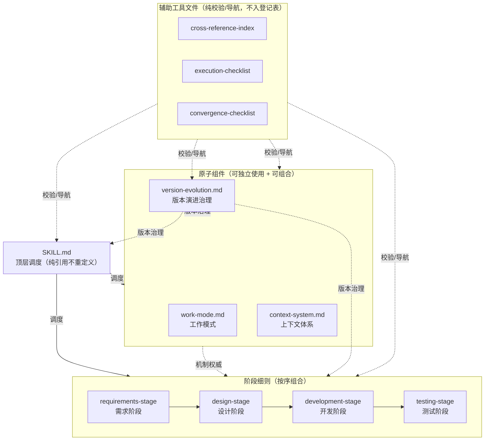
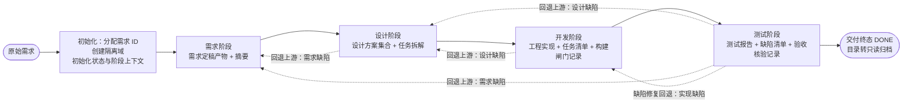

# 软件开发自动化工作流 —— SKILL.md 顶层调度

> 版本：v1.0.8
> 文档属性：skill 交付文件（入口调度文件）
> 交付状态：已交付至 skill 根目录 `SKILL.md`；经 work-mode 双视角评估定稿（评分轨迹 R1 8.0/7.0 → R2 9.0/9.0 收敛），定稿前修 5 条建议项（§9 索引补开发侧三点、§4 图注 §8.2 通道括注、重入分支 4 挂钩例外、INIT 节点标签补全）；早期草图 `docs/00-pipeline-flowchart.md`、`docs/01-pipeline-overview.md` 于交付时删除，全流程图职责由本文 §4 承接
> 对齐基准：`references/work-mode.md` v1.8；`references/context-system.md` v2.3.4；`references/requirements-stage.md` v0.8.8；`references/design-stage.md` v0.9.1；`references/development-stage.md` v1.2；`references/testing-stage.md` v1.0；`references/version-evolution.md` v1.0
> 定位：skill 的唯一入口文件，调度组织全部组件，实现**从原始需求到交付终态的全自动流水线**
> 关键约定：**本文只做顶层调度，不复述、不重定义任何机制**——角色契约、收敛判定、异常处理、出入口契约、归档命名等一律以组件文件为准（组件清单见 §2）；本文与组件冲突时以组件为准；本文对组件的引用均为**路径 + 章节号**形式，不复制内容
>
> 版本演进留痕：本文版本演进注释已迁移至 skill 的版本迭代组件（references/version-evolution.md，含总账与 changelog 明细指针），头部仅保留当前版本与对齐基准

---

### 1. Skill 目标与职责边界

**目标**：用户单次调用，携带原始需求文本启动流水线，自动完成**需求 → 设计 → 开发 → 测试**四阶段，直至需求进入交付终态（`state.json` DONE）；中途仅在各组件定义的人工介入点与用户交互。

**职责边界**：

- 本文承担：启动与初始化、四阶段主调度循环、阶段切换与回退的**状态驱动**、断点恢复入口、交付收尾、人工介入点索引；
- 本文不承担：任何阶段内机制（入口条件细则、实例编排、评估视角、收敛判定、确认规则）——一律执行对应阶段细则；任何上下文结构（隔离域、三层上下文、写入一致性）——一律执行《上下文体系》；任何实例内机制（角色、轮次、归档）——一律执行《工作模式》。

---

### 2. 组件登记表

| 组件 | 现行版本 | 角色 | 权威范围 |
| --- | --- | --- | --- |
| `references/work-mode.md` | v1.8 | 原子组件 | 执行者-评估者-仲裁者工作模式：角色契约、独立性、收敛判定、异常处理、归档命名、报告结构 |
| `references/context-system.md` | v2.3.4 | 原子组件 | 上下文体系：隔离域与存储布局、三层上下文、上下文包装配、跨阶段通道（§8）、进度维护与断点恢复（§9）、数据留存生命周期（§10） |
| `references/requirements-stage.md` | v0.8.8 | 阶段细则 | 需求阶段（第一阶段）：原始需求 → 可交付需求稿 |
| `references/design-stage.md` | v0.9.1 | 阶段细则 | 设计阶段（第二阶段）：需求定稿产物 → 设计方案集合 + 任务拆解 |
| `references/development-stage.md` | v1.2 | 阶段细则 | 开发阶段（第三阶段）：任务拆解 → 可编译可启动的工程实现 |
| `references/testing-stage.md` | v1.0 | 阶段细则 | 测试阶段（第四阶段，最终质量关口）：工程实现 → 测试报告 + 缺陷清单，确认通过即需求交付 |
| `references/version-evolution.md` | v1.0 | 原子组件 | 版本演进治理：版本号与升版规约、引用侧同步纪律、changelog 用法规约、版本总账（轻量指针表） |

**冲突规则**：本文与任一组件冲突时以组件为准；阶段细则与原子组件冲突时以原子组件为准（设计/开发/测试三细则已声明对《上下文体系》只收紧不放松；需求阶段细则声明未定义机制以《工作模式》为准）。组件升版时本文头部对齐基准同步更新（仅元数据）。辅助工具文件（`references/cross-reference-index.md` 交叉引用索引表、`references/execution-checklist.md` 执行检查清单、`references/convergence-checklist.md` 收敛检查清单）为纯校验/导航工具，不定义机制，不入本表，冲突时一律以组件原文为准。

**组件关系全景图**（派生态可视化，以各组件头部对齐基准与 §2 登记表为唯一事实来源；本图不承载版本耦合，仅供快速理解组件间依赖与引用方向，冲突时以登记表与各组件原文为准）：

---

### 3. 启动与初始化

**调用输入**：

| 输入 | 必备性 | 说明 |
| --- | --- | --- |
| 原始需求文本 | 必备 | 用户陈述、工单文本、口头转述、参考资料等；空文本或无法识别功能意图时不启动（需求阶段入口条件，《需求阶段》§5） |
| 归档根路径 | 可选 | 注入时以注入路径为归档根；缺省为 skill 目录下 `.autoflow/`（《上下文体系》§4） |

**初始化序列**（Main Agent 执行，全部动作一次性完成后进入主循环）：

1. **分配需求 ID**：唯一 `<requirement-id>`（建议 `<YYYYMMDD>-<序号>`，《上下文体系》§4）；
2. **创建隔离域**：建立需求目录，写入原始需求引用与需求摘要初始版（《上下文体系》§10 需求启动环节）；
3. **初始化状态**：`state.json` 当前阶段置「需求」，阶段内状态「未启动」；创建需求阶段 `stage-context.json`（首阶段无上游切换事件，其阶段上下文于本步创建，《上下文体系》§5.2）；
4. **进入主调度循环**（§5）。

**并行说明**：多个需求可各自启动独立流水线（目录分域天然隔离，《上下文体系》§4 并行安全）；本文每次调用处理一个需求。

---

### 4. 流水线全景

**图注**：各阶段内部执行流程（入口判定、实例编排、评估循环、确认、异常出口）见对应阶段细则 §5 流程图，本图不展开；四条「回退上游」边为跨阶段回退通道（《上下文体系》§8.2 上行反馈通道——目标失效上报 / 假设证伪回写，触发与恢复语义见各细则 §7.2），回退目标以归因结论为准（测试阶段设计缺陷回退设计、需求缺陷回退需求，《测试阶段》§7.2）；「缺陷修复回退」边为跨阶段上行通道（《上下文体系》§8.2，不改变 `state.json` 当前阶段，见 §6.2）；本图承接早期草图（原 `docs/00-pipeline-flowchart.md`、`docs/01-pipeline-overview.md`，五阶段模型与 `.workspace/` 路径已废止）的全流程图职责，两草图于本文交付时删除。

---

### 5. 主调度循环

Main Agent（编排者，兼任各实例仲裁者，《工作模式》§2.2）按以下五步循环驱动流水线，直至 DONE 或终止：

**第一步 · 状态定位**：读取 `state.json` 确定当前阶段与阶段内状态（《上下文体系》§5.1、§9.1 总览视图）；首次运行即初始化结果（§3）。

**第二步 · 入口判定**：按当前阶段细则的入口条件执行判定——需求（《需求阶段》§5 入口条件）、设计（《设计阶段》§5 入口条件）、开发（《开发阶段》§5 入口条件）、测试（《测试阶段》§5 入口条件）；不满足时按该细则处置（退回上游补充 / 升级人工），调度侧不另行加码。

**第三步 · 阶段执行**：执行当前阶段细则全文——Main Agent 承担细则定义的实例外编排职责（解析分类、问询登记、实例编排、闸门与出口判定等），work-mode 实例按《工作模式》契约运行；阶段内迭代、升级、确认全部由细则驱动，调度侧仅在状态变更时按《上下文体系》§9.4 事件写入映射同批写全对应文件。

**第四步 · 出口定稿**：阶段级人工确认通过后阶段定稿——定稿产物与摘要登记入 `requirement-context.json`，`state.json` 阶段状态置「定稿」（《上下文体系》§9.4 阶段定稿事件、§10）。

**第五步 · 阶段切换**：按《上下文体系》§9.4 阶段切换事件执行——出口阶段定稿登记 → 入口阶段 `stage-context.json` 创建 → `state.json` 当前阶段推进；随后回到第一步。测试阶段定稿无下游切换，直接进入交付收尾（§7）。

**循环终止条件**：① 测试阶段定稿 → DONE（§7）；② 任一阶段被人工裁定终止 → 流水线终止（不产生阶段定稿，`state.json` 终态标记，决策留痕，《上下文体系》§10 与各细则终止情形枚举）；终止后向用户告知终止结论、决策留痕位置与需求目录路径（数据留存按《上下文体系》§10；终止不满足 DONE 前提，不适用只读归档封存）。

---

### 6. 跨阶段流的调度承载

#### 6.1 回退上游（目标失效）

触发、裁定权、恢复语义一律以被触发阶段细则 §7.2「回退上游」出口与《上下文体系》§8.2 为准；调度侧仅承载状态驱动：

1. 回退发生时，`state.json` 当前阶段置为目标阶段（需求/设计），阻塞项同步登记（《上下文体系》§9.4 上行反馈事件）；
2. 目标阶段重新激活后按其入口条件重新进入（各细则恢复语义：上游重新定稿后经 G0 全量重入，重新登记 / 重新执行 / 重新核验）；
3. 中间阶段的在途实例、清单、记录的留痕与处置按各细则 §7.2 恢复语义执行，调度侧不另行定义。

#### 6.2 缺陷修复回退（测试 → 开发）

执行《上下文体系》§8.2、《测试阶段》§5.5 与《开发阶段》§7.2（校验、重新激活、闸门重跑与定向复验均以组件为准）。**调度口径**：该回退不改变 `state.json` 当前阶段（保持「测试」），属阶段间上行修复通道而非阶段切换；事件写入按《上下文体系》§9.4 上行反馈事件执行。

---

### 7. 交付收尾

测试阶段级人工确认通过后，Main Agent 依次完成：

1. **定稿登记**：测试报告、缺陷清单、验收核验记录、摘要登记入需求层（《上下文体系》§9.4 阶段定稿事件、《测试阶段》§7.4）；
2. **终态标记**：`state.json` 终态置 DONE（《上下文体系》§10）；
3. **归档封存**：需求目录转只读归档，保留全部数据供回溯与审计（《上下文体系》§10）；
4. **向用户呈交交付摘要**：需求层索引中各阶段定稿产物路径与摘要（需求稿、设计方案集合、工程实现与构建闸门结论、测试报告与遗留风险），呈交形式为路径 + 摘要引用，不复制全文（《上下文体系》§11 引用不复制）。

历史参考仅人工可摘取，体系不提供自动复用（《上下文体系》§10、§1.1）。

---

### 8. 断点恢复入口

Main Agent 无状态化调度（《上下文体系》§9.3）：任一时刻重新调用本 skill 且指定续跑既有需求时，不重新初始化，直接执行：

1. 定位需求目录，读取 `state.json` 确定当前阶段与阻塞状态；
2. 读取对应 `stage-context.json` 确定当前实例；
3. 执行元数据核对修复（《上下文体系》§9.4）：缺失写入先修复后推进；
4. 进入实例目录按《工作模式》轮次内补齐原则补派缺失环节；
5. 回到 §5 主调度循环第一步继续。

**重入判定**（四分支互斥完备）：调用输入指明既有 `<requirement-id>`（或凭归档根内目录现状辨识）且其 `state.json` **无终态标记（非 DONE 且非终止）** → 走断点恢复；**DONE** → 呈交已交付归档摘要（§7 第 4 步口径）并询问是否按 §3 启动新需求，不静默择路；**已被裁定终止** → 告知终止结论与决策留痕位置（§5 终止条件②口径）并询问是否重新立项，不静默择路；未指明或目录不存在 → 按 §3 新需求启动（例外：指明 `<requirement-id>` 而缺省根未命中的，见下「归档根续跑声明」——先询问，不直接立项）；歧义（如原始需求文本与既有需求摘要明显不符）时向用户确认，不静默择路。

**归档根续跑声明**：归档根注入不落盘（需求层元数据不承载归档根字段）；续跑调用须携带与启动时相同的归档根注入；指定的 `<requirement-id>` 在缺省根 `.autoflow/` 未命中时，先询问用户归档根是否为注入路径，不得直接按新需求启动。

---

### 9. 人工介入点总索引

全部人工介入点由组件定义，本文只作索引（交互规则、留痕载体、强制确认义务一律以组件为准）：

| 类别 | 介入点 | 定义处 |
| --- | --- | --- |
| 信息征询 | 歧义澄清、现状不可获取替代结论征询 | 《需求阶段》§5.2、§5.4 |
| 信息征询 | 需求拆分建议裁定（决定权归人工/需求方） | 《需求阶段》§5.1 |
| 信息征询 | 设计范围问询、UI 基线提供、外部输入问询（技术方案模板） | 《设计阶段》§5.1 |
| 信息征询 | 外部输入问询与登记（已有需求稿、需求稿模板）及读取失败替代裁定 | 《需求阶段》§5.0 |
| 信息征询 | 工程清单确认、构建/启动命令与技术栈问询 | 《开发阶段》§5.1 |
| 信息征询 | 测试运行入口问询 | 《测试阶段》§5.2 |
| 阶段确认 | 需求阶段定稿确认 | 《需求阶段》§7.4 |
| 阶段确认 | 设计阶段实例级 + 阶段级确认（阶段级不可关闭） | 《设计阶段》§7.4 |
| 阶段确认 | 开发阶段级确认（不可关闭） | 《开发阶段》§7.4 |
| 阶段确认 | 开发修复期轻量阶段级确认 | 《开发阶段》§7.2 |
| 阶段确认 | 测试阶段级确认（不可关闭，最终关口） | 《测试阶段》§7.4 |
| 升级裁决 | 各阶段达上限/停滞/不可达升级的四出口裁决 | 《工作模式》§6 + 各细则 §7.2 |
| 升级裁决 | 构建闸门连续失败升级（定位续流 / 终止） | 《开发阶段》§5.4 |
| 升级裁决 | 入口退回补充与入口升级裁定 | 各细则 §5 入口条件 |
| 升级裁决 | 确认/问询环节需求方不可达的暂停（等待恢复）/终止裁定 | 各细则 §7.4 / §5.1 |
| 迭代问询 | 迭代中阻断级疑问向需求方问询、不可达时裁决者替代裁定 | 各细则 §7.3 |
| 缺陷处置 | 缺陷归因裁定、接受/转出裁定、缺陷重新归因裁定 | 《测试阶段》§5.5、§7.2；《开发阶段》§7.2 |

---

### 10. 启动默认参数登记

调度侧登记启动相关参数：含细则声明「可由编排者启动时调整」项（调整须经用户明示并留痕于阶段上下文）与实例级注入参数（固定值，细则注明覆盖理由，不经启动调整）：

| 参数 | 默认值 | 定义处 |
| --- | --- | --- |
| 入口退回补充上限 | 3 次 | 各阶段细则 §5 入口条件 |
| 问询上界（澄清/命令/范围/测试基础） | 3 轮 | 各阶段细则 §5 |
| 收敛阈值 | 8 / 10 | 各阶段细则模式参数表 |
| 迭代上限 | 需求 5 轮；设计 5 轮；开发 5 轮；测试 5 轮（均覆盖《工作模式》默认 10 轮） | 各阶段细则模式参数表 |
| 构建闸门连续失败升级阈值 | 2 次 | 《开发阶段》§5.4 |
| 归档根 | `.autoflow/`（外部注入优先） | 《上下文体系》§4 |
| 外部服务依赖：figma MCP | 服务配置 `{"servers":{"figma":{"type":"http","url":"https://mcp.figma.com/mcp"}}}`；**需登录后方可使用**，登录就绪校验与不可用处置定义于《设计阶段》§4.2、§5.1 | 《设计阶段》§4.2 |

---

### 11. 与早期设计文档的关系

原 `docs/00-pipeline-flowchart.md` 与 `docs/01-pipeline-overview.md` 为五阶段模型早期草图（含 `.workspace/` 路径、「轮次不建目录」等已废止约定），早已声明不作对齐依据；本文交付时两草图删除，全流程图与概要职责由本文 §4 与 §1 承接。`docs/` 目录此后仅存放评估期间的草稿（交付即删）。
