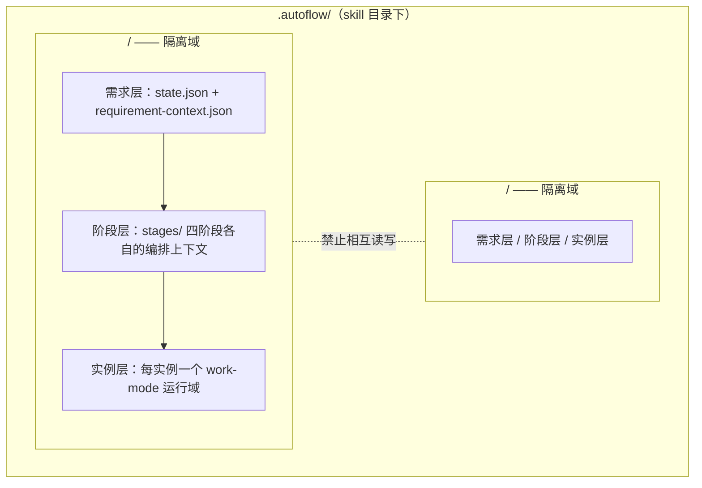

# 软件开发自动化工作流 —— 跨需求跨阶段上下文体系

> 版本：v2.3.5
> 定位：以**隔离**为核心的上下文基础设施，支撑四阶段流水线（需求 / 设计 / 开发 / 测试）与《工作模式》实例化编排
> 对齐基准：`work-mode.md`《执行者-评估者-仲裁者工作模式》v1.9（以下简称《工作模式》）；`requirements-stage.md`《需求阶段》v0.8.9（以下简称《需求阶段》）。本文档**替代**旧版上下文体系（原 `docs/02-context-system.md` v0.2，已于交付时删除；旧版基于五阶段模型与 `.workspace/` 路径，不再作为对齐依据）
> 说明：本文档为**最终上下文组件**，存放于 skill 的 `references/` 目录，与 `work-mode.md` 平级；体系运行时的实际工作信息存放于 skill 目录下 `.autoflow/`，与组件、草稿严格隔离
> 版本演进留痕：本文版本演进注释已迁移至 skill 的版本迭代组件（references/version-evolution.md，含总账与 changelog 明细指针），头部仅保留当前版本与对齐基准

---

## 1. 设计目标

| 目标 | 说明 |
| --- | --- |
| 需求间隔离 | 不同需求的工作信息（状态、产物、评估、决策、假设）完全分域存放，互不可见、互不引用 |
| 阶段间传递可控 | 同一需求内，阶段之间不靠会话记忆，只靠落盘上下文传递；任一阶段可由全新 Subagent 接手 |
| 实例与阶段一致 | 任务指令与阶段/需求上下文保持派生一致，避免同一事实多版本漂移；实例参数注入全程留痕 |
| 进度可查 | 任意时刻可凭当前需求目录内的状态文件还原「做到哪、做过什么、还差什么」 |
| 数据留存 | 每轮执行产物、评估报告、仲裁记录、执行计划全部持久化在需求目录内，可回溯可审计 |
| 体积可控 | 需求内分层摘要 + 按需加载，保证任何 Subagent 的输入包在预算内 |

### 1.1 为什么是隔离而不是复用

- 不同需求的验收标准、技术约束、决策背景各不相同，跨需求自动注入旧上下文会把**过期的前提**带进新需求，产生误导性偏差；
- 评估与仲裁的独立性要求评估者只看当前实例的产物与标准，历史需求的结论不应成为隐性依据；
- 需要历史参考时，由**人工**显式从旧需求归档中摘取并写入新需求的输入，设计不提供自动复用通道。

---

## 2. 对齐锚点

本体系是《工作模式》与阶段细则的**运行时承载层**，不重复定义其机制，仅定义上下文的存放、装配与流动规则：

| 锚点 | 承接内容 |
| --- | --- |
| 《工作模式》四角色契约 | 规划者 / 执行者 / 评估者 / 仲裁者的可见信息范围（其 §2）是上下文包装配的强制依据 |
| 《工作模式》规划阶段 | 执行计划及其评估、仲裁产物在实例层 `planning/` 归档；执行阶段评估者不可见计划的隔离由装配层强制 |
| 《工作模式》触发式重规划 | 重规划计划与基线重置标注在实例内归档；重规划结论的摘要可上行至阶段迭代历史 |
| 《工作模式》偏离三型 | 执行细节型（登记于变更说明）/ 假设失效型（触发重规划）/ 目标失效型（升级人工）的上行后果由 §8.2 承接 |
| 《工作模式》任务指令四要素 + 假设接口 | 目标 / 约束 / 验收标准 / 范围的派生规则见 §6；`hypotheses` / `evidenceRequired` 的注入来源见 §6.2 |
| 《工作模式》§9.5 实例化前置检查 | 检查结论落盘于实例层 `instance-context`，未通过不得实例化 |
| 《工作模式》§10.5 归档结构 | 实例层 `planning/` 与 `round-N/` 目录结构、文件命名一律以《工作模式》为准 |
| 《需求阶段》实例化范式 | 任务指令（任务级）+ 模式参数（实例级）的注入结构、澄清记录引用制、收敛后人工确认 |
| 《需求阶段》需求分类 | 需求级类型（新增型 / 改动型 / 问题修复型）随需求稿摘要传递；条目级类型随定稿产物正文（功能点清单）传递，下游按需读取全文获得；改动型/问题修复型的现状分析记录为需求阶段阶段层文件，注入任务指令上游产物摘要 |
| 流水线约定 | 四阶段：需求 / 设计 / 开发 / 测试；归档位置外部注入优先，默认 `.autoflow/` |

---

## 3. 总体结构：需求隔离 + 需求内三层



| 层级 | 生命周期 | 解决的问题 | 主要内容 |
| --- | --- | --- | --- |
| 需求层（Requirement） | 一次需求（一条流水线） | 「这个需求做到哪了、全貌是什么」 | 运行状态、需求摘要、阶段定稿产物索引、上游关联假设登记 |
| 阶段层（Stage） | 单个阶段 | 「本阶段依据什么、含哪些实例、迭代到哪」 | 阶段编排上下文、澄清记录（如适用）、现状分析记录（需求阶段，改动型/问题修复型）、任务清单（开发阶段）、实例清单与状态 |
| 实例层（Instance） | 单次 work-mode 实例化 | 「这次实例的目标、参数、各轮产物与裁决」 | 实例上下文（任务指令快照 + 参数记录 + 前置检查结论）、`planning/`、`round-N/` |

层间关系原则：

- **向下注入**：下层启动时由 Main Agent（编排者）注入上层的**摘要与引用**，而非全文；
- **边界封闭**：所有读写都发生在当前需求目录内；需求目录之间不存在任何引用边；
- **同层隔离**：每个阶段、每个实例各自独立目录，互不覆盖；
- **单一实例粒度**：实例 = 一次「产出—审视—修正」循环，对应《工作模式》的一次实例化；一个阶段可含多个实例（如开发阶段每任务一实例，见 §5.2）。

**设计决策：不设任务层**。阶段层与实例层之间不设独立任务层，任务以「阶段层任务清单条目 + 实例目录命名（`instance-<task-id>`）」形态存在。判据：**任务 : 实例恒为 1:1**——回退与重做一律按重启同一实例处置（《工作模式》§6 追加约束重启语义：轮次重置、归档只读、目录续编），不新建实例；因此任务层无独立承载内容（无多实例分组、无任务级跨实例事实），任务级事实由任务清单承载、任务过程由实例全量留痕承接。**重新评估触发条件**：当一个任务需对应多个实例（如多方案并行对比、拆分批次分别实例化，任务目录下将出现 ≥2 个实例目录），或出现任务级跨实例事实（如任务级预算累计、跨实例证据链）时，应引入任务层。

---

## 4. 存储布局与隔离域

```
<skill-dir>/
├── changelog/                             # 版本演进留痕（按改动日期命名，一次改动的全部条目记入当日文件）
├── SKILL.md                               # skill 入口调度文件（顶层编排，纯引用不重定义机制）
├── references/                            # 组件目录（七份组件平级存放，另有两份辅助工具文件）
│   ├── work-mode.md                       # 工作模式契约（原子组件）
│   ├── context-system.md                  # 上下文组件（本文档，原子组件）
│   ├── requirements-stage.md              # 需求阶段细则
│   ├── design-stage.md                    # 设计阶段细则
│   ├── development-stage.md               # 开发阶段细则
│   ├── testing-stage.md                   # 测试阶段细则
│   ├── version-evolution.md               # 版本迭代组件（版本演进治理）
│   ├── cross-reference-index.md           # 交叉引用索引表（辅助工具，纯校验不定义机制）
│   ├── execution-checklist.md             # 执行检查清单（辅助工具，纯导航不定义机制）
│   └── convergence-checklist.md           # 收敛检查清单（辅助工具，纯校验不定义机制）
└── .autoflow/                             # 运行时工作信息（归档根，默认值；外部注入时以注入路径为根）
    ├── work-mode-artifacts/               # 脱离流水线单独运行 work-mode 时的默认归档（《工作模式》§10.5）
    ├── optimization-log/                  # skill 自身优化事务留痕（方案优化文档，方案与执行可追溯）
    └── <requirement-id>/                  # 需求隔离域
        ├── state.json                     # 需求层：进度主控
        ├── requirement-context.json       # 需求层：跨阶段传递唯一入口
        ├── docs/                          # 需求级快速访问入口（软链接集合，平权挂载各阶段交付物，见 §11.10）
        │   ├── requirements.md            # → stages/101-requirements/requirements.md
        │   ├── ui-design.md               # → stages/201-design/ui-design.md
        │   ├── api-contract.md            # → stages/201-design/api-contract.md
        │   ├── frontend-architecture.md   # → stages/201-design/frontend-architecture.md
        │   ├── frontend-detailed-design.md # → stages/201-design/frontend-detailed-design.md
        │   ├── backend-architecture.md    # → stages/201-design/backend-architecture.md
        │   ├── backend-detailed-design.md # → stages/201-design/backend-detailed-design.md
        │   ├── task-tsk-NNN.md            # → stages/301-development/tsk-NNN.md
        │   ├── testing-report.md          # → stages/401-testing/testing-report.md
        │   └── defects.md                 # → stages/401-testing/defects.md
        └── stages/
            ├── 101-requirements/          # 需求阶段（对齐《需求阶段》）
            │   ├── requirements.md        # 阶段定稿正式需求稿（按《需求阶段》§4 模板）
            │   ├── stage-context.json
            │   ├── clarification-log.md   # 澄清记录（Main Agent 持久维护，《需求阶段》引用制）
            │   ├── current-state-analysis.md  # 现状分析记录（改动型/问题修复型必备，《需求阶段》§5.2）
            │   └── instance-1/            # work-mode 实例
            │       ├── instance-context.md
            │       ├── planning/          # 规划阶段启用时生成：plan-rN / eval-*-plan-rN / arbitration-plan-rN / plan-replan-rN
            │       └── round-N/           # executor-deliverable / executor-summary / eval-*-rN / arbitration-rN
            ├── 201-design/                # 设计阶段（结构同构，出入口契约见 §8.4）
            │   ├── ui-design.md           # UI 设计交付物（《设计阶段》§4.2）
            │   ├── api-contract.md        # API 契约文档 Markdown 主体（《设计阶段》§4.3）
            │   ├── api-contract.yaml      # API 契约派生形态
            │   ├── frontend-architecture.md    # 前端架构设计（《设计阶段》§4.4）
            │   ├── frontend-detailed-design.md # 前端详细设计（《设计阶段》§4.5）
            │   ├── backend-architecture.md     # 后端架构设计（《设计阶段》§4.4）
            │   ├── backend-detailed-design.md  # 后端详细设计（《设计阶段》§4.5）
            │   ├── design-scope-record.md # 设计范围确认记录（阶段层文件）
            │   └── instance-*/             # work-mode 实例（ui / api / frontend / backend）
            ├── 301-development/           # 开发阶段
            │   ├── stage-context.json
            │   ├── task-manifest.json     # 任务清单（条目 ID 追溯锚点）
            │   ├── tsk-NNN.md             # 每任务一份交付物（《开发阶段》§4.2）
            │   ├── build-gate-record.md   # 构建闸门记录
            │   ├── entry-confirmation.md  # 入口确认记录
            │   └── instance-tsk-NNN/      # work-mode 实例
            └── 401-testing/               # 测试阶段
                ├── testing-report.md      # 测试报告
                ├── defects.md             # 缺陷清单
                ├── acceptance-verification.md  # 验收核验记录
                └── instance-req-NNN/      # work-mode 实例
```

隔离规则：

1. **需求 ID 唯一**：每个需求启动时分配唯一 `<requirement-id>`（建议 `<YYYYMMDD>-<序号>`），其全部工作信息写入对应目录；
2. **单域读写**：任一 Subagent 与 Main Agent 在某需求执行期间，只允许读写该需求的目录；
3. **无跨需求引用**：产物路径引用、摘要引用一律解析为当前需求目录内的相对路径，禁止出现指向其他需求目录的路径；
4. **并行安全**：多个需求并行推进时，目录分域天然互不干扰，无需额外加锁；
5. **归档只读**：需求结束（DONE）后其目录转为只读归档，保留全部数据用于回溯与审计。

目录粒度约定：

- **阶段一目录**：四大阶段各自独立目录；
- **实例一目录**：每个 work-mode 实例独立目录，实例内归档结构与命名一律执行《工作模式》§10.5（含**轮次建目录** `round-N/`、各轮交付物保留完整副本——旧版「轮次不建目录、产物逐轮覆盖」约定废止，以《工作模式》为准）；
- **归档位置注入**：流水线实例化时，实例归档位置作为《工作模式》§9.2 模式参数注入为上述实例目录；脱离流水线单独运行时使用《工作模式》§10.5 默认。

---

## 5. 各层内容定义

### 5.1 需求层

| 条目 | 内容 |
| --- | --- |
| 运行状态 `state.json` | 进度主控：当前阶段、阶段内状态（未启动 / 运行中 / 待确认 / 定稿 / 终止）、当前实例与轮次、阻塞项清单、升级人工历史、追加约束重启历史、**执行统计段**、终态标记 |
| 需求摘要 `requirement-context.json` | 需求一句话概述、需求类型（新增型 / 改动型 / 问题修复型）、原始需求引用、各阶段定稿产物路径与摘要索引、未决项清单、**上游关联假设登记**（见下） |

`requirement-context.json` 是**跨阶段传递的唯一入口**：任何新阶段启动时，Main Agent 只保证其读到「需求摘要 + 所需上游产物引用」，不依赖会话历史，也不依赖其他需求的任何信息。

**上游关联假设登记**：凡经任务指令 `hypotheses` 字段注入下游实例的假设（来源、注入目标实例、当前状态：待验证 / 已证实 / 已证伪），统一登记于此。该登记是 §8.2 假设证伪回写的**单一事实来源**——实例仲裁发现假设证伪时，凭登记追溯来源阶段与条目。改动型/问题修复型需求中，现状分析记录的现状假设一经注入下游实例即同步登记（《需求阶段》§3.2）。

**执行统计段**（`state.json` 内段）：按阶段累计——实例累计消耗轮次（分实例）、升级人工次数、人工介入次数（问询 / 确认 / 裁定分别计数）、阶段耗时（启动至定稿或终止）；随既有事件写入同批累加（§9.4，不新增独立事件类型）。统计段为**派生态**：矛盾时凭实例归档与阶段上下文重建，不作为任何判定的依据（仅供回溯与效率分析）。

### 5.2 阶段层

| 条目 | 内容 |
| --- | --- |
| 阶段上下文 `stage-context.json` | 阶段指令参数（评估视角、阈值、上限等注入值）、引用的上游产物清单、实例清单与各实例状态、阶段级事件（人工确认结论、重启记录） |
| 澄清记录 `clarification-log.md` | 仅需求阶段必备（《需求阶段》§6 引用制）：问题 → 结论 → 时间，含降级处置记录与人工裁定记录及「已确认」状态标注；由 Main Agent 持久维护 |
| 现状分析记录 `current-state-analysis.md` | 仅需求阶段、且需求级类型为改动型/问题修复型时必备（《需求阶段》§3.2）：相关模块、既有行为边界、依赖、影响面、现状假设；问题修复型另含缺陷现象、复现条件、预期行为依据；由 Main Agent 持久维护并注入任务指令上游产物摘要 |
| 任务清单 `task-manifest.json` | 仅开发阶段必备：任务 ID、任务定义、关联需求条目 ID（《需求阶段》REQ-NNN 追溯锚点）、改动范围、前置依赖（其他任务 ID，如无则为空）、交付类型（前端 / 后端 / 集成）、对应实例 ID、状态（待启动 / 执行中 / 定稿 / 修复中）。**来源**：由 Main Agent 依据设计阶段出口契约（§8.4）的**任务拆解产物**登记（字段一一对应）；任务清单一经登记，任务 ID 与关联条目 ID 跨轮持久，变更仅可追加。**回退上游重入语义**：回退上游重新定稿后重新进入时，任务清单全量重新登记——依新任务拆解逐条登记；新任务拆解的任务 ID 由设计侧按《设计阶段》§4.6 自原拆解最大编号续编（续编输入通道：回退时 Main Agent 将上一代任务拆解归档引用与原拆解最大编号注入设计阶段重激活输入，经 §8.2 回退通道随仲裁记录一并传递），开发侧登记与拆解字段维持一一对应，不另行编号；原清单与实例归档按代只读留痕成链、不参与分批、闸门与出口判定；具体适用见开发阶段细则 §7.2 |

### 5.3 实例层

| 条目 | 内容 |
| --- | --- |
| 实例上下文 `instance-context.md` | 任务指令快照（四要素 + 可选 `hypotheses` / `evidenceRequired`，派生规则见 §6）、模式参数注入记录、§9.5 前置检查结论（通过 / 补齐内容 / 升级原因）、角色降级标注、追加重启与重规划历史摘要 |
| 规划阶段归档 `planning/` | 执行计划、规划阶段评估报告、规划阶段仲裁记录、重规划计划，命名与结构执行《工作模式》§10.5；**仅规划阶段启用时生成** |
| 执行阶段归档 `round-N/` | 每轮交付物与摘要、各视角评估报告、仲裁记录，结构执行《工作模式》§10.5 |

实例层是 work-mode 运行的完整自包含域：凭该目录内文件即可按《工作模式》§7 恢复任一中断的实例。

---

## 6. 任务指令派生规则

### 6.1 四要素派生

任务指令四要素（《工作模式》§9.1）由 Main Agent 在实例化时从上层上下文派生，派生关系与留痕要求如下：

| 要素 | 派生来源 | 说明 |
| --- | --- | --- |
| 目标 | 阶段目标 +（多实例阶段）任务定义 | 开发阶段实例的目标 = 任务清单中该任务的定义；其余阶段 = 阶段目标本身 |
| 约束 | 需求层定稿产物摘要中的关键约束条目（经 `requirement-context.json` 索引定位，不凭转述） + 阶段级注入约束 | 逐条引用来源，不得凭会话记忆转述；改动型/问题修复型需求的约束含回归边界（《需求阶段》§6 第 3 段） |
| 验收标准 | 阶段验收标准（各阶段细则定义，如《需求阶段》§1 + §4） | 实例级不另行放宽或收紧 |
| 范围 | 实例范围（单实例阶段 = 阶段范围；开发阶段 = 任务改动范围） | 与任务清单改动范围字段一致 |

派生完成后执行《工作模式》§9.5 前置检查（目标清晰 / 约束无冲突 / 验收标准可评估），检查结论写入 `instance-context.md`；未通过不得实例化。

### 6.2 假设与证据要求注入

`hypotheses` / `evidenceRequired`（《工作模式》§9.1 可选扩展字段）的注入映射：

| 注入来源 | 映射规则 |
| --- | --- |
| 需求稿「未决项」中的隐含假设 | 与该实例相关的假设注入 `hypotheses`，逐条标注来源条目 |
| 需求稿「技术风险与对策」 | 与实例相关的风险对应的前提注入 `hypotheses`，取证方式注入 `evidenceRequired` |
| 现状分析记录的现状假设（改动型/问题修复型） | 与实例相关的现状假设注入 `hypotheses`（《需求阶段》§3.2），取证方式（读码 / 运行验证）注入 `evidenceRequired` |
| 上游阶段定稿产物中显式标注的假设 | 同上，由 Main Agent 摘取注入 |

所有注入的假设同步登记至 `requirement-context.json` 上游关联假设登记（§5.1），状态初始为「待验证」；假设结论（证实 / 证伪）产生时——无论是迭代中的假设失效型偏离裁决，还是实例定稿时交付物的逐条回应——均由 Main Agent **即时回写**登记状态，不延迟至阶段结束。

---

## 7. 上下文包：角色化装配

各角色**不共享会话**，输入由 Main Agent 统一装配为上下文包，且**只取材于当前需求目录**：

```
上下文包 = 固定段 + 需求段 + 阶段段 + 实例段 [+ 按需引用]
```

| 段 | 内容 | 装配规则 |
| --- | --- | --- |
| 固定段 | 角色职责 + 任务指令 + 输出格式要求 | 按角色从实例上下文取任务指令快照 |
| 需求段 | 需求摘要 + 本阶段所需上游产物的**摘要** | 上游产物只注入摘要（`executor-summary.md`），全文路径引用 |
| 阶段段 | 阶段级约束与评估标准 | 按阶段细则注入 |
| 实例段 | 按角色差异装配（见下表） | 规划阶段启用时含已确认执行计划等 |
| 按需引用 | 需要全文时由 Subagent 显式读取对应路径 | 引用必须使用登记过的需求目录内路径 |

实例段按角色差异化装配（可见范围以《工作模式》§2 角色模型为准，装配层强制执行）：

| 角色与场景 | 实例段内容 |
| --- | --- |
| 规划者（规划阶段首轮） | 计划模板 +（第 2 轮起）上一轮计划整合意见 |
| 规划者（重规划） | 定稿计划 + 当轮整合意见 + 偏离/假设核验结论 |
| 执行者 | 交付物模板 + 已确认执行计划（规划阶段启用时） +（第 2 轮起）上一轮整合意见 |
| 评估者（规划阶段） | 评估标准 + 执行计划 + 输出格式要求 |
| 评估者（执行阶段） | 评估标准 + 交付物 + 输出格式要求；**不包含执行计划与规划阶段任何产物**——避免评估基准继承计划遗漏（《工作模式》§2.3），装配层对此强制校验 |

体积治理：

- **摘要强制**：任何产物定稿时必须同步产出摘要，无摘要的产物不允许被下游引用；
- **预算控制**：上下文包总体积设上限（按项目配置）。**角色必需输入永不裁剪**：任务指令、评估标准、被评对象（计划/交付物本体）、已确认执行计划、上一轮整合意见；超预算时仅裁剪可选段，**先裁需求段**（降至一句话概述）、再裁阶段段（降至摘要级）；
- **引用优先**：大体积内容（代码变更、完整报告）一律以路径引用传递，不进上下文包。

> 说明：不设全局段。若某需求确需参考历史需求的信息，由人工在启动该需求时显式写入其需求输入，使其成为当前需求自己的上下文。

---

## 8. 信息流规则

### 8.1 下行传递（阶段 → 阶段，实例 → 实例）

- 下游只接收上游的**摘要 + 定稿产物路径引用**，全文按需读取；
- 跨阶段追溯以需求条目 ID 为锚点（《需求阶段》§6 条目 ID 跨轮持久、跨阶段引用）；
- 未定稿的阶段产物不得被下游引用（阶段定稿以该阶段细则的出口判定为准，如《需求阶段》§5.4 人工确认通过）。

### 8.2 上行反馈（实例 → 需求层）

旧版体系只有下行传递；《工作模式》v1.5 的偏离三型与假设接口要求四条上行通道（含跨阶段回退）：

| 通道 | 触发 | 处置 |
| --- | --- | --- |
| 假设证伪回写 | 实例以假设失效型偏离或交付物证据证伪了**源自上游登记**的假设 | 仲裁记录标注「上游关联假设证伪」+ 被证伪假设的来源条目；Main Agent 将需求层登记状态更新为「已证伪」并列入阻塞项；由人工裁定是否回退上游（经《工作模式》§6「回退上游」出口，上游阶段重新激活并接收本实例仲裁记录作为新输入） |
| 目标失效上报 | 实例出现目标失效型偏离（任务指令的目标/约束/验收标准本身有误） | 升级人工（《工作模式》§5）；Main Agent 同步登记需求层阻塞项；人工裁定修正目标后，受影响阶段及其实例按「追加约束重启」语义重启（轮次重置、已落盘归档只读保留），自受影响的最上游阶段重新推进 |
| 缺陷修复回退 | 测试阶段发现缺陷，经任务清单关联到任务条目 ID | Main Agent 定位对应开发实例，以缺陷描述为追加约束重新激活该实例（按《工作模式》§6「追加约束重启」语义：轮次重置、已落盘归档只读保留、新轮次目录续编），任务清单状态置「修复中」；修复收敛后状态回「定稿」并回写测试阶段复验结论 |
| 阻塞升级 | 任一实例升级人工且当轮无法闭合 | 升级材料包按实例落盘；阻塞原因、轮次、待决项登记入 `state.json` 阻塞项清单，供需求级进度视图呈现 |

上行反馈的写入者**仅为 Main Agent**；实例内角色不直接修改需求层文件。

**跨阶段读取边界**：Main Agent（编排者）拥有需求域全域视野，可跨阶段读取（如缺陷修复回退凭任务清单定位开发实例、假设证伪凭登记追溯来源阶段）；**Subagent 不得跨阶段直读**，仅消费装配注入的内容（§7），跨阶段信息一律经 Main Agent 以摘要 + 引用形式注入。

### 8.3 实例内流动

整合意见回传、偏离登记（执行细节型在交付物变更说明、其余在仲裁记录）、重规划计划与基线重置标注，全部按《工作模式》契约在实例目录内落盘，体系不另行定义。

### 8.4 阶段出入口最小契约（设计 / 测试阶段）

设计与测试阶段的细则文档未定义前，由上下文体系先行定义其出入口最小契约，消除体系悬挂点；细则出台后以细则为准，只可收紧不可放松。**现状**：设计阶段细则（`design-stage.md`）与测试阶段细则（`testing-stage.md`）均已交付，本表作为出入口基线契约保留，实际执行以各细则为准。

| 阶段 | 入口输入 | 出口产物（必备项） | 出口条件 |
| --- | --- | --- | --- |
| 设计 | 需求层摘要（含需求级类型；条目级类型按需读取需求定稿产物全文获得）+ 需求定稿产物摘要 + 未决项 + 假设登记 +（改动型/问题修复型）现状分析记录 | ① 设计方案与摘要；② **任务拆解**（须为独立产物，字段：任务 ID、任务定义、关联需求条目 ID、改动范围、前置依赖、交付类型——与 task-manifest 登记字段同构，是任务清单登记的唯一权威来源，见 §5.2） | 各视角收敛 + 人工确认（比照《需求阶段》§5.4 出口模式） |
| 测试 | 开发定稿产物与摘要 + 验收标准 + 任务清单 | ① 测试报告与摘要；② 缺陷清单（逐条必须关联任务条目 ID，作为 §8.2 缺陷修复回退的触发输入） | 验收标准全部核验且缺陷收敛或已处置 |

**空缺期降级条款已失效**（设计/测试细则均已出台）：历史口径为细则出台前 Main Agent 按本契约执行、出口确认一律升级为强制人工确认；两阶段的阶段层结构与需求阶段同构（`stage-context.json` + 实例目录），任务指令与模式参数的注入规则遵循 §6 与《需求阶段》§3.5 范式。

---

## 9. 进度维护与断点恢复

### 9.1 进度的三个视图

| 视图 | 载体 | 回答的问题 |
| --- | --- | --- |
| 总览 | `requirement-context.json` + `state.json` | 需求整体做到哪、各阶段状态、阻塞项 |
| 阶段视图 | `stage-context.json`（+ 任务清单） | 本阶段含哪些实例、各实例状态、阶段级事件 |
| 实例视图 | 实例目录落盘文件 | 当前轮次、评分趋势、收敛建议、偏离与重规划历史 |

### 9.2 进度写入职责

| 写入者 | 写入内容 | 时机 |
| --- | --- | --- |
| Main Agent（编排） | `state.json`、`requirement-context.json`、`stage-context.json`、任务清单、澄清记录、现状分析记录、假设登记 | 每次状态变更 / 定稿登记 / 上行反馈发生后 |
| 规划者 Subagent | 执行计划、重规划计划 | 规划阶段每轮 / 重规划触发时 |
| 执行者 Subagent | 交付物 + 摘要、偏离声明（含执行细节型登记） | 每轮执行完成时 |
| 评估者 Subagent | 视角评估报告（规划阶段评计划、执行阶段评交付物） | 每轮评估完成时 |
| Main Agent（仲裁者） | 仲裁记录（含偏离裁决、重规划触发判定、基线重置标注） | 每轮仲裁完成时 |

规则：**Subagent 之间不直接修改彼此的产物**；跨层状态一律由 Main Agent 写入，保证单一事实来源；所有写入都落在当前需求目录内。

**阶段内实例并行规则**：同一阶段的多个实例（开发阶段）**默认串行推进**；确需并行时，各实例的上下文包装配、评估派发与仲裁必须相互独立，不得共享在途状态；Main Agent 对并行实例的仲裁逐实例独立完成，轮次计量互不影响（《工作模式》§6 轮次计量以实例为界）。

### 9.3 断点恢复

Main Agent 无状态化调度：任何时刻重启，仅凭当前需求目录内的落盘文件即可还原现场——

1. 读取 `state.json` 确定当前阶段与阻塞状态；
2. 读取对应 `stage-context.json` 确定当前实例；
3. **执行元数据核对修复（§9.4）**：比对元数据与实例落盘产物，缺失写入先修复后推进；
4. 进入实例目录，凭 `instance-context.md` 与最新轮次落盘文件，按《工作模式》§7「轮次内补齐」原则核对当轮应到/已到报告，仅补派缺失环节；
5. 按 §7 规则重新装配上下文包，继续执行。

### 9.4 写入一致性：派生态原则与事件写入映射

**派生态原则**：元数据文件（`state.json`、`requirement-context.json`、`stage-context.json`、`task-manifest.json`、假设登记）全部是**派生态**（含 `state.json` 执行统计段）；实例层落盘产物（交付物、评估报告、仲裁记录、规划产物）是**权威态**。两者矛盾时以落盘产物为准并重建元数据——元数据漂移是可恢复的，不是致命的。

**写入顺序**：自底向上——先写实例层落盘产物，再写阶段层，最后写需求层；保证任一中断点上「上层元数据引用下层内容」总能解析成功（被引者存在则引用者必已写入）。

**事件写入映射**：每类事件发生时，Main Agent 须同批写全对应文件；任一缺失即视为事件未完结，不得推进至下一状态。

| 事件 | 同批必写文件（自底向上） |
| --- | --- |
| 轮次仲裁完成 | 实例 `round-N/` 仲裁记录 → `stage-context.json` 实例状态与轮次 → `state.json` 当前实例与轮次（同批累加执行统计段） |
| 偏离裁决（假设失效/目标失效型） | 仲裁记录 → 假设登记状态（涉登记假设时） → `state.json` 阻塞项清单 |
| 阶段定稿 | 交付物与摘要 → `requirement-context.json` 定稿产物索引 → `state.json` 阶段状态 |
| 上行反馈（§8.2 四通道） | 实例仲裁记录/交付物 → 需求层登记与阻塞项 → `state.json` 阶段状态（回退/修复场景） |
| 阶段切换 | 出口阶段定稿登记 → 入口阶段 `stage-context.json` 创建 → `state.json` 当前阶段 |

**核对修复**：断点恢复（§9.3）推进前执行元数据与落盘产物的核对（存在性 + 状态一致性），发现缺失写入先修复后推进；修复失败则登记阻塞项并升级人工。

---

## 10. 数据留存生命周期


| 环节 | 规则 |
| --- | --- |
| 需求启动 | 创建 `<requirement-id>/` 目录，写入原始需求引用与需求摘要初始版 |
| 运行期间 | 全部读写限定在本需求目录内；轮次产物只追加不删除 |
| 阶段定稿 | 定稿产物与摘要登记入 `requirement-context.json`，供下游引用 |
| 需求结束 | 目录转只读归档，不删除、不清理；`state.json` 终态为 DONE |
| 历史参考 | 仅人工可阅读归档并手动摘取内容到新需求输入；体系不提供自动回写或自动注入 |

---

## 11. 一致性与隔离规则汇总

1. **需求边界封闭**：一个需求的全部工作信息只存在于它自己的目录，读写不出界；
2. **单一事实来源**：同一事实（需求条目、任务定义、评分、假设状态）只在一处定义，其他位置一律引用；上游关联假设登记是假设状态的唯一权威记录；
3. **引用不复制**：下游上下文引用上游产物用路径 + 摘要，不复制全文，避免版本漂移；
4. **写入有界**：谁写什么、何时写，严格按 §9.2 职责表执行；Main Agent 是唯一跨层写入者；
5. **摘要先行**：无摘要产物不可被引用，保证上下文包体积可控；
6. **全量留痕**：所有轮次、裁决、偏离、重规划落盘即不删除，修正以追加新版本方式进行；归档只读；
7. **计划隔离装配强制**：执行阶段评估者上下文包不含执行计划与规划阶段产物，由装配层校验，违反即装配失败——失败的上下文包**不得派发**，由 Main Agent 修复后重新装配，不静默降级；
8. **机制不重复定义**：角色契约、收敛判定、异常处理、归档命名一律以《工作模式》为准，本体系只承载其运行时上下文；
9. **状态可重建**：元数据是派生态、实例落盘产物是权威态，矛盾时以落盘产物为准；断点时可凭核对修复完整重建元数据，缺失写入修复先于继续推进；
10. **软链接一致性**：`docs/` 软链接集合（§4 目录布局）的链接目标须真实存在；阶段定稿时由 Main Agent 在写入交付物后**同批创建**软链接；阶段未启动时软链接不创建（不预创建悬空链接）；需求结束（§10 归档只读）时软链接随目录转只读——断点恢复（§9.3）时若发现悬空软链接，按"链接目标缺失"登记阻塞项，修复路径二选一：补全缺失交付物后重建链接，或撤销悬空软链接并留痕。

---

## 12. 与其他文档的关系

| 文档 | 关系 |
| --- | --- |
| `work-mode.md` v1.9 | 实例层归档结构、角色可见范围、偏离与重规划机制的权威来源；本文不重复定义；两者同为 `references/` 目录平级原子组件 |
| `requirements-stage.md` v0.8.9 | 需求阶段的阶段层实现（澄清记录、现状分析记录、人工确认、任务指令注入值、需求分类、外部输入问询与登记——已有需求稿/需求稿模板；v0.8.9 增强制生成正式需求稿、阶段目录编号 101-requirements、定稿产物 `requirements.md` 与 `docs/` 软链接）；后续设计/开发/测试阶段细则文档与本文为同级引用关系 |
| `design-stage.md` v0.9.2 | 设计阶段的阶段层实现（figma MCP 接入机制、技术方案模板外部输入问询；v0.9.2 增架构设计与详细设计分离为两份独立文档、阶段目录编号 201-design、PlantUML 优先 / mermaid 降级、定稿产物命名与 `docs/` 软链接）；与本文为同级引用关系 |
| `development-stage.md` v1.3 | 开发阶段的阶段层实现（任务清单、构建闸门、入口技术栈基线、缺陷修复回退侧处置；v1.3 增阶段目录编号 301-development、定稿产物 `tsk-NNN.md` 与 `docs/` 软链接）；与本文为同级引用关系 |
| `testing-stage.md` v1.1 | 测试阶段的阶段层实现（验收核验记录、缺陷清单归因细化、出口三处置集；v1.1 增阶段目录编号 401-testing、定稿产物 `testing-report.md` / `defects.md` 与 `docs/` 软链接）；与本文为同级引用关系，对 §8.4 测试出入口契约只收紧不放松 |
| `SKILL.md` v1.0.10 | skill 入口调度文件（位于 skill 根目录）：顶层编排（启动初始化、主调度循环、阶段切换与回退状态驱动、断点恢复入口、交付收尾）；纯引用不重定义机制，与本文冲突时以本文为准；v1.0.10 仅元数据同步（§2 登记版本列） |
| `version-evolution.md` v1.0 | 版本演进治理原子组件（版本号与升版规约、引用侧同步纪律、changelog 用法规约、版本总账）；与本文为同级平级关系，版本历史细节以下方 changelog/ 目录为唯一权威 |
| `changelog/` 目录 | 版本演进留痕库：各组件文档的版本演进注释迁移于此，按改动日期命名（`<YYYY-MM-DD>.md`，假定单次改动不超过一天），一次改动的全部条目记入当日文件；文档头部不再承载演进注释 |
| `references/cross-reference-index.md` | 交叉引用索引表（引用方 → 被引方 → 章节号 → 引用语义），组件章节结构变更时逐行校验引用有效性；纯校验工具，不定义任何机制 |
| `references/execution-checklist.md` | 执行检查清单（原子动作名 + 权威定义处指针），Main Agent 调度时逐项核对执行动作是否已执行；纯引用式导航工具，不定义任何机制，与交叉引用索引表同批校验 |
| `references/convergence-checklist.md` | 收敛检查清单（收敛判定条件名 + 权威定义处指针），仲裁者在每轮仲裁中逐项核验收敛条件是否满足；纯引用式校验工具，不定义任何机制，与交叉引用索引表同批校验 |
| 旧版上下文体系 v0.2（原 `docs/02-context-system.md`，已删除） | 被本文替代：五阶段目录（s1~s5）、`.workspace/` 路径、「轮次不建目录」约定均废止 |
| 早期草图（原 `docs/00-pipeline-flowchart.md`、`docs/01-pipeline-overview.md`、`docs/02-context-system-v2.md` 等，已删除） | 五阶段模型与 `.workspace/` 路径早已废止，全流程图职责由 `SKILL.md` §4 承接；skill 根目录 `docs/` 作为"设计草稿（评估期间临时存放，交付即删）"的机制已于 v2.3.5 起废止（评估迭代期已过、组件全部交付，无新草稿产生） |
| 需求级 `<req-id>/docs/` 软链接入口 | v2.3.5 增；按 §4 目录布局，需求隔离域内对各阶段交付物的平权软链接集合，链接创建/校验/撤销规则见 §11.10 |
| `.autoflow/optimization-log/` | v2.3.5 增；skill 自身优化事务留痕目录（方案优化文档、变更计划、修复记录），与 `.autoflow/work-mode-artifacts/`（运行时工作信息）职责分离 |

---

## 13. 附录：任务拆解续编机制端到端示例

> 性质：说明性附录，不复述机制、不定义规则——机制权威以 §5.2、§8.2 与《开发阶段》§7.2 为准；本节仅为降低续编机制的理解成本而设

**场景**：开发阶段执行中，实例 TSK-003 发现设计阶段任务拆解存在缺陷（接口依赖遗漏），经《开发阶段》§7.2 回退上游出口触发回退设计阶段。

**步骤 1 · 回退触发**（《开发阶段》§7.2 + 本文 §8.2）

- 运行中实例 TSK-003 即行中止，代码变更保留为工程现状（不主动回滚）
- Main Agent 将 TSK-003 仲裁记录 + 上一代任务拆解归档引用 + 原拆解最大编号（TSK-005）经 §8.2 回退通道注入设计阶段重激活输入
- 需求层阻塞项同步登记，`state.json` 当前阶段置「设计」

**步骤 2 · 设计阶段重入**（《设计阶段》§4.6 续编编号）

- 设计阶段经入口条件（G0）重新进入，范围问询与实例编排重新执行
- 新拆解自原拆解最大编号续编：TSK-006 起（原 TSK-001~005 的 ID 永不复用）
- 新拆解对原拆解的修正（如补入遗漏的接口依赖任务）逐条标注变更说明

**步骤 3 · 开发阶段重入**（《开发阶段》§5.2 + §7.2）

- 设计阶段重新定稿后，开发阶段经入口条件（G0）重新进入
- 任务清单全量重新登记：依新拆解（TSK-001~005 原条目 + TSK-006+ 新增条目）逐条登记
- 登记复核增列「残留承载完整」：工作空间内已落地代码变更（TSK-001~002 已定稿 + TSK-003 已中止的代码变更）逐条核验——由新任务吸收 / 专设任务显式清理 / 保留现状并说明理由
- 原清单按代编号转只读归档成链（`task-manifest-gen0.json` → 只读），不参与分批、闸门与出口判定
- 新实例任务指令注入「工程现状声明」（已落地变更清单，《开发阶段》§5.5）

**步骤 4 · 续编验证要点**

- 任务 ID 连续性：TSK-001~005（原代）+ TSK-006+（新代），无断号、无复用
- 残留承载完整：每条已落地代码变更均被新拆解显式处置
- 工程现状基线：新实例执行基线以工作空间当前代码状态为起点
