# 软件开发自动化工作流 —— 设计阶段

> 版本：v0.9.1
> 文档属性：skill 交付文件（阶段指令细则）
> 交付状态：已交付至 skill 根目录 `design-stage.md`（文件名去编号；后迁移至 `references/` 目录，仅元数据同步）；经 work-mode 双视角评估定稿（评分轨迹：R1 8.2/7 → R2 9/7.5 → R3 9/7 → R4 9/6.5 → R5 8/7 → R6 8/7；v0.7 减法轮后 R7 9.5/8.5 收敛）并经人工确认定稿；草稿 `docs/05-design-stage.md` 于交付时删除
> 对齐基准：`work-mode.md` v1.9；`context-system.md` v2.3.4；`requirements-stage.md` v0.8.8
> 定位：四大阶段（需求 / 设计 / 开发 / 测试）中的**第二阶段**，将定稿需求转化为可实施的设计方案与任务拆解
> 关键约定：本阶段的迭代细化以 `work-mode.md`《执行者-评估者-仲裁者工作模式》（位于 `references/` 目录，以下简称《工作模式》）实例化运行；本文只定义设计阶段实例化时注入的参数与细化规则，凡未定义的机制（角色契约、独立性原则、收敛判定、异常处理、归档命名、报告结构等）一律以《工作模式》为准
>
> 版本演进留痕：本文版本演进注释已迁移至 skill 的版本迭代组件（references/version-evolution.md，含总账与 changelog 明细指针），头部仅保留当前版本与对齐基准

---

### 1. 阶段目标

将需求阶段定稿产物转化为**可实施的设计方案**，满足：

- **需求覆盖**：每个需求功能点（REQ-NNN）均有设计承载（UI 承载 / 接口承载 / 前端实现承载 / 后端实现承载），无遗漏；
- **契约明确**：API 契约完整到前后端可据此独立开发，无需回询对方实现细节；
- **一致性**：UI 设计、API 契约、前后端方案相互对齐，无矛盾；
- **可行性**：技术上无阻断级障碍，关键技术风险已识别并有对策；
- **可拆解**：任务拆解可直接登记为开发阶段任务清单（字段同构，见 §4.6）。

---

### 2. 定位与关系

| 对象 | 关系 |
| --- | --- |
| `work-mode.md`（执行者-评估者-仲裁者工作模式） | 本细则 §5.5 的各设计实例按该模式实例化运行；本细则未定义的机制一律以该文件为准 |
| 上游：需求阶段 | 入口输入按《上下文体系》§8.4 设计入口契约；需求级类型随需求稿摘要获得、条目级类型按需读取需求定稿产物全文获得（《需求阶段》§2） |
| 下游：开发阶段 | 本阶段出口的任务拆解是开发阶段任务清单登记的**唯一权威来源**（《上下文体系》§5.2、§8.4）；设计方案与摘要供开发实例引用 |
| `context-system.md`（上下文体系） | 阶段层结构、出入口契约、假设注入与回写、写入一致性一律以该文件为准；本细则对其出入口契约**只收紧不放松** |

---

### 3. 输入与输出

| 方向 | 内容 |
| --- | --- |
| 输入 | ① 《上下文体系》§8.4 设计入口契约全量内容：需求层摘要（含需求级类型）+ 需求定稿产物摘要 + 未决项 + 假设登记 +（改动型/问题修复型）现状分析记录；② 设计范围问询结论（§5.1，Main Agent 登记）；③（设计范围判定为「无需 UI 但涉及前端」时）**UI 基线**——需求方提供的 UI 文件或 UI 访问地址（必备，缺失阻塞前端实例，见 §5.1）；④ 可选：外部输入注入（技术方案模板，见 §5.1 外部输入问询） |
| 输出 | 按设计范围判定裁剪，**任务拆解恒必备**：① UI 设计交付物（判定需 UI 时）；② API 契约文档 Markdown 主体与派生 YAML/JSON（判定涉前端或后端时）；③ 前端方案（架构设计 + 详细设计，判定涉前端时）；④ 后端方案（架构设计 + 详细设计，判定涉后端时）；⑤ 任务拆解（独立产物，§4.6）；⑥ 上述各产物的摘要 |

**归档约定**：执行《工作模式》§10.5（含每轮交付物与摘要保留完整副本）；实例归档于 `stages/design/instance-<产物标识>/`（产物标识：`ui` / `api` / `frontend` / `backend`），阶段层结构同构于需求阶段（《上下文体系》§4）。

---

### 4. 交付物模板

各产物模板如下；实例内执行者每轮输出的交付物外层按《工作模式》§10.4 五段结构参照组织（标题、正文、变更说明、摘要、未落实项声明），「正文」按对应模板组织。

#### 4.1 设计范围确认记录（阶段层文件，非 work-mode 交付物）

由 Main Agent 问询需求方后登记维护（§5.1），结构固定：

1. **范围判定结论**：是否需要 UI 设计（是 / 否）、是否涉及后端（是 / 否）、是否涉及前端（需 UI 时按派生恒为是；无需 UI 时问询判定，见 §5.1），各附需求方原话依据（派生项标注「派生」）；
2. **UI 交付形态**（判定需 UI 时必填）：figma / html+tailwind 二选一，附需求方原话依据；
3. **UI 基线登记**（判定无需 UI 但涉及前端时必填）：UI 文件路径或 UI 访问地址，登记时间；
4. **实例化范围映射**：据范围判定列出的实例清单（§5.3 依赖链裁剪结果）；
5. **figma MCP 登录就绪登记**（判定需 UI 且交付形态为 figma 时必填）：登录就绪状态（就绪 / 未就绪）、核验时间；未就绪时后续人工裁定随裁定记录补登；
5a. **技术方案模板登记**（如提供，§5.1 外部输入问询）：路径/URL、登记时间；读取失败处置裁定随人工裁定段登记；
6. **人工裁定段**（如有人工裁定）：问题 → 裁定结论 → 时间，来源标注（人工裁定 / 人工裁定·迭代期，含范围裁定、基线索取裁定、figma MCP 就绪裁定与模板读取失败裁定），及「已确认」状态标注（§7.4）。

#### 4.2 UI 设计交付物

正文六段：

1. **设计范围与页面清单**：覆盖的需求条目 ID 列表；页面/视图清单（名称、用途、关联条目 ID）；
2. **页面结构与交互说明**：逐页面给出布局结构、组件构成、交互行为（状态流转、反馈）；
3. **UI 基线对齐**（存在既有产品 UI 延续要求时适用）：与既有 UI 的继承关系与差异点；
4. **约束符合性**：需求稿约束段中与 UI 相关条目的逐条回应；
5. **技术风险与对策**（如有）：逐条标注关联条目 ID；
6. **未决项**（如有）：每条含关联条目 ID、来源（继承自上游需求阶段未决项的沿用其原标注 / 本阶段产生为非阻断级）、当前假设与影响范围。

**形态差异**：

- **figma 形态**：正文以页面清单 + 逐页设计规范描述组织，figma 源文件或访问链接登记于交付物「标题」段下方来源行；执行者经 **figma MCP 服务**接入 figma 读取设计文件（服务配置见 `SKILL.md` §10 外部服务依赖登记；该服务需登录后方可使用，登录就绪校验与不可用处置见 §5.1）；
- **html+tailwind 形态**：交付物为**单页面可交互原型**（html + tailwind 文件集），正文附原型文件清单与交互覆盖说明（哪些交互已可操作、哪些仅静态呈现）。

#### 4.3 API 契约文档

**Markdown 主体**（权威形态）正文七段：

1. **接口总览**：接口清单表（接口 ID `API-NNN`、路径、方法、用途、关联需求条目 ID）；接口 ID 全文唯一、跨轮持久、永不复用（比照《需求阶段》条目 ID 规则）；
2. **通用约定**：基础路径、鉴权方式、请求/响应包络、分页与排序约定；
3. **接口定义**：逐接口给出请求结构（字段、类型、必填性、约束）、响应结构、示例；
4. **错误码表**：错误码、语义、触发条件、客户端处置建议；
5. **幂等与并发约束**：逐接口标注幂等性、并发安全要求；
6. **版本与兼容约定**：契约演进规则（字段新增/废弃的兼容要求）；
7. **需求覆盖核对表**：接口 ID ↔ 需求条目 ID 双向映射，未覆盖条目显式标注理由（如纯静态页面无接口依赖）。

**派生形态**：Markdown 主体定稿后生成 YAML/JSON 机器可读形态（默认 OpenAPI 规格）；**两种形态矛盾时以 Markdown 主体为准**并重新派生；执行者随交付物附逐接口对照核验结论作为证据，评估者按「派生一致性」维度（§6.2）评估主体与派生形态的逐接口一致性，通过后方可随出口交付。

#### 4.4 前端方案（架构设计 + 详细设计）

正文两段独立组织，缺任一即不合格（提供技术方案模板时按 §5.1 外部输入问询的优先级规则：模板决定正文结构组织，下述强制要素缺失时以独立小节补齐）：

1. **架构设计**：技术选型与依据、模块划分与职责、路由结构、状态管理方案、与 UI 设计的对齐方式（页面清单 → 组件映射）、与 API 契约的对齐方式（调用面清单，引用接口 ID）、构建与部署形态、非功能指标承接（性能/安全/可用性，逐条引用需求稿约束）；
2. **详细设计**：逐模块的组件/类结构、关键交互时序、异常与边界处理、与 UI 基线或 UI 设计交付物的像素级还原策略（如适用）、日志与埋点（如需求涉及）、（改动型/问题修复型）回归边界落实方案——逐条说明既有前端行为的保持机制（回归边界见需求稿约束段，源于现状分析记录）。

#### 4.5 后端方案（架构设计 + 详细设计）

正文两段独立组织，缺任一即不合格（模板优先级规则同 §4.4）：

1. **架构设计**：技术选型与依据、服务分层与模块划分、数据模型与存储方案、API 契约实现映射（接口 ID → 处理入口）、外部依赖清单、安全设计（鉴权落地、数据保护）、非功能指标承接（性能/可用性/容量，逐条引用需求稿约束）；
2. **详细设计**：逐模块的类/函数结构、关键流程时序、数据访问与事务设计、异常处理与错误码落地（与 API 契约错误码表一致）、（改动型/问题修复型）回归边界落实方案——逐条说明现状行为保持机制（回归边界见需求稿约束段，源于现状分析记录）。

#### 4.6 任务拆解（独立产物，出口必备）

由 Main Agent 在各设计实例全部定稿后汇总产出（§5.4），不经 work-mode 循环；正文结构：

1. **拆解总表**：任务 ID（格式 `TSK-NNN`，顺序编号、唯一、永不复用）、任务定义、关联需求条目 ID、改动范围（目标模块/文件域）、前置依赖（其他任务 ID，如有）、交付类型（前端 / 后端 / 集成）；字段与开发阶段 `task-manifest.json` 登记字段**同构**（《上下文体系》§5.2）；
2. **拆解原则声明**：任务粒度判据（单任务可由一个开发实例独立完成与验收）、任务 : 实例 1:1 约束（《上下文体系》§3 不设任务层判据）、需求条目覆盖核对（每个 REQ-NNN 至少被一个任务关联，未关联条目显式标注理由）；**客观自检项**（Main Agent 产出后逐项核验，核验结论随产物留痕）：依赖关系图无环、前置依赖无悬空任务 ID 引用、任务间改动范围无未声明重叠（重叠经前置依赖字段显式标注，或在拆解原则声明段说明理由的，视为已声明）；
3. **依赖关系图**：任务间前后置关系（文字或 mermaid），供开发阶段编排参考。

**重入续编编号**：回退上游重新激活设计阶段时，新拆解自原拆解最大编号续编分配任务 ID（顺序编号、唯一、永不复用不变）；续编输入由回退时注入（上一代拆解归档引用与原拆解最大编号，经《上下文体系》§8.2 回退通道随仲裁记录一并传递，《上下文体系》§5.2）。

---

### 5. 执行流程

```mermaid
flowchart LR
    IN([需求定稿产物]) --> G0{入口条件满足}
    G0 -->|否| BACK([退回上游 / 升级人工])
    BACK -.补充后重新进入.-> G0
    BACK -.达补充上限 / 不可达.-> HUM
    HUM -.重新进入入口判定.-> G0
    G0 -->|是| Q1[设计范围问询需求方]
    Q1 -.需求方不可达 / 达上限 / 停滞.-> HUM
    Q1 --> J1{范围判定结果}
    J1 -->|三项全否| HUM
    J1 -->|需 UI| U1[实例 instance-ui：<br/>UI 设计]
    J1 -->|无需 UI 且涉前端| C1
    J1 -->|仅后端| C1[实例 instance-api：<br/>API 契约]
    U1 --> CU1{实例级人工确认}
    CU1 -->|通过| C1
    CU1 -.不通过：追加约束重启.-> U1
    C1 --> CC1{实例级人工确认}
    CC1 -->|通过| CHK{需 UI 或基线已登记<br/>或不涉前端}
    CC1 -.不通过：追加约束重启.-> C1
    CHK -->|是| P1[前端实例 instance-frontend<br/>与后端实例 instance-backend<br/>并行]
    CHK -->|否| Q2[向需求方索取 UI 基线]
    Q2 -->|基线获得| P1
    Q2 -.达上限 / 停滞 / 不可达.-> HUM
    P1 --> CP1{实例级人工确认<br/>逐实例}
    CP1 -.不通过：追加约束重启.-> P1
    CP1 -->|全部通过| TS[Main Agent：<br/>任务拆解汇总]
    TS --> CONF2{阶段级人工确认}
    CONF2 -->|通过| OUT([设计方案集合 + 任务拆解 + 摘要])
    CONF2 -.不通过：重启对应实例.-> P1
    CONF2 -.不通过：纯汇总缺陷返工.-> TS
    CONF2 -.需求方不可达：升级裁决.-> HUM
    HUM -.范围裁定结论登记.-> J1
    HUM -.基线补提供.-> P1
    HUM -.figma 就绪续流.-> U1
    HUM -.退回上游重审需求.-> UP([退回需求阶段])
    HUM --> END([终止本阶段])
```

**图注**：每个 work-mode 实例（U1 / C1 / P1 中的两个实例）内部按《工作模式》契约运行「执行-评估-仲裁」循环（画法比照《需求阶段》§5 图注 WM 区段，图中不展开）；**实例启动前置条件检查**（含《工作模式》§9.5 前置检查）于每个实例启动前逐实例执行，不满足时升级 HUM，恢复路径为环境满足后重新实例化或终止。「终止本阶段」对应五类情形：入口达上限升级后人工裁定终止、问询或基线索取达上限/停滞/不可达升级后人工裁定终止（§5.1）、三项全否组合守卫升级后人工裁定终止（§5.1）、实例启动前置不满足升级后人工裁定终止（§5.5）、确认环节需求方不可达经裁决者裁定终止（§7.4）。续流回边：`HUM -.范围裁定结论登记.-> J1`、`HUM -.基线补提供.-> P1`（基线升级触发点——Q2 索取升级与 §7.3 使用期失效——时序上均在 API 契约定稿之后，补提供后启动前端实例（Q2 分支）或以追加约束重启前端实例（§7.3 使用期失效））、`HUM -.figma 就绪续流.-> U1`（figma MCP 登录就绪校验升级触发点——§5.1 实例化前校验与 §7.3 使用期失效——时序上均在 UI 实例启动或迭代期，登录就绪后启动或以追加约束重启 UI 实例；形态改判裁定经 `HUM -.范围裁定结论登记.-> J1` 续流）、`HUM -.重新进入入口判定.-> G0`、`HUM -.退回上游重审需求.-> UP`（上游经 `UP` 重新定稿后本阶段经 G0 重新进入，见 §7.2）。基线仅约束前端实例：需 UI 分支基线不适用（CHK 恒通过）；无需 UI 且涉前端分支基线未登记时，存在适用后端实例则后端实例先行启动（图中不展开），前端实例待基线补提供后启动。figma MCP 登录就绪仅约束 figma 形态的 UI 实例（§5.1）：未就绪时 API 契约与后端实例不受约束（图中不展开，处置比照基线缺口的后端实例先行启动规则）。实例级确认环节暂停态与需求方不可达升级按 §7.4 处置，不另画边；`CONF2 -.不通过：重启对应实例.-> P1` 代表重启受影响实例（覆盖 U1 / C1 / P1，以 P1 为代表画法）；前后端并行时仲裁与实例级确认逐实例独立完成（《上下文体系》§9.2）；`CP1 --> TS` 仅在全部适用实例通过实例级确认后触发；「接受当前产物」与「裁决权衡项裁定后满足收敛」经 HUM 进入对应实例的实例级人工确认（以 CU1 / CC1 / CP1 为代表画法，不另画边）。

**角色说明**：比照《需求阶段》§5 角色说明——「需求方」回答「设计应该是什么」（范围问询、实例级确认中的未决项假设接受意见），「人工裁决者」在流程异常或达上限时选择处置出口；两者可由同一人承担，职责与留痕不合并。

**入口条件**：需求阶段已定稿（人工确认通过），且《上下文体系》§8.4 设计入口输入齐备（需求层摘要、需求定稿产物摘要、未决项、假设登记，改动型/问题修复型另含现状分析记录）；不满足时不启动本阶段——由 Main Agent 退回上游补充，达补充上限（默认 **3 次**，可由编排者启动时调整）或上游不可达时升级人工，升级后人工可裁定**终止本阶段**（决策留痕，图中 `HUM --> END`）或待上游补充满足入口条件后**重新进入入口判定**（图中 `HUM -.重新进入入口判定.-> G0`）。

**流程责任划分**：§5.1~5.2（范围问询、入口准备）与 §5.4（任务拆解）由 **Main Agent（编排者）** 在 work-mode 实例**之外**完成，其质量不设独立评估循环——任务拆解的缺陷由下游开发阶段登记与阶段级人工确认暴露；§5.3、§5.5 的实例按《工作模式》契约运行。

#### 5.1 设计范围问询（Main Agent，实例外）

设计范围判定**不做自动推导**，由 Main Agent 直接向需求方问询并取得书面结论：

- **问询内容**：① 是否需要 UI 设计；② 是否涉及后端；③ 是否涉及前端——**仅在无需 UI 时问询**，需 UI 时涉前端按判定口径派生恒为成立（UI 为用户交互面，其实现承载必在前端侧），不单独问询，判定矛盾无从产生；④（需 UI 时）UI 交付形态：figma 或 html+tailwind 单页面可交互原型。**判定口径**（问询时随问题一并告知需求方）：涉前端 = 需求含用户交互面实现；涉后端 = 需求含服务/数据侧实现；
- **问询上界与停滞**：默认 **3 轮**（可由编排者启动时调整）；达上限，或**本轮问询未使任一待决判定项获得书面结论**（停滞），或需求方不可达 → 升级人工，人工裁定选项：① 给出范围结论，登记设计范围确认记录人工裁定段（来源 = 人工裁定，图中 `HUM -.范围裁定结论登记.-> J1` 续流）；② **终止本阶段**（决策留痕）；裁定结论受 §7.4 强制确认约束；
- **组合守卫**：三项判定（UI / 涉前端 / 涉后端）均为「否」时不得裁剪出可行实例清单，升级人工（图中 `J1 -->|三项全否| HUM`）；人工裁定二选一：① **终止本阶段**（决策留痕，`HUM --> END`）；② **退回上游重审需求**（经 §7.2 回退上游出口承载，图中 `HUM -.退回上游重审需求.-> UP`，适配依据留痕仲裁记录）；
- **无 UI 但涉前端**：判定为「无需 UI 设计但涉及前端」时，Main Agent 向需求方索取 **UI 文件或 UI 访问地址**作为 UI 基线；索取失败（达上限 / 停滞 / 不可达）不阻塞问询结论产出与实例裁剪，基线缺口由图中 CHK / Q2 承接（未登记前前端实例不得启动，不约束 API 契约与后端实例）；Q2 索取适用问询上界、停滞判定与升级规则；升级后人工裁定选项：① 基线补提供后续流（需求方暂时不可达时可暂停等待，暂停留痕；基线升级触发点时序上均在契约定稿之后，图中 `HUM -.基线补提供.-> P1` 启动前端实例）；② **终止本阶段**（决策留痕）；UI 基线登记入设计范围确认记录；索取升级的人工裁定登记人工裁定段并受 §7.4 强制确认约束；
- **登记**：全部结论（含需求方原话依据）写入设计范围确认记录（§4.1），并据范围判定裁剪实例化范围（§5.3）；
- **外部输入问询（技术方案模板）**：范围问询同步询问用户是否提供**技术方案模板**（markdown 文件或 URL，适用前端与后端方案的架构设计 + 详细设计，即概要与详细两段），提供时输入本地路径或 URL，结论登记设计范围确认记录（增「技术方案模板登记」条目：路径/URL + 登记时间）。提供时前后端方案正文结构按模板组织（**模板优先**），但强制要素——与 API 契约的接口 ID 级对齐引用、非功能指标逐条引用需求稿约束、（改动型/问题修复型）回归边界落实方案——在模板中缺失时以独立小节补齐（保证下游追溯链不断）；§4.4/§4.5 内置模板退为未提供时的默认。**读取失败处置**（路径不可读 / URL 无法访问或解析失败）：升级询问用户三选一——改提供本地路径 / 粘贴正文 / 视为未提供继续；处置结论登记人工裁定段并受 §7.4 强制确认约束。模板经 §5.2 公共上游包引用注入前后端实例（Subagent 不得自行跨环境读取）；未提供时零额外开销；
- **figma MCP 登录就绪校验**：判定需 UI 且交付形态为 figma 时，Main Agent 于实例化前校验 figma MCP 服务已配置且登录就绪（服务配置见 `SKILL.md` §10 外部服务依赖登记）。**未就绪不阻塞问询结论产出与实例裁剪**，仅阻塞 UI 实例启动（不约束 API 契约与后端实例，依赖链处置比照基线缺口的后端实例先行启动规则，§5.3）；校验结论登记设计范围确认记录 figma MCP 登录就绪登记段（§4.1）。未就绪时升级人工，人工裁定三选一：① 登录完成后续流（需求方暂时不可达时可暂停等待，暂停留痕；图中 `HUM -.figma 就绪续流.-> U1`，UI 实例启动或以追加约束重启）；② **形态改判 html+tailwind**（属范围裁定，登记人工裁定段并受 §7.4 强制确认约束，图中 `HUM -.范围裁定结论登记.-> J1` 续流）；③ **终止本阶段**（决策留痕）。校验适用问询上界、停滞判定与升级规则（比照 Q2 口径）。

#### 5.2 入口准备（Main Agent，实例外）

Main Agent 装配各实例的公共上游包：需求定稿产物摘要 + 未决项 + 假设登记 +（改动型/问题修复型）现状分析记录摘要 + 设计范围确认记录 +（如提供）技术方案模板引用（§5.1 外部输入问询）；实例假设注入按《上下文体系》§6.2 执行并登记上游关联假设。

#### 5.3 依赖链与实例编排

实例按以下依赖链推进，前置实例未定稿不得启动后继实例：

| 序 | 实例 | 启动条件 | 适用判定 |
| --- | --- | --- | --- |
| 1 | `instance-ui`（UI 设计） | 范围判定「需 UI」且 §5.2 完成；figma 形态另须 figma MCP 登录就绪（§5.1，不约束后继实例链外的 API 契约与后端实例） | 需 UI |
| 2 | `instance-api`（API 契约） | UI 实例定稿（无 UI 实例时 §5.2 完成） | 涉前端或后端（必备启动，不设跳过） |
| 3 | `instance-frontend` / `instance-backend` | API 契约定稿（含派生形态一致性核验）；**前端实例另须 UI 基线已登记**（无需 UI 但涉前端分支，见 §5.1；不约束后端实例）；**两实例并行**，仲裁逐实例独立完成（《上下文体系》§9.2） | 各自对应判定 |
| — | 任务拆解（§5.4） | 全部适用实例定稿 | 恒执行 |

**裁剪规则**：仅后端 → 跳过 UI 与前端实例；需 UI → UI 实例为 API 实例前置（UI 设计是前后端设计的前置环节）；无需 UI 但涉前端 → UI 基线为前端实例启动前置，不约束 API 契约与后端实例（§5.1）；需 UI 且 figma 形态 → figma MCP 登录就绪为 UI 实例启动前置（未就绪时 API 契约与后端实例不受约束，§5.1）。

#### 5.4 任务拆解汇总（Main Agent，实例外）

全部适用实例定稿后，Main Agent 按 §4.6 产出任务拆解：任务定义取材于各方案定稿产物的模块/接口划分，关联条目 ID 取材于 API 契约需求覆盖核对表（§4.3，含未覆盖条目的显式标注记录）并结合各方案产物的条目承载；产出后随阶段定稿进入 §7.4 阶段级人工确认。任务拆解不设独立评估循环，但其需求覆盖核对必须逐条完成——存在未关联且无理由的 REQ-NNN 时不得进入阶段级确认。

#### 5.5 设计实例工作模式细化（执行-评估-仲裁循环）

每个设计实例以《工作模式》实例化运行。实例化上下文包如下（以 `instance-api` 为例，其余实例同构替换）：

**任务指令（任务级）**：

| 项 | 内容 |
| --- | --- |
| 任务目标 | 产出满足 §1 相关标准与本实例产物模板（§4）的定稿交付物 |
| 上游产物摘要 | §5.2 公共上游包 +（UI/API 后置实例）前置实例定稿产物摘要（UI 设计摘要 → API 契约；API 契约摘要 + UI 设计/UI 基线 → 前端方案；API 契约摘要 +（改动型/问题修复型）现状分析记录 → 后端方案），由 Main Agent 装配 |
| 验收标准 | §1 阶段目标 + §6 本实例评估视角与评分标准 |
| 约束 | 需求稿约束段逐条引用 + 前置产物定稿结论 + 设计范围确认记录；改动型/问题修复型的现状分析结论为硬约束 |
| 范围 | 以本实例产物模板边界为准；范围变更须经追加约束重启 |

**模式参数（实例级，对应《工作模式》§9.2 八类参数）**：

| 参数 | 注入值 |
| --- | --- |
| 评估视角集合 | 按实例类型注入（§6）：UI 实例 = 需求覆盖视角 + 交互完备视角；API 实例 = 需求覆盖视角 + 契约完备视角；前后端实例 = 需求覆盖视角 + 技术可行视角 |
| 收敛阈值 | 8 / 10（默认值；下文凡引用阈值均指本注入值） |
| 迭代上限 | 5 轮（覆盖《工作模式》默认 10 轮；理由：设计产物以前置产物为硬约束对齐基线，但多实例依赖链与跨产物一致性核验增加收敛复杂度；达上限未收敛即升级人工） |
| 归档位置 | `stages/design/instance-<产物标识>/`（§3 归档约定） |
| 交付物模板 | §4 对应产物模板（外层按《工作模式》§10.4 五段结构参照组织）；前后端实例提供技术方案模板时按 §5.1 优先级规则（模板优先 + 强制要素补齐） |
| 规划阶段开关 | 显式采用默认值（启用，《工作模式》§9.2 默认）：设计产物为复杂文档/原型任务，规划阶段提供步骤拆解与结构 |
| 规划阶段迭代上限 | 显式采用默认值（3 轮，《工作模式》§9.2 默认） |
| 能力清单 | 显式采用默认值（空，角色自行从运行时上下文发现，见 §9.6） |

**角色配置**：

| 角色 | 承担者 | 本阶段说明 |
| --- | --- | --- |
| 执行者 | 独立 Subagent | 按任务指令产出本实例交付物；第 2 轮起接收上一轮整合意见；能力要求与降级策略见《工作模式》§9.4 |
| 评估者 | 独立 Subagent，每视角一个 | 可见信息范围按《工作模式》§2：评估标准 + 交付物本身（含当轮摘要）+ 上游摘要 + 输出格式要求；不可见执行过程与其他视角报告 |
| 仲裁者 | Main Agent | 按《工作模式》§2.2 约束运行；并行实例的仲裁逐实例独立完成 |

**实例化前置条件**：执行《工作模式》§9.4 前置条件与降级策略（评估者不可降级、Main Agent 不得兼任）与 §9.5 前置检查；环境不满足时本实例**不可启动**，升级人工，恢复路径二选一：环境满足后重新实例化，或终止本阶段（决策留痕）。

**循环出口**：收敛 → 实例级人工确认（§7.4）→ 定稿并解锁后继实例；未收敛且未达上限 → 整合意见回传执行者；触发升级条件 → 升级人工（见 §7.2）。

---

### 6. 评估视角与评分

各实例注入两视角（§5.5 模式参数表）；评估对象为交付物正文及其当轮摘要；评估者报告结构遵循《工作模式》§10.6。两视角共用的**需求覆盖视角**按实例产物差异化评估对象（UI 实例评页面清单覆盖、API 实例评需求覆盖核对表、前后端实例评方案对条目与契约的承载）；**一致性基线**：与需求定稿产物摘要、**本实例依赖链上的**前置实例定稿摘要、设计范围确认记录的对齐以任务指令注入的上游摘要为准。

**阶段目标覆盖映射**（评估标准对 §1 阶段目标的承接关系，满足《工作模式》§10.3 评估标准的任务覆盖要求）：

| §1 阶段目标 | 承接视角与维度 |
| --- | --- |
| 需求覆盖 | 需求覆盖视角·条目覆盖（各实例）+ API 实例需求覆盖核对表 |
| 契约明确 | 契约完备视角（API 实例三维度） |
| 一致性 | 需求覆盖视角·一致性 + 需求覆盖视角·约束符合（各实例）+ 技术可行视角·契约对齐（前后端实例） |
| 可行性 | 技术可行视角·技术可行性、详设深度（前后端实例）+ 交互完备视角·可实现性（UI 实例） |
| 可拆解 | 不进实例评估——由 §5.4 任务拆解客观自检项与 §7.4 阶段级人工确认承接（实例外编排职责） |

#### 6.1 需求覆盖视角（视角 ID：`coverage`，各实例通用）

| 评估维度 | 关注要点 | 分值 |
| --- | --- | --- |
| 条目覆盖 | 关联需求条目 ID 是否覆盖任务指令指定的条目集合；遗漏的场景、边界条件是否补全 | 4 |
| 一致性 | 与上游摘要及前置产物结论是否对齐；摘要与正文一致且要素齐全 | 3 |
| 约束符合 | 需求稿约束段相关条目是否逐条回应 | 3 |

#### 6.2 实例专属视角

**UI 实例——交互完备视角（`interaction`）**：

| 评估维度 | 关注要点 | 分值 |
| --- | --- | --- |
| 交互完备性 | 页面清单内交互行为是否定义完整（状态流转、反馈、异常态）；html+tailwind 形态下可交互范围与说明是否一致 | 4 |
| 可实现性 | 设计是否可被前端实现（组件粒度、布局可实现）；figma 规范描述是否足以还原 | 3 |
| 结构自洽 | 页面间导航与共享组件是否自洽 | 3 |

**API 实例——契约完备视角（`contract`）**：

| 评估维度 | 关注要点 | 分值 |
| --- | --- | --- |
| 契约完备性 | 请求/响应结构、错误码、幂等与并发约束是否足以支撑前后端独立开发 | 4 |
| 前后端中立性 | 契约是否不偏袒任一侧实现；字段语义是否无歧义 | 3 |
| 派生一致性 | 派生 YAML/JSON 与 Markdown 主体逐接口一致（核验结论为证据） | 3 |

**前后端实例——技术可行视角（`feasibility`）**：

| 评估维度 | 关注要点 | 分值 |
| --- | --- | --- |
| 技术可行性 | 选型与架构是否存在阻断级障碍；改动型/问题修复型按现状分析记录核对影响面，新增部分按通用技术可行性评估 | 3 |
| 契约对齐 | 方案与 API 契约逐接口对齐（前端调用面、后端实现映射），无悬空接口 ID 引用 | 3 |
| 详设深度 | 详细设计是否达到可实施粒度（结构、时序、异常处理齐全）；架构设计与详细设计两段独立且相互支撑 | 4 |

各视角总分 10 分；评分逐维度给出分值与依据。

---

### 7. 收敛与异常

#### 7.1 收敛判定

各实例的收敛判定、收敛建议规则、未收敛时的处理均执行《工作模式》§6；迭代上限为 §5.5 注入值（5 轮），达上限未收敛即升级人工。**跨实例一致性不设独立评估循环**：前后端并行实例定稿后若发现与 API 契约矛盾，按 §7.2 追加约束重启受影响实例；跨产物矛盾的发现主体为阶段级人工确认中的跨产物一致性核对（见 §7.4）。

#### 7.2 升级人工出口在本阶段的映射

升级材料包规范按《工作模式》§6 执行。四个出口在本阶段的处置如下：

| 出口 | 本阶段处置 |
| --- | --- |
| 追加约束重启 | 轮次重置，新约束并入任务指令后重启本实例循环；**需求稿缺陷**（设计中发现需求条目有误/遗漏）经本出口承载时，同步触发《上下文体系》§8.2 目标失效上报——回退需求阶段的裁定权归人工 |
| 接受当前产物 | 仅在人工明确授权时使用；进入 §7.4 实例级人工确认，通过后方定稿 |
| 回退上游 | 需求定稿产物存在阻断级缺陷且无法以追加约束承载时使用：经《工作模式》§6 回退需求阶段（需求阶段重新激活并接收本实例仲裁记录，见《上下文体系》§8.2）。**恢复语义**：触发实例按《工作模式》§6 终止，本阶段本轮一并终止——已定稿实例产物归档只读保留，未启动实例不再启动，暂停与终止决策留痕于阶段上下文；需求阶段重新定稿后，本阶段经入口条件（图中 G0）重新进入，设计范围问询与实例编排重新执行；暂停/终止留痕仅供回溯，不产生恢复通道（图中 `UP`）。**下游处置**：回退发生时视同触发《上下文体系》§8.2 目标失效上报（需求层阻塞项同步登记）；任务拆解已移交开发阶段登记或开发实例已启动的，开发阶段任务清单与在途实例的处置随该上报的人工裁定一并给出 |
| 裁决权衡项 | 执行《工作模式》§6；裁定后满足收敛判定的，须经 §7.4 实例级人工确认方定稿 |

#### 7.3 迭代中新发现的阻断级疑问

实例评估或细化中新发现的阻断级疑问（功能边界无法定义 / 验收无法客观判定 / 与前置产物矛盾且无法自行消解）由仲裁者升级人工向需求方问询；结论以「追加约束重启」并入任务指令。**迭代期需求方不可达时**：升级人工裁决者替代问询，裁定结论登记设计范围确认记录「人工裁定」段（来源 = 人工裁定·迭代期），并受 §7.4 强制确认约束。**UI 基线使用期失效**：实例迭代中发现 UI 基线失效或不可访问，按阻断级疑问经本节升级处置；经问询升级规则向需求方重新索取，补提供后以追加约束重启前端实例（图中 `HUM -.基线补提供.-> P1`）；其余已定稿实例不因基线失效重新定稿，跨产物矛盾由阶段级确认的跨产物一致性核对兜底（§7.4）；前端实例因新基线无法收敛的，按 §7.1 达上限升级人工处置。**figma MCP 登录使用期失效**：figma 形态 UI 实例迭代中发现 MCP 服务不可用或登录失效，比照本段 UI 基线使用期失效口径处置——升级人工裁定三选一（登录恢复后以追加约束重启 UI 实例 / 形态改判 html+tailwind，属范围裁定受 §7.4 强制确认约束，改判后按新形态重启 UI 实例 / 终止本阶段）；其余已定稿实例不受影响，跨产物矛盾由阶段级确认兜底（§7.4）。

#### 7.4 人工确认（实例级 + 阶段级两层）

设计阶段设两层人工确认出口，均位于 work-mode 实例之外，不改变实例内「交付决定权归属评估者」的契约：

**实例级人工确认**——每个实例收敛终止后、定稿前执行：

- **确认对象**：本实例交付物整体与其「未决项」段各项假设（假设接受意见向需求方征询，征询结论记入确认留痕）；
- **通过** → 实例定稿，产物与摘要登记入 `stage-context.json`，解锁后继实例；
- **不通过** → 确认意见作为附加约束，按《工作模式》§6「追加约束重启」重启本实例循环（轮次处理含停滞检测历史重置）。

**阶段级人工确认**——任务拆解产出后、阶段定稿前执行：

- **确认对象**：任务拆解整体（粒度、依赖、需求覆盖）+ **跨产物一致性核对**（UI 设计 / UI 基线 ↔ API 契约 ↔ 前后端方案的接口 ID 级交叉核对，承接 §7.1 跨实例矛盾的发现职责）+ 各产物未决项的汇总状态；
- **通过** → 阶段定稿，Main Agent 按《上下文体系》§9.4 事件写入映射登记定稿产物索引，任务拆解移交开发阶段登记任务清单；
- **不通过** → 二分支处置：① 缺陷可定位到设计实例的，确认意见作为附加约束按追加约束重启对应实例；重启实例再定稿后，受影响的后继实例按依赖链（§5.3）一并重启（确认意见与前置实例新一轮定稿摘要并入任务指令），随后重新汇总任务拆解并重新提交阶段级确认；② **纯汇总缺陷**（不可定位到设计实例的任务拆解自身缺陷，如誊写错误、依赖图成环、任务 ID 引用错误）由 Main Agent 直接返工任务拆解并重新提交确认（图中 `CONF2 -.不通过：纯汇总缺陷返工.-> TS`）。

**通用规则**：

- **角色归属**：「通过 / 不通过」决定由人工裁决者作出；未决项假设接受意见向需求方征询（角色边界见 §5 角色说明）；
- **可配置**：两层确认默认启用；流水线分发时实例级确认可配置为自动放行（放行决定留痕于仲裁记录补注），**阶段级确认不可配置关闭**；
- **需求方不可达**：确认环节需求方不可达 → 升级人工裁决者，裁决者选择等待恢复（暂停留痕）或终止本阶段（决策留痕）；未确认内容在取得确认前不得流入下游（即使终止也不产生阶段定稿）；
- **强制确认**（优先于自动放行配置）：触发锚点为**设计范围确认记录中未经需求方确认的人工裁定记录**（含 §5.1 范围裁定、基线索取裁定与 §7.3 迭代期裁定）；存在任一未确认记录时自动放行强制失效，本次交付必须经人工确认；确认通过且征询结论留痕后，对应记录标注「已确认」，不再触发强制确认义务（语义比照《需求阶段》§7.4 确认状态与解除）。
