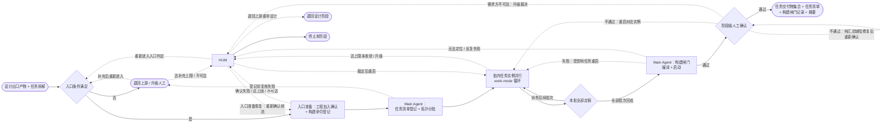

# 软件开发自动化工作流 —— 开发阶段

> 版本：v1.3
> 文档属性：skill 交付文件（阶段指令细则）
> 交付状态：已交付至 skill 根目录 `development-stage.md`（文件名去编号；后迁移至 `references/` 目录，仅元数据同步）；经 work-mode 双视角评估定稿（评分轨迹：R1 8/7 → R2 9.5/7 → R3 8/7 → R4 7.5/6.5 → v0.5 减法轮 → R5 8/7 → R6 8/7 → R7 9.5/7 → R8 8.5/7.0 → R9 9.5/9.0 收敛，定稿前修 2 条建议项）并经人工确认定稿；草稿 `docs/06-development-stage.md` 于交付时删除
> 对齐基准：`work-mode.md` v1.9；`context-system.md` v2.3.7；`requirements-stage.md` v0.8.10；`design-stage.md` v0.9.5
> 定位：四大阶段（需求 / 设计 / 开发 / 测试）中的**第三阶段**，将设计方案与任务拆解转化为可编译、可启动的工程实现
> 关键约定：本阶段的迭代细化以 `work-mode.md`《执行者-评估者-仲裁者工作模式》（位于 `references/` 目录，以下简称《工作模式》）实例化运行；本文只定义开发阶段实例化时注入的参数与细化规则，凡未定义的机制（角色契约、独立性原则、收敛判定、异常处理、归档命名、报告结构等）一律以《工作模式》为准
>
> 版本演进留痕：本文版本演进注释已迁移至 skill 的版本迭代组件（references/version-evolution.md，含总账与 changelog 明细指针），头部仅保留当前版本与对齐基准

---

### 1. 阶段目标

将设计阶段出口的任务拆解转化为**可运行的工程实现**，满足：

- **任务完成**：任务清单全部任务定稿，每个任务的代码变更与任务定义一一对应；
- **实现忠实**：代码实现与设计方案（架构设计 / 详细设计 / API 契约）逐条对应，无擅自变更设计结论；
- **需求承载**：每个需求功能点（REQ-NNN）经任务关联获得代码承载，追溯链 REQ-NNN ↔ TSK-NNN ↔ 代码变更完整；
- **可运行**：阶段出口时项目编译通过且可启动（阶段闸门，§5.4）；
- **回归保持**：改动型/问题修复型需求的回归边界行为逐条保持（源于需求稿约束段与现状分析记录）。

---

### 2. 定位与关系

| 对象 | 关系 |
| --- | --- |
| `work-mode.md`（执行者-评估者-仲裁者工作模式） | 本细则 §5.5 的各任务实例按该模式实例化运行；本细则未定义的机制一律以该文件为准 |
| 上游：设计阶段 | 入口输入为设计阶段出口产物（《设计阶段》§3 输出）：设计方案集合与摘要 + 任务拆解；任务拆解是任务清单登记的**唯一权威来源**（《上下文体系》§5.2、《设计阶段》§2） |
| 下游：测试阶段 | 本阶段出口产物（各任务定稿交付物与摘要、任务清单、构建闸门记录）按《上下文体系》§8.4 测试入口契约移交；测试阶段发现的缺陷经《上下文体系》§8.2 缺陷修复回退重新激活对应任务实例（本侧承载见 §7.2） |
| `context-system.md`（上下文体系） | 任务清单结构（§5.2）、任务指令派生（§6）、上行反馈四通道（§8.2）、阶段内实例并行规则（§9.2）、事件写入映射（§9.4）一律以该文件为准；本细则对其约定**只收紧不放松** |

---

### 3. 输入与输出

| 方向 | 内容 |
| --- | --- |
| 输入 | ① 设计出口契约产物（《上下文体系》§8.4：设计方案集合与摘要 + 任务拆解（独立产物））+ 经需求层索引传递的需求层内容（《上下文体系》§5.1：需求层摘要 + 需求定稿产物摘要 + 未决项 + 假设登记）+（改动型/问题修复型）现状分析记录（《上下文体系》§5.2，需求阶段阶段层文件，由 Main Agent 摘取摘要注入）；② 入口确认记录（§5.1，Main Agent 登记）：工作空间工程清单用户确认结论 + 构建/启动命令登记 + 技术栈基线（语言/框架版本与依赖清单，§4.1） |
| 输出 | ① 各任务定稿交付物与摘要（代码变更已落实于目标工程，归档存交付物文档 `tsk-NNN.md`，§4.2）；② 任务清单（`task-manifest.json`，状态全部「定稿」）；③ 构建闸门记录（§4.3）；④ 阶段定稿摘要（要素：任务总数与定稿数、构建闸门结论、需求条目承载核对结论、未决项数量、回归边界保持结论（如适用，由 Main Agent 依据 §7.4 回归边界分配核对结论汇总产生）） |

**归档约定**：执行《工作模式》§10.5（含每轮交付物与摘要保留完整副本）；实例归档于 `stages/301-development/instance-tsk-NNN/`（《上下文体系》§4，任务与实例 1:1，目录以任务 ID 命名，阶段目录命名遵循《上下文体系》§4 `301-development/` 编号），阶段层结构同构于需求阶段。**阶段定稿产物**——每任务定稿后由 Main Agent 整理交付物至 `stages/301-development/tsk-NNN.md`（按 §4.2 模板实例化）；各产物按 §7.4 阶段级人工确认通过后由 Main Agent 在需求级 `<req-id>/docs/` 下创建同名软链接（`docs/task-tsk-NNN.md` → `stages/301-development/tsk-NNN.md`，《上下文体系》§4、§11.10），阶段未启动时不创建悬空软链接。

**代码即产物**：任务实例的执行者直接修改目标工程代码，代码变更本身是交付物的实质内容；实例归档目录存放的是交付物文档（变更说明、验证证据、摘要，§4.2），不复制代码全文——代码以工程内路径引用（《上下文体系》§7 引用优先）。

---

### 4. 交付物模板

各产物模板如下；任务实例内执行者每轮输出的交付物外层按《工作模式》§10.4 五段结构参照组织（标题、正文、变更说明、摘要、未落实项声明），「正文」按 §4.2 模板组织。

#### 4.1 入口确认记录（阶段层文件，非 work-mode 交付物）

由 Main Agent 在入口准备中登记维护（§5.1），结构固定：

1. **工作空间工程清单**：工程名、工作空间内路径、用途（目标工程 / 依赖工程），附用户确认原话与确认时间；
2. **构建/启动命令登记**：构建命令、启动命令、来源标注（Main Agent 探查 / 用户问询），探查依据（README / 构建脚本 / 包管理配置路径）或问询记录；
3. **技术栈基线**：各目标工程的语言与运行时版本、框架及主版本、依赖清单与锁定版本（探查来源：包管理配置与锁文件）；用途——注入实例供执行者比对工程实际版本，避免引入不适配三方包与使用错误版本的类/接口/语法；适配错误由构建闸门客观验证兑底（§5.4）；
4. **人工裁定段**（如有人工裁定）：问题 → 裁定结论 → 时间，来源标注（人工裁定 / 人工裁定·迭代期，覆盖入口条件裁定、§5.1 入口准备裁定、§5.4 闸门定位裁定、§7.3 迭代期裁定与 §7.2 缺陷重新归因裁定），及「已确认」状态标注（§7.4）。本段创建时机前移：入口条件（G0）升级即发生人工裁定时，入口确认记录即予创建以承载登记。

#### 4.2 任务实例交付物

正文六段：

1. **变更文件清单**：文件路径、变更类型（新增 / 修改 / 删除）、对应任务改动范围声明（与任务清单改动范围字段一致，超出即属范围变更，须经追加约束重启）；
2. **实现说明**：关键实现决策与设计方案对应关系——架构设计模块归属、详细设计条目落实、API 契约实现映射（引用接口 ID `API-NNN`）；与设计结论不一致处逐条显式声明理由（不声明视为擅自变更设计）；
3. **需求承载对应**：关联需求条目 ID（REQ-NNN）逐条说明代码承载位置（文件/入口级定位）；
4. **验证证据**：与任务定义对应的客观验证项及结论（构建通过、自测用例运行结果、本地启动验证等，按任务定义适用项逐项给出命令与输出摘要；验证失败不得定稿）；
5. **回归边界落实**（改动型/问题修复型必备）：需求稿回归边界中与本任务相关条目的逐条保持确认（保持机制与验证方式）；新增型需求本段说明改动范围对既有代码的影响面；
6. **未决项**（如有）：每条含关联条目 ID、当前假设与影响范围。

#### 4.3 构建闸门记录（阶段层文件，非 work-mode 交付物）

由 Main Agent 在构建闸门（§5.4）执行后登记，结构固定：构建命令与编译结论、启动命令与启动结论（可启动判据：进程正常拉起且无启动级错误）、证据摘要（命令输出要点）、失败时的受影响任务定位结论（如适用）、执行时间。

#### 4.4 阶段定稿摘要

要素要求见 §3 输出④；缺要素视为格式不合格，按《工作模式》§5 退回重出。

---

### 5. 执行流程

**图注**：每个任务实例（BN 内）按《工作模式》契约运行「执行-评估-仲裁」循环（画法比照《需求阶段》§5 图注 WM 区段，图中不展开）；任务实例收敛即定稿（不设任务级人工确认，§7.4），任务清单状态同步更新（《上下文体系》§5.2）；**实例启动前置条件检查**（含《工作模式》§9.5 前置检查）于每个实例启动前逐实例执行，不满足时升级 HUM，恢复后重新实例化或终止——该判定与回边为实例级机制，图中不展开；「终止本阶段」对应六类情形：入口达上限升级后人工裁定终止、工程清单确认升级后人工裁定终止（§5.1）、构建/启动命令问询升级后人工裁定终止（§5.1）、构建闸门升级后人工裁定终止（§5.4）、实例启动前置不满足升级后人工裁定终止（§5.5）、确认环节需求方不可达经裁决者裁定终止（§7.4）；确认环节需求方不可达经裁决者裁定「等待恢复」为暂停态，恢复后续接阶段级确认，不另画边（画法比照《需求阶段》§5 图注口径）；`BN` 为批内并行实例集合的代表画法，批间串行推进（§5.3）；`GATE -.失败：受影响任务重启.-> BN` 的受影响任务以闸门失败证据定位（§5.4），定位不了或反复失败升级 HUM；`CONF -.不通过：重启对应实例.-> BN` 代表重启受影响任务实例（图中以 BN 为代表画法）；纯汇总缺陷由 Main Agent 于实例外直接修复后经 `CONF -.不通过：纯汇总缺陷修复后重新确认.-> CONF` 自环边重新提交确认；测试阶段缺陷修复回退不经本图（跨阶段上行通道，自外部重新激活对应实例，§7.2）；上游经 `UP` 重新定稿后，本阶段经入口条件（G0）重新进入（§7.2 回退上游恢复语义）。

**HUM 出口流向代表画法声明**：`HUM -.裁定后重启.-> BN` 代表升级裁定后的实例级续流（覆盖追加约束重启、裁决权衡项裁定后满足收敛、接受当前产物等出口；实例级机制图中不展开）；`HUM -.入口准备恢复：重新确认续流.-> EP` 覆盖入口准备升级后用户补充重新确认（此时任务清单尚未登记，续流自 EP 重新经 TM）；入口达上限补充后重入经 `HUM -.重新进入入口判定.-> G0`。

**角色说明**：比照《需求阶段》§5 角色说明——「需求方」在入口确认（工程清单确认、构建命令问询）与阶段级确认（未决项假设接受意见）中提供信息，「人工裁决者」在流程异常或达上限时选择处置出口；两者可由同一人承担，职责与留痕不合并。

**入口条件**：设计阶段已定稿（阶段级人工确认通过），且设计出口产物齐备（设计方案集合与摘要、任务拆解）；不满足时不启动本阶段——由 Main Agent 退回上游补充，达补充上限（默认 **3 次**，可由编排者启动时调整）或上游不可达时升级人工，升级后人工可裁定**终止本阶段**（决策留痕，图中 `HUM --> END`）或待上游补充满足入口条件后**重新进入入口判定**（图中 `HUM -.重新进入入口判定.-> G0`）；裁定结论登记入口确认记录人工裁定段（此时入口确认记录即予创建，§4.1）并受 §7.4 强制确认约束。

**流程责任划分**：§5.1~5.2（入口准备、任务登记与分批）与 §5.4（构建闸门）由 **Main Agent（编排者）** 在 work-mode 实例**之外**完成，其质量不设独立评估循环——缺陷由阶段级人工确认与下游测试阶段暴露；§5.3、§5.5 的实例按《工作模式》契约运行。

#### 5.1 入口准备（Main Agent，实例外）

- **工作空间工程确认**（必备）：开发假定在当前工作空间执行（执行者直接读写工作空间内工程代码）；Main Agent 依据任务拆解的改动范围列出所需工程清单，**向用户确认是否已将全部相关工程加入工作空间**并取得书面结论；未确认或工程缺失时不得登记任务清单；确认结论登记入口确认记录（§4.1）；
- **构建/启动命令登记**：**探查优先 + 自动登记**——实例化前由 Main Agent 探查各目标工程的 README、构建脚本与包管理配置；探查成功时**自动登记**（来源标注「探查」，不经问询），探查无法确定时向用户问询（来源标注「问询」）；结论连同来源登记入口确认记录；命令缺失时构建闸门（§5.4）不可执行，故本项为任务登记前置；构建闸门为客观验证操作，探查登记的命令经闸门验证兑底；
- **技术栈基线登记**：与构建命令同源探查——Main Agent 探查各目标工程的包管理配置与锁文件（依赖清单与锁定版本）及语言/框架版本，登记入口确认记录（§4.1）；探查无法确定时并入既有问询统一处置（计入同一 3 轮上界）；目的：实例注入后执行者得以比对工程实际版本，避免引入不适配三方包、错误版本的类/接口/语法；
- **问询上界与停滞**：上述工程确认与命令探查（探查无法确定时问询）统一适用——默认 **3 轮**（可由编排者启动时调整）；达上限，或**本轮确认/问询未使任一待决项获得书面结论**（停滞），或需求方不可达 → 升级人工（图中 `EP -.确认失败 / 达上限 / 不可达.-> HUM`），人工裁定选项：① 用户补充后重新确认/给出命令结论续流（图中 `HUM -.入口准备恢复：重新确认续流.-> EP`）；② **终止本阶段**（决策留痕）；裁定结论登记入口确认记录人工裁定段并受 §7.4 强制确认约束；
- **公共上游包装配**：需求定稿产物摘要 + 设计方案集合摘要 + 任务拆解 + 未决项 + 假设登记 +（改动型/问题修复型）现状分析记录摘要 + 入口确认记录（含技术栈基线，§4.1）；实例假设注入按《上下文体系》§6.2 执行并登记上游关联假设。

#### 5.2 任务清单登记与拓扑分批（Main Agent，实例外）

- **登记**：依设计阶段任务拆解逐条登记 `task-manifest.json`，字段一一对应（《上下文体系》§5.2），另补对应实例 ID（`instance-<task-id>`）与初始状态「待启动」；登记前复核任务拆解客观自检结论（依赖无环、无悬空引用、无未声明重叠，《设计阶段》§4.6）与**任务清单非空**（任务数为零意味着需求承载核对有误，退回上游由设计阶段重审，不在开发阶段空转）与**依赖引用有效性**（前置依赖引用均为本次登记清单内有效条目）与**残留承载完整**（仅重入场景：新拆解对已落地代码变更逐条承载，见 §7.2），复核失败退回上游（图中 BACK 语义）；任务 ID 一经登记跨轮持久，变更仅可追加；
- **拓扑分批**：按前置依赖关系拓扑分层——前置依赖全部定稿的任务进入当前批次；批内任务无相互依赖，**批内并行、批间串行**（并行执行《上下文体系》§9.2 阶段内实例并行规则）。

#### 5.3 批内实例编排

批次内各任务实例同时启动（并行规则：上下文包装配、评估派发与仲裁逐实例独立，不共享在途状态，《上下文体系》§9.2）；实例启动时任务清单状态置「执行中」（《上下文体系》§5.2）；本批全部实例定稿后方可启动下一批；任务实例定稿即任务清单状态置「定稿」（不经任务级人工确认，§7.4）。**批内升级调度**：单个实例升级人工等待裁定期间，同批其他实例独立继续推进（并行规则不变），批次推进等待全部定稿或终止裁定。

#### 5.4 构建闸门（Main Agent，实例外）

全部任务定稿后，Main Agent 依入口确认记录登记的命令执行：① 编译（全部目标工程）；② 启动（进程拉起且无启动级错误）；结论与证据摘要登记构建闸门记录（§4.3）。**失败处置**：依据失败证据（编译错误定位、启动异常栈）定位受影响任务，以失败证据为附加约束按追加约束重启对应实例（图中 `GATE -.失败.-> BN`），重启定稿后重跑闸门；无法定位或同一闸门连续 **2 次**失败仍不通过 → 升级人工（人工裁定：给出定位结论续流 / 终止本阶段）；裁定结论登记入口确认记录人工裁定段并受 §7.4 强制确认约束。构建闸门为客观验证操作，不设独立评估循环。

#### 5.5 任务实例工作模式细化（执行-评估-仲裁循环）

每个任务实例以《工作模式》实例化运行。实例化上下文包如下：

**任务指令（任务级，派生规则执行《上下文体系》§6.1）**：

| 项 | 内容 |
| --- | --- |
| 任务目标 | 任务清单中该任务的任务定义（《上下文体系》§6.1：开发阶段实例目标 = 任务定义） |
| 上游产物摘要 | §5.1 公共上游包 + 本任务关联的设计方案定稿摘要（架构/详细设计相关模块段 + 关联接口 ID 的契约段）+（前置依赖任务）前置任务交付物摘要，由 Main Agent 装配 |
| 验收标准 | §1 阶段目标 + §6 本实例评估视角与评分标准 |
| 约束 | 需求稿约束段逐条引用 + 设计方案定稿结论 +（改动型/问题修复型）回归边界与现状分析结论（硬约束）+ 入口确认记录（构建/启动命令） |
| 范围 | 任务清单改动范围字段（超出即范围变更，须经追加约束重启） |

重入场景（§7.2 回退上游恢复语义）下，任务指令另注入**工程现状声明**：工作空间内已落地变更清单（含原清单实例已定稿与已中止任务的代码变更），执行基线以工程现状为起点，新任务的验证证据针对增量与现状整体。

**模式参数（实例级，对应《工作模式》§9.2 八类参数）**：

| 参数 | 注入值 |
| --- | --- |
| 评估视角集合 | 需求覆盖视角 + 实现忠实视角（§6） |
| 收敛阈值 | 8 / 10（默认值；下文凡引用阈值均指本注入值） |
| 迭代上限 | 5 轮（覆盖《工作模式》默认 10 轮；理由：代码任务以验证证据为客观反馈，收敛路径明确；达上限未收敛通常指示任务粒度或设计问题，升级人工） |
| 归档位置 | `stages/301-development/instance-tsk-NNN/`（§3 归档约定） |
| 交付物模板 | §4.2 任务实例交付物模板（外层按《工作模式》§10.4 五段结构参照组织） |
| 规划阶段开关 | 显式采用默认值（启用，《工作模式》§9.2 默认）：代码实现任务含多文件改动与顺序依赖，规划阶段提供实施步骤拆解 |
| 规划阶段迭代上限 | 显式采用默认值（3 轮，《工作模式》§9.2 默认） |
| 能力清单 | 显式采用默认值（空，角色自行从运行时上下文发现，见 §9.6） |

**角色配置**：

| 角色 | 承担者 | 本阶段说明 |
| --- | --- | --- |
| 执行者 | 独立 Subagent | 按任务指令直接修改目标工程代码并产出交付物文档；第 2 轮起接收上一轮整合意见；能力要求与降级策略见《工作模式》§9.4 |
| 评估者 | 独立 Subagent，每视角一个 | 可见信息范围按《工作模式》§2：评估标准 + 交付物本身（含当轮摘要）+ 上游摘要 + 输出格式要求；不可见执行过程与其他视角报告；评估代码变更时按交付物路径引用读取工程代码 |
| 仲裁者 | Main Agent | 按《工作模式》§2.2 约束运行；并行实例的仲裁逐实例独立完成 |

**实例化前置条件**：执行《工作模式》§9.4 前置条件与降级策略（评估者不可降级、Main Agent 不得兼任）与 §9.5 前置检查；环境不满足（含工作空间内目标工程不可访问）时本实例**不可启动**，升级人工，恢复路径二选一：环境满足后重新实例化，或终止本阶段（决策留痕登记阶段上下文，§7.4）。

**循环出口**：收敛 → 实例定稿（任务清单状态「定稿」）；未收敛且未达上限 → 整合意见回传执行者；触发升级条件 → 升级人工（见 §7.2）。

---

### 6. 评估视角与评分

各任务实例注入两视角（§5.5 模式参数表）；评估对象为交付物正文及其当轮摘要（代码变更经交付物路径引用核验）；评估者报告结构遵循《工作模式》§10.6。**一致性基线**：与需求定稿产物摘要、任务关联的设计方案定稿摘要、前置任务交付物摘要、入口确认记录的对齐以任务指令注入的上游摘要为准。

**阶段目标覆盖映射**（评估标准对 §1 阶段目标的承接关系，满足《工作模式》§10.3 评估标准的任务覆盖要求）：

| §1 阶段目标 | 承接视角与维度 |
| --- | --- |
| 任务完成 | 需求覆盖视角·条目覆盖（任务定义逐项落实） |
| 实现忠实 | 实现忠实视角·设计忠实 |
| 需求承载 | 需求覆盖视角·条目覆盖 + 交付物「需求承载对应」段 |
| 可运行 | 不进实例评估——由 §4.2 验证证据段与 §5.4 构建闸门承接（实例外编排职责） |
| 回归保持 | 实现忠实视角·回归保持 + 交付物「回归边界落实」段 |

#### 6.1 需求覆盖视角（视角 ID：`coverage`）

| 评估维度 | 关注要点 | 分值 |
| --- | --- | --- |
| 条目覆盖 | 任务定义是否逐项落实为代码变更；关联需求条目是否均有承载位置；遗漏的场景、边界条件是否补全 | 4 |
| 一致性 | 与上游摘要及前置任务结论是否对齐；摘要与正文一致且要素齐全 | 3 |
| 约束符合 | 需求稿约束段相关条目是否逐条回应 | 3 |

#### 6.2 实现忠实视角（视角 ID：`fidelity`）

| 评估维度 | 关注要点 | 分值 |
| --- | --- | --- |
| 设计忠实 | 实现与架构/详细设计逐条对应；API 契约实现映射无悬空接口 ID；与设计不一致处是否显式声明理由 | 4 |
| 验证充分 | 验证证据与任务定义对应且结论客观（命令 + 输出摘要）；验证失败项是否闭合 | 3 |
| 回归保持 | 改动型/问题修复型：回归边界相关条目逐条保持确认；新增型：改动范围对既有代码的影响面说明是否充分 | 3 |

各视角总分 10 分；评分逐维度给出分值与依据。

---

### 7. 收敛与异常

#### 7.1 收敛判定

各实例的收敛判定、收敛建议规则、未收敛时的处理均执行《工作模式》§6；迭代上限为 §5.5 注入值（5 轮），达上限未收敛即升级人工。**跨任务一致性不设独立评估循环**：并行任务间的冲突（同一文件竞争、接口实现不一致）由构建闸门与阶段级人工确认暴露，按 §7.2 追加约束重启受影响实例。

#### 7.2 升级人工出口在本阶段的映射

升级材料包规范按《工作模式》§6 执行。四个出口在本阶段的处置如下：

| 出口 | 本阶段处置 |
| --- | --- |
| 追加约束重启 | 轮次重置，新约束并入任务指令后重启本实例循环；**设计稿缺陷**（开发中发现设计方案或任务拆解有误/遗漏）经本出口承载时，同步触发《上下文体系》§8.2 目标失效上报——回退设计阶段的裁定权归人工 |
| 接受当前产物 | 仅在人工明确授权时使用；定稿后经阶段级人工确认方随阶段出口 |
| 回退上游 | 设计定稿产物存在阻断级缺陷且无法以追加约束承载时使用：经《工作模式》§6 回退设计阶段（设计阶段重新激活并接收本实例仲裁记录，见《上下文体系》§8.2）。**恢复语义**：触发实例按《工作模式》§6 终止，本阶段本轮一并终止——运行中实例即行中止，其轮次产物留痕；**代码变更保留为工程现状，不主动回滚**——工作空间内已落地代码变更构成新实例的执行基线，由新任务拆解通过 §5.2「残留承载完整」复核逐条承载（吸收 / 专设任务显式清理 / 保留现状并说明理由，未承载者复核失败退回上游）；已定稿任务交付物与代码变更状态留痕于阶段上下文，未启动实例不再启动，暂停与终止决策留痕；设计阶段重新定稿后，本阶段经入口条件（图中 G0）重新进入，**任务清单全量重新登记**：依新任务拆解逐条重新登记（登记复核增列**残留承载完整**——复核对象为工作空间内全部已落地代码变更，新拆解逐条承载：由新任务吸收 / 专设任务显式清理 / 保留现状并说明理由，未承载者复核失败退回上游，§5.2）；**任务 ID 编号**：任务 ID 由设计侧拆解按《设计阶段》§4.6 规则分配（顺序编号、唯一、永不复用），设计侧重入时自原拆解最大编号续编（《上下文体系》§5.2）；**续编输入通道**：回退上游时 Main Agent 将上一代任务拆解归档引用与原拆解最大编号注入设计阶段重激活输入（经《上下文体系》§8.2 回退通道随仲裁记录一并传递）；开发侧登记维持一一对应，前置依赖引用即为本轮拆解内有效条目（《上下文体系》§5.2 跨轮持久与仅追加的适用）；被替代的原清单按代编号转只读归档成链，留痕且不参与分批、闸门与出口判定；工作空间工程现状（含原实例已落地的代码变更）为新实例的执行基线，任务指令注入**工程现状声明**（已落地变更清单，§5.5）；暂停/终止留痕仅供回溯，不产生恢复通道（图中 `UP`）。**下游处置**：回退发生时视同触发《上下文体系》§8.2 目标失效上报（需求层阻塞项同步登记） |
| 裁决权衡项 | 执行《工作模式》§6；裁定后满足收敛判定的，实例定稿进入批次推进 |

**缺陷修复回退**（源自测试阶段，《上下文体系》§8.2）：测试阶段缺陷经任务清单关联到任务 ID 后，Main Agent 校验该 ID 为**出口时任务清单的有效条目**，不是的升级人工重新归因（裁定结论登记入口确认记录人工裁定段并受 §7.4 强制确认约束）；校验通过后以缺陷描述为追加约束重新激活对应实例（轮次重置、已落盘归档只读保留、新轮次目录续编），任务清单状态置「修复中」；修复收敛后状态回「定稿」并回写复验结论；被激活实例若处于本阶段已定稿状态，其重启不影响其他已定稿任务，修复定稿后**一律重跑构建闸门**（编译 + 启动全量）；**多缺陷合并规则**：同一任务关联多条缺陷的，合并入同一次激活的追加约束集合；实例已处「修复中」时后续到达的缺陷并入当轮追加约束集合（登记合并留痕，不重复轮次重置）；复验结论按缺陷逐条回写；**修复期强制确认解除**：修复收敛且闸门重跑通过后，若入口确认记录中存在未确认裁定记录，增设一次轻量阶段级确认（确认对象：修复交付物与摘要 + 未确认裁定记录），通过后对应记录标注「已确认」，义务解除；不通过时确认意见作为附加约束重启修复实例（比照 §7.4 不通过分支①），重新收敛并重跑闸门后再次提交轻量确认。

#### 7.3 迭代中新发现的阻断级疑问

实例评估或细化中新发现的阻断级疑问（实现路径无法定义 / 验证无法客观判定 / 与设计方案矛盾且无法自行消解）由仲裁者升级人工向需求方问询；结论以「追加约束重启」并入任务指令。**迭代期需求方不可达时**：升级人工裁决者替代问询，裁定结论登记入口确认记录「人工裁定」段（来源 = 人工裁定·迭代期），并受 §7.4 强制确认约束。

#### 7.4 人工确认（仅阶段级）

开发阶段仅设阶段级人工确认（任务实例收敛即定稿，不设任务级确认），位于 work-mode 实例之外，不改变实例内「交付决定权归属评估者」的契约：

- **确认对象**：任务清单整体（全部任务定稿、需求条目承载完整）+ 构建闸门记录（编译与启动结论）+ **跨任务一致性核对**（任务间接口实现、共享文件改动的冲突核对，承接 §7.1 跨任务矛盾的发现职责）+ **回归边界分配核对**（改动型/问题修复型适用：回归边界条目逐条确认至少由一个任务的交付物第 5 段承载，未承载条目显式标注豁免理由）+ 各任务未决项的汇总状态；
- **通过** → 阶段定稿，Main Agent 按《上下文体系》§9.4 事件写入映射登记定稿产物索引（每任务交付物独立登记：`stages/301-development/tsk-NNN.md`），同步在需求级 `<req-id>/docs/` 下创建同名软链接（`docs/task-tsk-NNN.md` → `stages/301-development/tsk-NNN.md`，《上下文体系》§4、§11.10），产物按《上下文体系》§8.4 测试入口契约移交；
- **不通过** → 二分支处置：① 缺陷可定位到任务实例的，确认意见作为附加约束按追加约束重启对应实例，重启定稿后一律重跑构建闸门（编译 + 启动全量），再重新提交确认；② **纯汇总缺陷**（不可定位到任务实例的阶段层产物缺陷，如摘要誊写错误、任务清单状态与落盘不符）由 Main Agent 直接修复并重新提交确认。

**通用规则**（适用于本节及 §7.2 轻量阶段级确认）：

- **角色归属**：「通过 / 不通过」决定由人工裁决者作出；未决项假设接受意见向需求方征询（角色边界见 §5 角色说明）；
- **不可配置关闭**：阶段级确认不可配置关闭；
- **需求方不可达**：确认环节需求方不可达 → 升级人工裁决者，裁决者选择等待恢复（暂停留痕）或终止本阶段（决策留痕）；未确认内容在取得确认前不得流入下游（即使终止也不产生阶段定稿）；
- **强制确认**：触发锚点为**入口确认记录中未经需求方确认的人工裁定记录**，显式枚举全部来源：入口条件（G0）升级裁定、§5.1 入口准备裁定、§5.4 闸门定位裁定、§7.3 迭代期裁定、§7.2 缺陷重新归因裁定；**下列实例级升级裁定不入锚点**（显式豁免）：实例达上限/停滞/权衡项升级及实例启动前置不满足升级（§5.5）；裁定留痕分承载——前组由实例仲裁记录承载（《工作模式》§6、§10.5），后者发生于实例启动之前、尚无仲裁记录，留痕登记于阶段上下文阶段级事件（《上下文体系》§5.2）；阶段级确认不可配置关闭且确认对象覆盖任务清单整体，承接其确认义务，且前置裁定不产生流入下游的需求侧内容（终止亦不产生阶段定稿），不附强制确认义务，故不重复纳入锚点；存在任一未确认记录时本次交付必须经人工确认；确认通过且征询结论留痕后，对应记录标注「已确认」，不再触发强制确认义务（语义比照《需求阶段》§7.4 确认状态与解除）。
