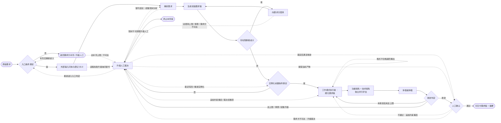

# 软件开发自动化工作流 —— 需求阶段

> 版本：v0.8.9
> 文档属性：skill 交付文件（阶段指令细则）
> 交付状态：已交付至 skill 根目录（后迁移至 `references/` 目录，仅元数据同步）；经 work-mode 四轮双视角评估定稿（评分轨迹 10/7 → 8.5/9 → 9.5/10 → 10/9），并经人工确认定稿
> 定位：四大阶段（需求 / 设计 / 开发 / 测试）中的**第一阶段**，将原始需求转化为可交付需求稿
> 关键约定：本阶段的迭代细化以 `work-mode.md`《执行者-评估者-仲裁者工作模式》（位于 `references/` 目录，以下简称《工作模式》）实例化运行；本文只定义需求阶段实例化时注入的参数与细化规则，凡未定义的机制（角色契约、独立性原则、收敛判定、异常处理、归档命名、报告结构等）一律以《工作模式》为准
>
> 版本演进留痕：本文版本演进注释已迁移至 skill 的版本迭代组件（references/version-evolution.md，含总账与 changelog 明细指针），头部仅保留当前版本与对齐基准

---

### 1. 阶段目标

将原始需求（用户陈述、工单、口头转述等）转化为**可交付需求稿**，满足：

- **完整性**：功能点、约束、非功能要求均已识别并记录；
- **可验证性**：每个功能点均有明确的验收标准；
- **可行性**：技术视角确认无阻断级技术障碍；
- **无歧义**：所有歧义均已澄清，无未决的阻断级疑问。

---

### 2. 定位与关系

| 对象 | 关系 |
| --- | --- |
| `work-mode.md`（执行者-评估者-仲裁者工作模式） | 本细则 §5.5 的细化循环按该模式实例化运行；本细则未定义的机制一律以该文件为准 |
| 下游：设计阶段 | 本阶段产物（可交付需求稿及其摘要）作为设计阶段输入；下游仅引用摘要，按需读取全文；功能点条目 ID 作为跨阶段追溯锚点；**需求级类型**随摘要传递下游、**条目级类型**随定稿产物正文（§4 功能点清单）传递（下游按需读取全文获得），作为阶段属性供下游细则差异化处置（分类的下游后果不在本细则定义） |

---

### 3. 输入与输出

| 方向 | 内容 |
| --- | --- |
| 输入 | 原始需求描述（用户陈述、工单文本、口头转述、参考资料等）；可选：既有工程访问条件（代码库访问、运行环境——改动型 / 问题修复型的现状分析依赖，见 §5.2）；可选：外部输入注入（已有需求稿、需求稿模板，见 §5.0） |
| 输出 | ① 阶段定稿产物 `requirements.md`（按 §4 可交付需求稿模板实例化的正式文档，**无论是否注入外部稿均须生成**，见 §5.0）；② 需求稿摘要（由执行者每轮同步生成，供下游设计阶段引用，要素要求见下） |

**摘要要素要求**：需求稿摘要为下游默认引用物，必须包含且仅包含以下要素——核心目标（一句话）、需求类型（新增型 / 改动型 / 问题修复型）、功能点条目 ID 范围与总数、关键约束（逐条一句话，改动型/问题修复型含回归边界要点）、关键技术风险（逐条一句话，如有；摘要仅列风险一句话，对策与详情以正文第 5 段为准）、未决项数量、本轮主要变更。缺要素的摘要视为交付物格式不合格，按《工作模式》§5 退回重出。

**归档约定**：执行《工作模式》§10.5（含每轮交付物与摘要保留完整副本）；阶段定稿产物 `requirements.md` 由 Main Agent 在 §7.4 阶段级人工确认通过后落盘到 `stages/101-requirements/requirements.md`（阶段目录命名遵循《上下文体系》§4 `101-requirements/` 编号），同步在需求级 `<req-id>/docs/` 下创建同名软链接（`docs/requirements.md` → `stages/101-requirements/requirements.md`，《上下文体系》§4、§11.10），阶段未启动时不创建悬空软链接。

---

### 4. 可交付需求稿模板

执行者每轮输出的需求稿正文按以下结构组织（顺序固定），外层按《工作模式》§10.4 五段结构参照组织（标题、正文、变更说明、摘要、未落实项声明）；**提供需求稿模板时的优先级规则见 §5.0**（模板决定正文结构组织，强制追溯要素缺失时以独立小节补齐）：

1. **需求概述**：一句话描述本需求的核心目标与业务价值；含**需求类型**（新增型 / 改动型 / 问题修复型）与一句话判定依据（§5.1）；
2. **功能点清单**：逐条列出功能点，每条含：
   - **条目 ID**（必填，格式 `REQ-NNN`，按分配顺序顺序编号，新增条目自当前最大编号续编；条目 ID **跨轮持久**，一经分配不复用、不重排，删除的 ID 留空；验收标准、技术风险、未决项均须引用条目 ID）；
   - 功能描述（系统应做什么）；
   - **条目类型**（必填：新增 / 改动 / 修复——条目级类型标注，验收附加项与回归边界的差异化施加依据，见 §5.1 混合需求双层类型机制；未显式标注时按需求级类型默认；**需求级类型为改动型/问题修复型时，条目内容具备新增性质（不引用、不改变既有行为）的必须显式标注为新增，不适用默认**；无法判断条目性质时按阻断级歧义处置，见 §5.4）；
   - 验收标准（如何验证该功能已实现，与条目 ID 一一对应）；
   - **优先级**（必填：P0/P1/P2；未显式标注时默认 P2。语义：**P0** = 核心流程，必须交付，缺失即需求不成立；**P1** = 重要功能，本期应交付；**P2** = 一般功能，可延期）；
3. **约束与非功能要求**：业务规则、合规要求、性能/安全/可用性指标等；改动型/问题修复型必含**回归边界**（保持不变的既有行为清单，逐条源于现状分析记录 §5.2，标注关联条目 ID）；
4. **歧义澄清记录**（引用制）：澄清记录全文由 Main Agent 持久维护于固定归档位置，此处给出归档路径引用 + 本轮新增条目摘要（问题 → 结论 → 时间；含降级处置记录与人工裁定记录）；
5. **技术风险与对策**（如有）：已识别的关键技术风险及应对方案，逐条标注关联条目 ID；
6. **未决项**（如有）：遗留的非阻断级疑问或待后续阶段确认的事项，每条含关联条目 ID、**来源**（降级阻断级歧义 / 普通非阻断级）、当前假设与影响范围。持久性约束见 §7.4 强制确认。

---

### 5. 执行流程

**图注**：`Q0` 为外部输入问询与登记（§5.0，Main Agent 实例外），读取失败升级询问替代经 `Q0 -.读取失败升级询问替代.-> HUM` 入边，裁定后续流回 Q0（图中不展开，处置见 §5.0）；「裁决权衡项」裁定后处置细则见 §7.2；「退回重出」连续 2 次仍不合格升级人工，见《工作模式》§7；「重新进入入口判定」对应入口退回升级后需求方补充满足条件的情形（见入口条件段）；「终止本阶段」对应入口达上限、前置不满足升级后人工裁定终止、确认环节需求方不可达经裁决者裁定终止（§7.4）、以及现状不可获取裁定终止（§5.2 出口③）四类情形；「确认环节需求方不可达」经 HUM 升级裁决后按 §7.4 处置（「等待恢复」为暂停态，不另画边）；「现状不可获取」升级人工经 `A1 -.现状不可获取升级人工.-> HUM` 入边，裁定三出口（等待恢复 / 替代结论 / 终止）见 §5.2（等待恢复为暂停态，不另画边；替代结论经 `HUM -.替代结论：续做现状分析.-> A1` 回路续接原流程）；WM 区段（WM1–WM4）为工作模式实例内执行阶段的代表画法，实例内另含规划阶段（依《工作模式》§4，规划阶段开关见 §5.5 模式参数表）。

**角色说明**：本细则中「需求方」与「人工（裁决者）」是两个独立的角色定义——**需求方**是需求信息源，回答「需求应该是什么」（澄清问答，结论写入澄清记录）；**人工裁决者**是流程决策者，在流程异常或达上限时选择处置出口（§7.2 四出口，决策写入仲裁记录）。运行时两者**可由同一人承担**，此时交互通道可合并，但**职责与留痕不合并**；真实分发环境下两者也可分别由不同人员承担（如需求方为客户或产品团队，裁决者为流水线值守人）。

**入口条件**：原始需求文本可读取，且含至少一条可识别的功能意图；不满足（空文本、内容缺失、仅只言片语无法识别意图）时不启动本阶段——由 Main Agent 退回需求方补充，需求方不可达时升级人工。**退回补充上界**：退回补充默认上限 **3 次**（可由编排者在启动时调整）；达上限仍不满足入口条件 → 升级人工，升级后人工可裁定**终止本阶段**（决策留痕，图中 `HUM --> END`）或待需求方补充满足入口条件后**重新进入入口判定**（图中 `HUM -.重新进入入口判定.-> G0`）。

**流程责任划分**：§5.0~5.4（外部输入登记、解析与分类、现状分析、初始稿、歧义澄清）由 **Main Agent（编排者）** 在工作模式实例**之外**完成，其质量不设独立评估循环——初始需求稿的缺陷作为 work-mode 实例的起点输入，由循环内的双视角评估暴露并经整合意见吸收；§5.5 起进入工作模式实例，角色与独立性按《工作模式》契约运行。

#### 5.0 外部输入问询与登记（Main Agent，实例外）

入口条件满足后、解析前，Main Agent 逐项询问用户是否提供两类可选外部输入，提供时输入**本地路径或 URL**，结论登记入阶段层**外部输入登记**（与澄清记录同级的固定归档位置）：

- **① 已有需求稿**（markdown 文件或 URL）：提供时本阶段**仍须产出阶段定稿产物 `requirements.md`**（无论是否注入外部稿，§3 输出①、§5.3 初始稿、§7.4 阶段定稿为强制路径，不可跳过）。外部稿作为输入参考，按以下口径转化整合到阶段定稿——**条目编号化**（REQ-NNN，跨轮持久、跨阶段引用）、**需求三分类判定**（§5.1，需求级 + 条目级双层类型机制）、**约束段与验收标准提取**、**歧义点进澄清流程**（§5.4）；**澄清结论派生的条目与强制要素补齐项**逐条标注来源（原需求稿已含 / 澄清派生 / 强制要素补齐）；**不擅自新增功能点**——原稿未含的功能点不引入（例外：澄清结论派生的条目与强制要素补齐项须逐条标注来源）；原稿缺失的强制追溯要素按 §4 补齐为独立小节；
- **② 需求稿模板**（markdown 文件或 URL）：提供时需求稿正文结构按模板组织（**模板优先**），但强制追溯要素——条目 ID（REQ-NNN）、条目类型与优先级、验收标准、约束段（含回归边界如适用）、未决项来源标注——在模板中缺失时以独立小节补齐（保证下游追溯链不断）；§4 内置模板退为未提供模板时的默认；
- **读取失败处置**（路径不可读 / URL 无法访问或解析失败）：升级询问用户三选一——改提供本地路径 / 粘贴正文 / 视为未提供继续；处置结论登记外部输入登记（人工裁定条目，受 §7.4 强制确认约束）；
- **注入方式**：已有需求稿与模板均经任务指令上游产物摘要引用注入（§5.5，路径/URL 与登记结论随引；Subagent 不得自行跨阶段或跨环境读取）；两项均未提供时按既有流程执行，零额外开销；
- **强制生成原则**（v0.8.9 增）：无论外部稿是否注入、是否可读、是否被采纳为原稿，阶段定稿产物 `requirements.md` 必须生成并经 §7.4 阶段级人工确认通过——这是下游设计阶段、设计阶段后续实例（UI / API / 前后端）以及开发阶段任务拆解的**唯一权威需求来源**（§3 输出① + §5.3 初始稿 + §7.4 定稿登记三段构成"强制路径"，缺一段即视为阶段未完成）。外部稿仅作为输入素材被整合到 `requirements.md` 正文中，不替代阶段定稿产物本身。

#### 5.1 解析需求与需求分类

对原始需求进行结构化解析，识别以下要素：

- 功能点（用户期望系统做什么）；
- 约束条件（业务规则、合规要求、时间窗口等）；
- 非功能要求（性能、安全、可用性等）；
- 隐含假设（需求方未明说但默认成立的前提，须显式登记并标注「假设」）。

**需求分类（三型）**：解析时同步判定需求类型，作为后续现状分析、评估基准与验收附加项的分支依据：

| 类型 | 判定锚点 |
| --- | --- |
| 新增型 | 构建当前不存在的功能，不以修改既有行为为前提；涉及既有模块时仅为集成接口 |
| 改动型 | 需求引用并意图**改变**既有行为（「把 A 改成 B」） |
| 问题修复型 | 需求陈述了**缺陷现象**（错误、异常、不符合预期），意图为恢复既有行为的正确性而非增强 |

**判定规则**：类型重叠时按「问题修复型 > 改动型 > 新增型」从严取型（修复本质是对既有行为的变更）。**分类存疑按阻断级歧义处置**（阻断级指定见 §5.4 除外款，澄清规则见 §5.4）：分类直接影响约束、验收与评估基准，Main Agent 无法自判时向需求方澄清；需求方不可达时人工裁定，裁定结论登记澄清记录并受 §7.4 强制确认约束。判定结论（类型 + 一句话判定依据）写入需求稿「需求概述」段；迭代中发现分类有误按追加约束重启修正，留痕仲裁记录。

**混合需求（双层类型机制）**：一次需求可同时包含新增与改动/修复内容，按双层处置——**需求级类型**按从严取型判定（混合需求必不为新增型），决定阶段级义务（是否执行现状分析 §5.2、评估信息依赖 §6.2）；**条目级类型**在功能点清单中逐条标注（新增 / 改动 / 修复，见 §4），验收附加项与回归边界按条目粒度差异化施加（§5.5）。**拆分建议**：新增与改动/修复部分相互无耦合且体量较大（参考锚点：两部分条目数均 ≥ 3，或现状分析覆盖模块互不重叠——新增侧无现状分析覆盖时，以其条目涉及模块（含集成面）参与比对）时，Main Agent 可建议拆分为多个单一类型需求分别启动流水线（各自独立隔离域）；存在耦合（新增功能依赖被改动的既有行为）或不满足体量锚点时不得拆分——拆分决定权归人工/需求方，建议与否及裁定结论登记澄清记录。

#### 5.2 现状分析（改动型 / 问题修复型必备）

判定为改动型或问题修复型时，Main Agent 在进入工作模式实例**之前**完成现状分析，产出**现状分析记录**（由 Main Agent 持久维护于与澄清记录同级的固定归档位置，供任务指令引用）：

- **分析深度**：允许**深入读码与运行验证**——不限于既有摘要，可阅读相关模块源码、运行验证脚本或复现操作；深度以覆盖改动影响面或定位缺陷机理为限，不做方案设计（方案设计归设计阶段）；
- **改动型必备内容**：相关模块、既有行为边界（不得破坏的现状行为）、依赖关系、预期改动影响面、现状假设（逐条标注「假设」）；
- **问题修复型必备内容**：在改动型内容基础上，增加缺陷现象、复现条件、**预期行为依据**（既有规格 / 约定 / 澄清结论）；预期行为依据不可得时按阻断级歧义处置（§5.4）；
- **现状不可获取**（工程访问受限、仓库不可达等）：登记为阻塞项，流程暂停并升级人工（呈交阻塞原因与替代建议）；人工裁定三出口：① **等待恢复**——访问恢复后续做现状分析（暂停留痕）；② **替代结论**——给出替代性现状结论或重分类为新增型（裁定结论登记为澄清记录「人工裁定」条目，受 §7.4 强制确认约束）；③ **终止本阶段**（决策留痕）。裁定不能补缺（现状确不可得）时仅 ①③ 可用；不得带未经裁定的现状缺口进入细化；
- **新增型不执行本节**，无额外开销。

**分析范围（混合需求）**：现状分析覆盖条目级类型为改动/修复的条目及其影响面；条目级类型为新增的条目无需现状依据，但与改动/修复部分存在集成面时，该集成面计入影响面。

现状分析由 Main Agent 在工作模式实例之外完成（属 §5 编排职责）；分析结论并入初始需求稿（现状假设显式标注后进入细化），现状分析记录引用注入任务指令上游产物摘要（§5.5）。

#### 5.3 生成初始需求稿

基于解析与现状分析结果，产出初始需求稿——即**阶段定稿产物 `requirements.md` 的起点版本**，后续经 §5.5 工作模式实例迭代细化收敛后定稿（提供已有需求稿时以原稿为基准按 §5.0 口径转化产出），结构包含：

1. **需求概述**：一句话描述本需求的核心目标，含需求类型与判定依据（§5.1）；
2. **功能点清单**：逐条列出识别的功能点；
3. **验收标准草案**：每个功能点对应的可验证标准；改动型/问题修复型另含缺陷消除验证与回归边界核验附加项（见 §5.5 验收附加项）；
4. **约束与非功能要求**：识别的约束与非功能性要求；改动型/问题修复型含**回归边界**（保持不变的既有行为清单，源于现状分析记录）；
5. **歧义清单**：尚未澄清的疑问（如有），逐条标注阻断级 / 非阻断级；
6. **未决项**（如有）：遗留的非阻断级疑问与降级歧义假设（含当前假设与影响范围；§5.4 降级产生的条目在此登记并标注来源）。

#### 5.4 歧义澄清

若初始需求稿中存在歧义或模糊点：

- 列出歧义清单（问题 + 影响范围 + 级别）；
- 由 Main Agent 向需求方提问澄清；
- 将澄清结果更新回初始需求稿，并保留澄清记录（问题 → 结论 → 时间；**重分级 / 降级结论与人工裁定结论亦须登记为澄清记录条目**）。

**阻断级判定锚点**：满足以下任一条件即判定为阻断级歧义——① 功能点的行为边界无法定义（做什么 / 不做什么无法回答）；② 验收标准缺失判定主体或预期结果，无法客观验证；③ 两个功能点或约束之间存在无法自行消解的相互矛盾。不满足上述锚点的歧义判定为非阻断级；**但下列情形为显式指定的阻断级情形，不适用前述非阻断级判定**：分类存疑（§5.1）、预期行为依据不可得（§5.2）、条目性质无法判断（§4）。

**阻断级歧义**：必须澄清后方可进入工作模式细化。**需求方不可达时**：将阻断级歧义登记为阻塞项，流程暂停并升级人工；人工介入后的处置集合与「达到上限 / 停滞」升级后的实例化前处置集合相同（见下文澄清循环边界段），不得带阻断级歧义进入细化。

**澄清循环边界**：澄清默认上限 **3 轮**（可由编排者在启动时调整）；达到上限，或**本轮澄清未使任何一条既有阻断级歧义获得澄清结论**（停滞）→ 升级人工：人工对剩余歧义重分级，可降级为非阻断级的按非阻断级处理进入细化（降级决定登记入澄清记录，其假设写入「未决项」并**标注来源为「降级阻断级歧义」**，见 §7.4 强制确认规则）；仍为阻断级的由人工裁决处置——**实例化前本阶段可用的处置集合**（§7.2 实例级出口集合不适用）：人工对剩余阻断级歧义的裁定结论**登记为澄清记录中的「人工裁定」条目**（问题 → 裁定结论 → 时间，来源 = 人工裁定），作为新约束写回需求稿后继续。人工裁定结论非需求方澄清结论，受 §7.4 强制确认约束，未经需求方确认不得定稿。

**非阻断级歧义**：不影响核心定义的细节疑问，不阻塞进入细化；执行者在细化时按当前最合理假设处理，并写入需求稿「未决项」段（含当前假设与影响范围），由评估者审视该假设的合理性。

**分类存疑的澄清**：需求分类无法自判（§5.1）时按阻断级歧义向需求方澄清；澄清结论登记澄清记录后重判类型，若导致类型变化（如改动型改判为问题修复型），同步补做或调整现状分析（§5.2）。

#### 5.5 工作模式细化（执行-评估-仲裁循环）

歧义澄清完成后，以《工作模式》实例化运行迭代细化。实例化上下文包如下：

**任务指令（任务级）**：

| 项 | 内容 |
| --- | --- |
| 任务目标 | 将初始需求稿细化为满足 §1 四项标准的可交付需求稿 |
| 上游产物摘要 | 原始需求摘要 + 初始需求稿摘要 + 歧义澄清记录（含降级处置记录与人工裁定记录，由 Main Agent 持久维护于固定归档位置）+（改动型 / 问题修复型）现状分析记录摘要 +（如提供）已有需求稿与需求稿模板引用（§5.0 外部输入登记，由 Main Agent 装配；新增型为可选现状摘要，有则注入） |
| 验收标准 | §1 阶段目标 + §6 评估视角与评分标准（覆盖映射见 §6 开头） |
| 约束 | 澄清结论与人工裁定结论为硬约束；（改动型/问题修复型）现状分析结论；逐条引用澄清记录，不凭转述 |
| 范围 | 以初始需求稿功能点清单为界；范围变更须经追加约束重启 |

**模式参数（实例级，对应《工作模式》§9.2 八类参数）**：

| 参数 | 注入值 |
| --- | --- |
| 评估视角集合 | 功能视角 + 技术视角（评估标准含评分分解，见 §6） |
| 收敛阈值 | 8 / 10（默认值；下文凡引用阈值均指本注入值） |
| 迭代上限 | 5 轮（覆盖《工作模式》默认 10 轮；理由：歧义已在 §5.4 前置澄清，但双视角评估文档型产物经验上需更多轮次收敛；达上限未收敛即升级人工） |
| 归档位置 | 流水线分发时注入；未注入时使用《工作模式》§10.5 默认 |
| 交付物模板 | 本细则 §4 需求稿模板（外层按《工作模式》§10.4 五段结构参照组织，其中「正文」按 §4 组织）；提供需求稿模板时按 §5.0 优先级规则（模板优先 + 强制要素补齐） |
| 规划阶段开关 | 显式采用默认值（启用，《工作模式》§9.2 默认）：需求稿细化为文档型任务，规划阶段为细化提供步骤拆解与结构 |
| 规划阶段迭代上限 | 显式采用默认值（3 轮，《工作模式》§9.2 默认） |
| 能力清单 | 显式采用默认值（空，角色自行从运行时上下文发现，见 §9.6） |

**验收附加项（按条目级类型施加，见 §4 条目类型）**：

- 条目级类型 = 改动：该条目验收标准须含「不破坏回归边界所列既有行为」（回归边界见需求稿约束段，源于现状分析记录）；
- 条目级类型 = 修复：在改动条目附加项基础上，另含「缺陷消除」标准——以复现条件反向验证（原复现路径不再触发缺陷现象）；
- 条目级类型 = 新增：无附加项（即使所在需求的需求级类型为改动型/问题修复型）。

**角色配置**：

| 角色 | 承担者 | 本阶段说明 |
| --- | --- | --- |
| 执行者 | 独立 Subagent | 按任务指令细化需求稿；第 2 轮起接收上一轮整合意见；能力要求与降级策略见《工作模式》§9.4 |
| 评估者 | 独立 Subagent，每视角一个 | 可见信息范围按《工作模式》§2：评估标准 + 需求稿本身（含当轮摘要）+ 上游摘要 + 输出格式要求；不可见执行过程与其他视角报告 |
| 仲裁者 | Main Agent | 按《工作模式》§2.2 约束运行 |

**实例化前置条件**（运行环境须满足《工作模式》§9.4 实例化前置条件与降级策略——评估者不可降级、Main Agent 不得兼任；任务指令另须经《工作模式》§9.5 前置检查通过，图中 `PRE` 判定含该检查）：

- 环境不满足《工作模式》§9.4 前置条件时，本阶段细化循环**不可启动**，由 Main Agent 升级人工，呈交阻塞原因与替代建议；人工处置后的恢复路径二选一：① 环境满足条件后重新实例化（图中 `HUM -.裁定写回 / 重新实例化.-> PRE`）；② 终止本阶段（决策留痕，图中 `HUM --> END`）。

**循环出口**：收敛 → 人工确认（见 §7.4）→ 定稿退出；未收敛且未达上限 → 整合意见回传执行者；触发升级条件 → 升级人工（见 §7.2）。

> 注：本节及下文凡引用「§5.5」均指工作模式细化循环；分类与现状分析（§5.1–5.2）不改变本节流程结构，仅改变注入内容与评估信息依赖。

---

### 6. 评估视角与评分

两视角评估对象均包含需求稿正文及其当轮摘要；评估者报告结构均遵循《工作模式》§10.6（含收敛建议、逐条分级问题清单、证据引用、无问题维度确认）。

**阶段目标覆盖映射**（评估标准对 §1 任务目标的承接关系，满足《工作模式》§10.3 评估标准的任务覆盖要求）：

| §1 阶段目标 | 承接视角与维度 |
| --- | --- |
| 完整性 | 功能视角·完整性 |
| 可验证性 | 功能视角·可验证性 + 技术视角·可测试性 |
| 可行性 | 技术视角·技术可行性 |
| 无歧义 | 功能视角·一致性（澄清记录对齐）；阻断级歧义作为两视角阻断级问题的判定依据 |

#### 6.1 功能视角（视角 ID：`functional`）

**核心关切**：需求稿是否完整、准确地表达了需求方的意图，是否可被验收。

| 评估维度 | 关注要点 | 分值 |
| --- | --- | --- |
| 完整性 | 功能点是否覆盖原始需求的全部意图；遗漏的场景、边界条件、异常流程是否已补全；条目 ID 唯一且与验收标准一一对应 | 3 |
| 可验证性 | 每个功能点是否有明确、可执行的验收标准；标准是否可量化或可客观判断 | 3 |
| 一致性 | 功能点之间是否自洽；验收标准与功能描述是否对齐；与初始需求稿及澄清记录是否对齐（条目数与结论一致；降级处置记录与人工裁定记录无遗漏）；摘要与正文一致且要素齐全 | 2 |
| 用户价值 | 功能点是否体现真实的用户价值；是否存在过度设计或无效功能；优先级标注是否合理（依 §4 优先级语义） | 2 |

#### 6.2 技术视角（视角 ID：`technical`）

**核心关切**：需求稿在技术上是否可行，是否可被实现与测试。

| 评估维度 | 关注要点 | 分值 |
| --- | --- | --- |
| 技术可行性 | 存在阻断级技术障碍与否；已注入代码库现状摘要时按现有技术栈评估，未注入时按**通用技术可行性**评估（技术栈精确匹配移交设计阶段） | 3 |
| 可测试性 | 验收标准是否可被自动化或人工测试验证；测试成本是否合理 | 3 |
| 技术约束 | 非功能要求（性能、安全、可用性等）是否在可接受范围内；是否已识别关键技术风险 | 2 |
| 改动范围 | 功能点对应的预期改动范围是否合理（改动型/问题修复型以现状分析记录为依据核对影响面）；是否涉及架构性变更 | 2 |

**改动范围维度的信息依赖（分类差异化）**：**新增型**以代码库现状为前提，任务指令未注入现状摘要时本维度标记「不适用」并自动获得该维度满分（2 分），总分仍为 10 分制，已注入时正常评估；**改动型与问题修复型**强制基于现状分析记录（§5.2）评估，**不适用「不适用」规则**；现状分析不可获取按 §5.2 阻塞处置，不得以维度置空方式放行。问题修复型另需审视缺陷消除标准与复现条件的可对应性（修复方案是否可被复现路径反向验证）。

各视角总分 10 分。评分时逐维度给出分值与依据；「与上游对齐」类判断以任务指令中的上游产物摘要为依据。

---

### 7. 收敛与异常

#### 7.1 收敛判定

本阶段的收敛判定、收敛建议规则、未收敛时的处理（含收敛加速回传与升级触发）均执行《工作模式》§6；迭代上限为 §5.5 注入值（5 轮），达上限未收敛即升级人工。

#### 7.2 升级人工出口在本阶段的映射

升级材料包规范按《工作模式》§6 执行（含本节标注的出口禁用与注明动作）。四个出口在本阶段的处置如下：

| 出口 | 本阶段处置 |
| --- | --- |
| 追加约束重启 | 轮次重置，澄清结论与新约束并入任务指令后重启循环（另见 §7.4 人工确认不通过的触发路径） |
| 接受当前产物 | 仅在人工明确授权时使用；**进入 §7.4 人工确认，通过后方定稿**（强制确认规则同样适用——存在未经需求方确认的降级处置记录或人工裁定记录时，非经需求方确认不得定稿） |
| 回退上游 | 本出口依《工作模式》§6 在本阶段**不可用**（无上游实例场景）：人工回应输入格式中禁用该选项，升级材料包注明本实例无上游；「重新征询原始需求」的实质需求改由人工选用「追加约束重启」承载（将重征结论作为新约束注入），适配依据留痕于当轮仲裁记录 |
| 裁决权衡项 | 执行《工作模式》§6；其中裁定后满足收敛判定的，须经 §7.4 人工确认方定稿 |

#### 7.3 迭代中新发现的阻断级歧义

评估或细化过程中新发现的阻断级歧义（判定锚点见 §5.4）由仲裁者升级人工，向需求方澄清；澄清结论以「追加约束重启」出口并入任务指令继续循环。**迭代期需求方不可达时**：升级人工裁决者替代澄清；裁定结论登记为澄清记录「人工裁定」条目（来源 = 人工裁定·迭代期 §7.3），以「追加约束重启」出口并入任务指令继续循环，并受 §7.4 强制确认约束。

#### 7.4 收敛后人工确认

工作模式实例收敛终止后、需求稿定稿前，设**人工确认**出口（本细则的阶段级出口，位于工作模式实例之外，不改变实例内「交付决定权归属评估者」的契约）：

- **角色归属**：人工确认的「通过 / 不通过」决定由**人工裁决者**作出；其中「未决项」各项假设的接受意见向**需求方**征询，征询结论记入确认留痕（角色边界见 §5 角色说明）；
- **确认对象**：需求稿整体与「未决项」段中的各项假设（重点：需求方是否接受当前假设或给出修正）；
- **通过** → 需求稿定稿，由 Main Agent 将需求稿与摘要登记为阶段产物（`stages/101-requirements/requirements.md` + 对应摘要 + `requirement-context.json` 定稿产物索引），同步在需求级 `<req-id>/docs/` 下创建软链接 `docs/requirements.md`（《上下文体系》§4、§11.10），供下游阶段引用；
- **不通过** → 确认意见作为附加约束，由 Main Agent（编排者）按《工作模式》§6「追加约束重启」规则重新装配上下文包并重启细化循环（轮次处理依《工作模式》§6，含停滞检测历史同步重置）；出口处置细则见 §7.2；
- **可配置**：人工确认默认启用；流水线分发时可配置为自动放行（放行决定须留痕于仲裁记录补注）；
- **需求方不可达**：确认环节需求方不可达 → 升级人工裁决者（图中 `CONF -.需求方不可达：升级裁决.-> HUM`），呈交阻塞原因；裁决者选择**等待恢复**（流程暂停留痕）或**终止本阶段**（决策留痕，图中 `HUM --> END`）；降级来源或人工裁定来源的内容在取得需求方确认前仍不得流入下游（即使终止本阶段，也不产生可交付需求稿）；
- **强制确认**（以下规则优先于自动放行配置）：强制确认的触发锚点为**澄清记录中未经需求方确认的非需求方澄清处置记录**，含三类：① **降级处置记录**（问题 → 降级结论 → 时间）；② **人工裁定记录**（问题 → 裁定结论 → 时间，来源 = 人工裁定，见 §5.1 分类裁定、§5.4 实例化前裁定与 §7.3 迭代期裁定）；③ **现状不可获取裁定记录**（改动型/问题修复型的现状分析因工程访问受限无法完成时的人工裁定，见 §5.2）。只要存在任一未经需求方确认的记录，自动放行强制失效，本次交付必须经人工确认，**无论对应未决项在当轮需求稿中是否仍存在**；来源为「降级阻断级歧义」的未决项在人工确认通过前不得删除或变更来源标注，假设如需转正须经需求方确认并留痕于澄清记录——此类内容源自未澄清的阻断级疑问，不允许未经需求方确认流入下游。**确认状态与解除**：人工确认通过且征询结论留痕后，对应记录在澄清记录中标注「已确认」；「已确认」记录保留可追溯，但不再触发强制确认义务（自动放行资格恢复）。说明：§5.4 的人工重分级与人工裁定仅裁定歧义级别或给出替代结论，不等同于需求方接受相应假设，故首次定稿前仍须本环节确认。
