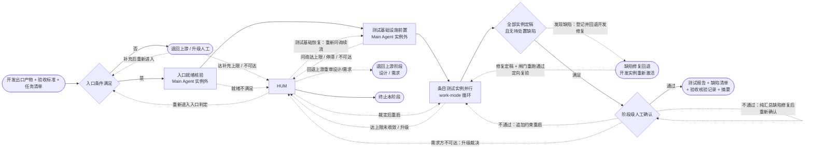

# 软件开发自动化工作流 —— 测试阶段

> 版本：v1.0
> 文档属性：skill 交付文件（阶段指令细则）
> 交付状态：已交付至 skill 根目录（后迁移至 `references/` 目录，仅元数据同步）；经 work-mode 四轮双视角评估定稿（评分轨迹 7.0/6.0 → 9.0/7.0 → 7.5/8.0 → 8.5/8.5 收敛），定稿前修 3 条建议项（§3 输入表补现状分析记录来源、HUM 声明 G0 边补 §5.1 就绪裁定续流语义、§4.3 创建时机措辞改按需创建）
> 定位：四大阶段（需求 / 设计 / 开发 / 测试）中的**第四阶段**，对开发定稿的工程实现执行验收核验并驱动缺陷收敛，是流水线的最终质量关口
> 关键约定：本阶段的迭代细化以 `work-mode.md`《执行者-评估者-仲裁者工作模式》（位于 `references/` 目录，以下简称《工作模式》）实例化运行；本文只定义测试阶段实例化时注入的参数与细化规则，凡未定义的机制（角色契约、独立性原则、收敛判定、异常处理、归档命名、报告结构等）一律以《工作模式》为准
> 对齐基准：`work-mode.md` v1.8；`context-system.md` v2.3.4；`requirements-stage.md` v0.8.8；`design-stage.md` v0.9.1；`development-stage.md` v1.2
>
> 版本演进留痕：本文版本演进注释已迁移至 skill 的版本迭代组件（references/version-evolution.md，含总账与 changelog 明细指针），头部仅保留当前版本与对齐基准

---

### 1. 阶段目标

对开发阶段出口的工程实现执行验收核验，满足：

- **验收完整**：需求稿全部验收标准（REQ-NNN 逐条）核验完毕，结论客观留痕；
- **缺陷收敛**：缺陷清单全部条目收敛或已处置（三处置集，§7.2），无未处置缺陷流出；
- **回归保持**：改动型/问题修复型需求的回归边界条目逐条核验保持（源于需求稿约束段）；
- **追溯闭合**：缺陷经任务清单关联到任务条目 ID，追溯链 REQ-NNN ↔ TSK-NNN ↔ 缺陷 ↔ 修复完整（《上下文体系》§8.2、§8.4）；
- **结论可信**：测试报告结论全部以客观运行结果或人工核验记录为证据，无未验证结论。

---

### 2. 定位与关系

| 对象 | 关系 |
| --- | --- |
| `work-mode.md`（执行者-评估者-仲裁者工作模式） | 本细则 §5.4 的各测试实例按该模式实例化运行；本细则未定义的机制一律以该文件为准 |
| 上游：开发阶段 | 入口输入为开发阶段出口产物（《开发阶段》§3 输出）：各任务定稿交付物与摘要、任务清单（状态全部「定稿」）、构建闸门记录、阶段定稿摘要；构建闸门记录通过是入口必备（可运行性由开发阶段闸门客观验证，本阶段不重复验证编译与启动） |
| 上游：需求阶段 | 验收标准与回归边界取自需求定稿产物（需求稿功能点清单与约束段，《需求阶段》§4），经需求层索引引用（《上下文体系》§5.1），不凭转述 |
| `context-system.md`（上下文体系） | 测试出入口最小契约（§8.4）、缺陷修复回退通道（§8.2）、阶段内实例并行规则（§9.2）、事件写入映射（§9.4）一律以该文件为准；本细则对其约定**只收紧不放松**（如缺陷清单关联任务条目 ID 的归因细化、出口处置三处置集） |
| 出口：需求交付 | 本阶段定稿即需求交付的最终质量关口；阶段级人工确认（§7.4）不可配置关闭 |

---

### 3. 输入与输出

| 方向 | 内容 |
| --- | --- |
| 输入 | ① 开发出口产物（《上下文体系》§8.4 测试入口契约；契约入口输入含验收标准，本表经②承载：开发定稿产物与摘要 + 任务清单）+ 构建闸门记录（通过结论，开发阶段 §4.3）；② 需求定稿产物（验收标准逐条、约束段、回归边界、未决项，经 `requirement-context.json` 索引定位，《上下文体系》§5.1）；③ 开发入口确认记录（工程清单与构建/启动命令，复用不重复问询，《开发阶段》§4.1）；④（改动型/问题修复型）现状分析记录（《上下文体系》§5.2，需求阶段阶段层文件，由 Main Agent 摘取摘要注入，§5.4） |
| 输出 | ① 测试报告与摘要（§4.1，出口必备）；② 缺陷清单（§4.2，逐条关联任务条目 ID，出口必备）；③ 验收核验记录（§4.3，阶段层文件）；④ 阶段定稿摘要（要素：验收标准核验结论逐条、缺陷总数与各处置状态、回归边界核验结论（如适用）、未决项数量） |

**归档约定**：执行《工作模式》§10.5（含每轮交付物与摘要保留完整副本）；实例归档于 `stages/testing/instance-<req-id>/`（《上下文体系》§4，测试条目与实例 1:1，目录以需求条目 ID 命名），阶段层结构同构于需求阶段。

**测试代码即产物**：测试实例的执行者直接在工作空间工程内编写测试代码（测试脚本、用例、共享 fixture），测试代码本身是交付物的实质内容；实例归档目录存放的是交付物文档（核验说明、运行证据、摘要，§4.4），不复制测试代码全文——测试代码以工程内路径引用（《上下文体系》§7 引用优先）。测试代码与生产代码的工程位置隔离约定（测试目录/后缀）由 §5.2 测试基础设施前置登记。

---

### 4. 交付物模板

各产物模板如下；测试实例内执行者每轮输出的交付物外层按《工作模式》§10.4 五段结构参照组织（标题、正文、变更说明、摘要、未落实项声明），「正文」按 §4.4 模板组织。

#### 4.1 测试报告（阶段层定稿产物）

由 Main Agent 在出口条件①②③满足后汇总产出，作为 §5.5 出口判定条件④与阶段级人工确认的确认对象（取材各实例交付物与验收核验记录，不经 work-mode 循环），结构固定：

1. **验收核验结论**：验收标准逐条（引用 REQ-NNN）核验结论（通过 / 不通过 / 经裁定接受），附证据引用（测试运行结果或人工核验记录路径）；
2. **回归边界核验结论**（改动型/问题修复型必备）：回归边界逐条核验结论与证据引用；
3. **缺陷统计与处置**：缺陷总数、修复收敛数、裁定接受数、裁定转出数，逐条引用缺陷清单条目；
4. **测试覆盖说明**：自动化测试覆盖的验收项与人工核验项的划分及理由（不可自动化的客观原因逐条说明）；
5. **遗留风险**（如有）：裁定接受与转出缺陷的风险陈述逐条。

#### 4.2 缺陷清单（阶段层定稿产物，出口必备）

由 Main Agent 登记维护，缺陷一经登记 ID 跨轮持久、变更仅可追加；每条结构固定：

- **缺陷 ID**（格式 `DEF-NNN`，顺序编号、唯一、不复用）；
- 缺陷现象与复现条件（测试代码路径或人工核验步骤 + 运行/观察证据）；
- **关联任务条目 ID**（必填，TSK-NNN，凭任务清单与开发交付物定位；定位不了或多任务嫌疑时升级人工归因，§7.2）；
- 关联验收/回归条目 ID（REQ-NNN，如适用）；
- 根因分类（实现缺陷 / 设计缺陷 / 需求缺陷——后两类经回退上游通道承载，§7.2）；
- 状态（待修复 / 修复中 / 待复验 / 复验通过 / 裁定接受 / 裁定转出）。

#### 4.3 验收核验记录（阶段层文件，非 work-mode 交付物）

由 Main Agent 在实例定稿与复验后登记，验收标准逐条（REQ-NNN）：核验方式（自动化测试 / 人工核验）、证据引用（测试代码路径 + 运行结果，或人工核验步骤记录）、结论、核验时间；回归边界条目同构登记。**人工裁定段**（如有人工裁定）：问题 → 裁定结论 → 时间，来源标注（人工裁定 / 人工裁定·迭代期，覆盖入口条件裁定、§5.1 就绪核验裁定、§5.2 测试基础问询裁定、§5.5 缺陷归因裁定、§7.2 缺陷接受/转出裁定、§7.3 迭代期裁定），及「已确认」状态标注（§7.4）。本段创建时机（按需创建）：任一来源的人工裁定须登记而验收核验记录尚未创建的，即予创建以承载登记（早于实例定稿登记）。本记录是测试报告第 1、2 段的取材源与出口判定的客观依据。

#### 4.4 测试实例交付物

正文六段：

1. **测试代码清单**：文件路径、变更类型（新增 / 修改）、对应验收条目声明（REQ-NNN）；测试代码位置符合 §5.2 隔离约定（超出约定位置即属范围变更，须经追加约束重启）；
2. **核验设计**：验收标准逐条到测试用例/核验步骤的映射；不可自动化项的人工核验步骤设计（操作步骤 + 预期结果）与不可自动化理由；
3. **运行证据**：测试执行命令与输出摘要（客观结果；运行失败不得定稿）；人工核验项的操作记录与观察结论；
4. **结论**：对应验收条目逐条核验结论（通过 / 不通过）；不通过项的缺陷现象描述与复现条件（供 §5.5 缺陷登记取材）；
5. **回归条目核验**（改动型/问题修复型且本条目关联回归条目时必备）：关联回归条目逐条核验结论；
6. **未决项**（如有）：每条含关联条目 ID、当前假设与影响范围。

---

### 5. 执行流程

**图注**：每个测试实例（TN 内）按《工作模式》契约运行「执行-评估-仲裁」循环（画法比照《需求阶段》§5 图注 WM 区段，图中不展开）；测试实例收敛即定稿（不设条目级人工确认，§7.4）；**实例启动前置条件检查**（含《工作模式》§9.5 前置检查）于每个实例启动前逐实例执行，不满足时升级 HUM，恢复后重新实例化或终止——该判定与回边为实例级机制，图中不展开；**缺陷归因升级**（§5.5：定位不了 / 多任务嫌疑 / 归因达上限）经 HUM 承载，归因裁定后续流经缺陷修复回退 / 回退上游通道——实例外机制，图中不展开；缺陷经 `TC -.发现缺陷.-> DEV` 出边承载：缺陷登记入缺陷清单后经《上下文体系》§8.2 缺陷修复回退通道重新激活对应开发实例（开发侧处置见《开发阶段》§7.2：修复定稿后一律重跑构建闸门），复验经 `DEV -.定向复验.-> TN` 回边以追加约束注入受影响测试实例（复验范围：缺陷定向 + 影响面回归，§5.5）——缺陷回退与复验可多次发生，图中以代表画法各画一边；根因分类为设计/需求缺陷的经 HUM 回退上游通道承载（《上下文体系》§8.2 目标失效上报，§7.2），图中经 `HUM -.回退上游重审设计/需求.-> UP` 代表画法承载（实际回退目标阶段以归因结论为准：设计缺陷回退设计阶段、需求缺陷回退需求阶段，实现缺陷不经本边）；「终止本阶段」对应六类情形：入口达上限升级后人工裁定终止、入口就绪不满足升级后人工裁定终止（§5.1）、测试基础问询升级后人工裁定终止（§5.2）、实例启动前置不满足升级后人工裁定终止（§5.4）、确认环节需求方不可达经裁决者裁定终止（§7.4）、缺陷归因升级后人工裁定终止（§7.2）；确认环节需求方不可达经裁决者裁定「等待恢复」为暂停态，恢复后续接阶段级确认，不另画边（画法比照《需求阶段》§5 图注口径）；`TN` 为并行实例集合的代表画法（并行规则 §5.3）；`CONF -.不通过：追加约束重启.-> TN` 代表重启受影响测试实例（图中以 TN 为代表画法）；纯汇总缺陷由 Main Agent 于实例外直接修复后经 `CONF -.不通过：纯汇总缺陷修复后重新确认.-> CONF` 自环边重新提交确认；测试阶段为流水线最后阶段，无下游阶段移交（出口产物即需求交付的最终质量证据，登记入需求层，§7.4）。

**HUM 出口流向代表画法声明**：`HUM -.裁定后重启.-> TN` 代表升级裁定后的实例级续流（覆盖追加约束重启、裁决权衡项裁定后续流、接受当前产物定稿；实例级机制图中不展开）；`HUM -.测试基础恢复：重新问询续流.-> TI` 覆盖测试基础问询升级后补充重新问询（此时条目实例尚未启动）；入口达上限补充后重入与入口就绪裁定补齐后续流经 `HUM -.重新进入入口判定.-> G0`（§5.1 就绪裁定续流亦经本边）；`HUM -.回退上游重审设计/需求.-> UP` 为回退上游出口代表画法，实际目标阶段以归因结论为准（见图注与 §7.2）；`HUM --> END` 对应图注所列六类终止情形。

**角色说明**：比照《需求阶段》§5 角色说明——「需求方」在阶段级确认（验收结论接受意见、未决项假设接受意见、裁定接受/转出缺陷的风险接受意见）中提供信息，「人工裁决者」在流程异常或达上限时选择处置出口（含缺陷归因裁定）；两者可由同一人承担，职责与留痕不合并。

**入口条件**：开发阶段已定稿（阶段级人工确认通过），且开发出口产物齐备（各任务定稿交付物与摘要、任务清单状态全部「定稿」、构建闸门记录通过结论、阶段定稿摘要）+ 需求定稿产物可引用（验收标准逐条、回归边界（如适用））；不满足时不启动本阶段——由 Main Agent 退回上游补充，达补充上限（默认 **3 次**，可由编排者启动时调整）或上游不可达时升级人工，升级后人工可裁定**终止本阶段**（决策留痕，图中 `HUM --> END`）或待上游补充满足入口条件后**重新进入入口判定**（图中 `HUM -.重新进入入口判定.-> G0`）；裁定结论登记验收核验记录人工裁定段（此时验收核验记录即予创建，§4.3）并受 §7.4 强制确认约束。

**流程责任划分**：§5.1~5.2（入口就绪核验、测试基础设施前置）与 §5.5 缺陷登记归因、出口判定由 **Main Agent（编排者）** 在 work-mode 实例**之外**完成，其质量不设独立评估循环——缺陷由阶段级人工确认暴露；§5.3、§5.4 的实例按《工作模式》契约运行。

#### 5.1 入口就绪核验（Main Agent，实例外）

复用开发入口确认记录（《开发阶段》§4.1），不重复问询；逐项客观核验：

- **产物齐备**：开发出口产物按入口条件清单齐备，任务清单状态全部「定稿」（读取落盘文件核验，不凭摘要转述）；
- **构建闸门**：构建闸门记录编译与启动结论均为通过（可运行性已由开发闸门客观验证，本阶段不重复验证）；
- **工程可访问**：入口确认记录所列目标工程在工作空间内可读写（含测试代码写入权限）；
- **验收标准可引用**：需求定稿产物经需求层索引可定位，验收标准逐条含判定主体与预期结果（《需求阶段》§4）；

任一不满足 → 升级人工（图中 `TP -.就绪不满足.-> HUM`），人工裁定选项：① 补齐后续流（图中 `HUM -.重新进入入口判定.-> G0` 或等待恢复）；② **终止本阶段**（决策留痕）；裁定结论登记验收核验记录人工裁定段并受 §7.4 强制确认约束。

#### 5.2 测试基础设施前置（Main Agent，实例外）

条目实例启动前，Main Agent 建立公共测试基础并登记**测试基础记录**（阶段层文件，结构固定：测试运行入口命令与验证结论、测试代码隔离约定、共享 fixture 位置与说明、来源标注）：

- **测试运行入口**：探查优先——Main Agent 探查各目标工程的既有测试设施（测试框架、测试脚本、运行配置），沿用或扩展；无既有设施时按工程语言惯例建立最小测试运行入口（命令可客观执行并输出结果）；探查无法确定运行方式时向用户问询（问询上界与停滞规则比照《开发阶段》§5.1：默认 3 轮，达上限/停滞/不可达升级人工（图中 `TI -.问询达上限 / 停滞 / 不可达.-> HUM`），人工裁定选项：① 用户补充后重新问询续流（图中 `HUM -.测试基础恢复：重新问询续流.-> TI`）；② **终止本阶段**（决策留痕）；裁定结论登记验收核验记录人工裁定段并受 §7.4 强制确认约束）；
- **测试代码隔离约定**：测试代码与生产代码的位置隔离（工程测试目录/命名后缀，依工程惯例），登记入测试基础记录；实例交付物的测试代码清单以此为范围边界；
- **共享 fixture**：跨条目共用的测试数据与环境准备（如工程启动、数据初始化）由本节一次性建立，各实例只读引用，不得各自修改（避免并行冲突）；
- **基础自验**：测试运行入口以最小用例客观执行一次，通过方可进入条目实例（失败按上文问询/升级路径处置）。

#### 5.3 条目实例编排

各条目测试实例同时启动（条目间默认无依赖；并行规则：上下文包装配、评估派发与仲裁逐实例独立，不共享在途状态，《上下文体系》§9.2）；全部实例定稿且无待处置缺陷后方可进入出口判定（§5.5）。**批内升级调度**：单个实例升级人工等待裁定期间，其他实例独立继续推进（并行规则不变），出口判定等待全部定稿或终止裁定。

#### 5.4 测试实例工作模式细化（执行-评估-仲裁循环）

每个条目实例以《工作模式》实例化运行。实例化上下文包如下：

**任务指令（条目级，派生规则执行《上下文体系》§6.1）**：

| 项 | 内容 |
| --- | --- |
| 任务目标 | 对该条目（REQ-NNN）的验收标准执行核验：编写与运行自动化测试（或执行人工核验步骤），产出客观核验结论 |
| 上游产物摘要 | 需求定稿产物中该条目的功能描述、验收标准、（关联时）回归边界条目 + 该条目关联任务的开发交付物摘要（经任务清单关联定位）+ 测试基础记录 + 开发入口确认记录（构建/启动命令）+（改动型/问题修复型）现状分析记录（摘要，Main Agent 摘取注入，《上下文体系》§5.2） |
| 验收标准 | §1 阶段目标 + §6 本实例评估视角与评分标准 |
| 约束 | 验收标准原文逐条引用 +（改动型/问题修复型）回归边界与现状分析结论（硬约束）+ 测试代码隔离约定（§5.2）+ 共享 fixture 只读约束 |
| 范围 | 该条目（REQ-NNN）的验收核验与其关联回归条目；范围变更须经追加约束重启 |

**模式参数（实例级，对应《工作模式》§9.2 七类参数）**：

| 参数 | 注入值 |
| --- | --- |
| 评估视角集合 | 验收覆盖视角 + 证据有效视角（§6） |
| 收敛阈值 | 8 / 10（默认值；下文凡引用阈值均指本注入值） |
| 迭代上限 | 5 轮（覆盖《工作模式》默认 10 轮；理由：测试任务以运行结果为客观反馈，收敛路径明确；达上限未收敛通常指示验收标准可测性或环境问题，升级人工） |
| 归档位置 | `stages/testing/instance-<req-id>/`（§3 归档约定） |
| 交付物模板 | §4.4 测试实例交付物模板（外层按《工作模式》§10.4 五段结构参照组织） |
| 规划阶段开关 | 显式采用默认值（启用，《工作模式》§9.2 默认）：测试代码编写含用例设计与环境准备，规划阶段提供步骤拆解 |
| 规划阶段迭代上限 | 显式采用默认值（3 轮，《工作模式》§9.2 默认） |

**角色配置**：

| 角色 | 承担者 | 本阶段说明 |
| --- | --- | --- |
| 执行者 | 独立 Subagent | 按任务指令编写测试代码并运行、产出交付物文档；人工核验项按核验步骤执行并记录；第 2 轮起接收上一轮整合意见；能力要求与降级策略见《工作模式》§9.4 |
| 评估者 | 独立 Subagent，每视角一个 | 可见信息范围按《工作模式》§2：评估标准 + 交付物本身（含当轮摘要）+ 上游摘要 + 输出格式要求；不可见执行过程与其他视角报告；评估核验结论时按交付物路径引用读取测试代码与运行证据 |
| 仲裁者 | Main Agent | 按《工作模式》§2.2 约束运行；并行实例的仲裁逐实例独立完成 |

**实例化前置条件**：执行《工作模式》§9.4 前置条件与降级策略（评估者不可降级、Main Agent 不得兼任）与 §9.5 前置检查；环境不满足（含测试运行入口不可执行、目标工程不可访问）时本实例**不可启动**，升级人工，恢复路径二选一：环境满足后重新实例化，或终止本阶段（决策留痕登记阶段上下文，§7.4）。

**循环出口**：收敛 → 实例定稿（验收核验记录对应条目登记）；未收敛且未达上限 → 整合意见回传执行者；触发升级条件 → 升级人工（见 §7.2）。

#### 5.5 缺陷登记归因与出口判定（Main Agent，实例外）

**缺陷登记**：实例交付物结论段的不通过项由 Main Agent 登记入缺陷清单（§4.2），复现条件与证据取自交付物；同一现象多实例报告的合并为一条缺陷（合并留痕）。

**归因**：Main Agent 凭任务清单与开发交付物（改动范围、实现说明）定位关联任务条目 ID；**定位不了或多任务嫌疑时升级人工归因**（人工凭开发交付物与代码现状裁定关联任务；裁定结论登记验收核验记录人工裁定段并受 §7.4 强制确认约束）；**根因分类**：实现缺陷经缺陷修复回退承载；设计/需求缺陷（实现忠实于设计/需求但验收不通过）经回退上游通道承载（《上下文体系》§8.2 目标失效上报，§7.2）。

**修复回退与复验**：实现缺陷经《上下文体系》§8.2 缺陷修复回退通道重新激活对应开发实例（开发侧处置：修复中状态、修复定稿后一律重跑构建闸门、多缺陷合并，见《开发阶段》§7.2）；修复定稿且闸门通过后，Main Agent 以缺陷复验为追加约束重启受影响测试实例（轮次重置、已落盘归档只读保留、新轮次目录续编），**复验范围 = 缺陷定向 + 影响面回归**：该缺陷的消除验证（复现路径反向验证）+ 受影响条目的验收标准 + 受影响回归边界条目；复验结论按缺陷逐条回写缺陷清单（复验通过 / 再次不通过——再次不通过的，原缺陷条目状态回退「修复中」并追加复验失败留痕，不另赋新 ID，重新走修复回退与复验）。

**出口判定**：满足以下全部条件方可进入阶段级人工确认——① 验收标准全部核验（验收核验记录逐条有结论与证据）；② 缺陷清单全部条目处于终态（复验通过 / 裁定接受 / 裁定转出，三处置集见 §7.2）；③ 回归边界条目全部核验（改动型/问题修复型）；④ 测试报告按 §4.1 汇总产出。任一不满足不得提交确认。

---

### 6. 评估视角与评分

各测试实例注入两视角（§5.4 模式参数表）；评估对象为交付物正文及其当轮摘要（测试代码与运行证据经交付物路径引用核验）；评估者报告结构遵循《工作模式》§10.6。**一致性基线**：与验收标准原文、回归边界条目、测试基础记录、关联开发交付物摘要、（改动型/问题修复型）现状分析记录摘要的对齐以任务指令注入的上游摘要为准。

**阶段目标覆盖映射**（评估标准对 §1 阶段目标的承接关系，满足《工作模式》§10.3 评估标准的任务覆盖要求）：

| §1 阶段目标 | 承接视角与维度 |
| --- | --- |
| 验收完整 | 验收覆盖视角·条目覆盖（实例级承接对应条目；阶段级由 §5.5 出口判定承接） |
| 缺陷收敛 | 不进实例评估——由 §5.5 缺陷登记归因与出口判定承接（实例外编排职责） |
| 回归保持 | 验收覆盖视角·回归核验 + 交付物「回归条目核验」段 |
| 追溯闭合 | 证据有效视角·追溯对应（缺陷关联与证据链）+ §5.5 归因（实例外） |
| 结论可信 | 证据有效视角·证据客观 + 验收覆盖视角·核验设计 |

#### 6.1 验收覆盖视角（视角 ID：`acceptance`）

| 评估维度 | 关注要点 | 分值 |
| --- | --- | --- |
| 条目覆盖 | 该条目验收标准是否逐项有核验用例/步骤；遗漏的场景、边界条件是否补全 | 4 |
| 核验设计 | 用例与验收标准的映射是否准确；人工核验项的不可自动化理由是否客观；预期结果是否可客观判定 | 3 |
| 回归核验 | 改动型/问题修复型且关联回归条目：回归条目是否逐条核验；新增型或无关联：改动范围对既有行为的影响面说明是否充分 | 3 |

#### 6.2 证据有效视角（视角 ID：`evidence`）

| 评估维度 | 关注要点 | 分值 |
| --- | --- | --- |
| 证据客观 | 运行证据为客观执行结果（命令 + 输出摘要）；运行失败项是否闭合；人工核验记录步骤与观察结论是否完整 | 4 |
| 结论对应 | 核验结论与证据一一对应，无无证据结论；不通过项的缺陷现象与复现条件是否可供登记取材 | 3 |
| 追溯对应 | 测试代码与验收条目、开发交付物的对应关系清晰；测试代码位置符合隔离约定 | 3 |

各视角总分 10 分；评分逐维度给出分值与依据。

---

### 7. 收敛与异常

#### 7.1 收敛判定

各实例的收敛判定、收敛建议规则、未收敛时的处理均执行《工作模式》§6；迭代上限为 §5.4 注入值（5 轮），达上限未收敛即升级人工。**跨条目一致性不设独立评估循环**：并行条目实例间的冲突（共享 fixture 误改、测试代码位置越界）由 §5.2 只读约束与隔离约定预防，违反时按追加约束重启受影响实例。

#### 7.2 升级人工出口在本阶段的映射

升级材料包规范按《工作模式》§6 执行。四个出口在本阶段的处置如下：

| 出口 | 本阶段处置 |
| --- | --- |
| 追加约束重启 | 轮次重置，新约束并入任务指令后重启本实例循环；复验注入（§5.5）亦经本出口承载 |
| 接受当前产物 | 仅在人工明确授权时使用；定稿后经阶段级人工确认方随阶段出口 |
| 回退上游 | 根因分类为设计/需求缺陷且无法以追加约束承载时使用：经《工作模式》§6 回退对应上游阶段（设计缺陷回退设计阶段、需求缺陷回退需求阶段，回退目标以归因结论为准，见《上下文体系》§8.2 目标失效上报）。**恢复语义**：测试阶段本轮一并终止——运行中实例即行中止，其轮次产物与测试代码变更现状一并留痕；已定稿实例交付物与验收核验记录状态留痕于阶段上下文，缺陷清单只读留痕；上游重新定稿并经开发阶段重新定稿后，本阶段经入口条件（图中 G0）重新进入，**全量重新核验**（原验收核验记录与缺陷清单按代只读归档成链，不参与出口判定）；工程现状为新实例的核验基线。暂停/终止留痕仅供回溯，不产生恢复通道（图中 `UP`）。**下游处置**：回退发生时视同触发《上下文体系》§8.2 目标失效上报（需求层阻塞项同步登记） |
| 裁决权衡项 | 执行《工作模式》§6；裁定后满足收敛判定的，实例定稿 |

**缺陷归因升级**（§5.5）：定位不了或多任务嫌疑的缺陷升级人工归因；归因裁定关联任务后按实现缺陷路径继续（缺陷修复回退）；归因裁定为设计/需求缺陷的按上文回退上游承载；归因升级达上限（同一缺陷连续 2 次归因裁定仍无法落定）或需求方/裁决者不可达 → 人工裁定终止本阶段或等待恢复（决策留痕）。

**缺陷出口三处置集**（§5.5 出口判定②的处置集合）：① **修复收敛**——缺陷修复且复验通过（终态）；② **人工裁定接受**——缺陷不修复，风险经人工裁决者裁定接受（裁定须征询需求方风险接受意见，结论登记验收核验记录人工裁定段并受 §7.4 强制确认约束；测试报告「遗留风险」段逐条承载）；③ **人工裁定转出**——缺陷转后续需求处理（裁定结论登记验收核验记录人工裁定段并受 §7.4 强制确认约束，另附转出承载说明：后续需求未启动前该缺陷留痕于需求层阻塞项，本次交付不阻塞）。无第四出口——不允许未处置缺陷挂起流出。

#### 7.3 迭代中新发现的阻断级疑问

实例评估或核验中新发现的阻断级疑问（验收标准无法客观判定 / 测试运行环境无法建立 / 与需求定稿产物矛盾且无法自行消解）由仲裁者升级人工向需求方问询；结论以「追加约束重启」并入任务指令。**迭代期需求方不可达时**：升级人工裁决者替代问询，裁定结论登记验收核验记录「人工裁定」段（来源 = 人工裁定·迭代期），并受 §7.4 强制确认约束。

#### 7.4 人工确认（仅阶段级）

测试阶段仅设阶段级人工确认（测试实例收敛即定稿，不设条目级确认），位于 work-mode 实例之外，不改变实例内「交付决定权归属评估者」的契约；**不可配置关闭**——测试阶段为流水线最终质量关口：

- **确认对象**：测试报告整体（验收核验结论逐条 + 回归核验结论 + 缺陷处置结论）+ 裁定接受/转出缺陷的遗留风险逐条 + 各条目未决项的汇总状态；
- **通过** → 阶段定稿，Main Agent 按《上下文体系》§9.4 事件写入映射登记定稿产物索引（测试报告、缺陷清单、验收核验记录、摘要）；测试阶段为流水线最后阶段，定稿后需求进入交付终态（`state.json` 终态为 DONE，《上下文体系》§10）；
- **不通过** → 二分支处置：① 意见可定位到测试实例或验收条目的，确认意见作为附加约束按追加约束重启对应实例，重新定稿并经出口判定后再次提交确认；② **纯汇总缺陷**（不可定位到实例的阶段层产物缺陷，如测试报告誊写错误、缺陷清单状态与落盘不符）由 Main Agent 直接修复并重新提交确认。

**通用规则**（适用于本节及 §7.2 裁定接受/转出的征询环节）：

- **角色归属**：「通过 / 不通过」决定由人工裁决者作出；验收结论接受意见、未决项假设接受意见、裁定接受/转出缺陷的风险接受意见向需求方征询（角色边界见 §5 角色说明）；
- **需求方不可达**：确认环节需求方不可达 → 升级人工裁决者，裁决者选择等待恢复（暂停留痕）或终止本阶段（决策留痕）；未确认内容在取得确认前不得定稿（即使终止也不产生阶段定稿）；
- **强制确认**：触发锚点为**验收核验记录中未经需求方确认的人工裁定记录**，显式枚举全部来源：入口条件（G0）升级裁定、§5.1 就绪核验裁定、§5.2 测试基础问询裁定、§5.5 缺陷归因裁定、§7.2 缺陷接受/转出裁定、§7.3 迭代期裁定；**下列实例级升级裁定不入锚点**（显式豁免）：实例达上限/停滞/权衡项升级及实例启动前置不满足升级（§5.4）；裁定留痕分承载——前组由实例仲裁记录承载（《工作模式》§6、§10.5），后者发生于实例启动之前、尚无仲裁记录，留痕登记于阶段上下文阶段级事件（《上下文体系》§5.2）；阶段级确认不可配置关闭且确认对象覆盖测试报告整体，承接其确认义务，且前置裁定不产生流入下游的需求侧内容（终止亦不产生阶段定稿），不附强制确认义务，故不重复纳入锚点；存在任一未确认记录时本次交付必须经人工确认；确认通过且征询结论留痕后，对应记录标注「已确认」，不再触发强制确认义务（语义比照《需求阶段》§7.4 确认状态与解除）。
