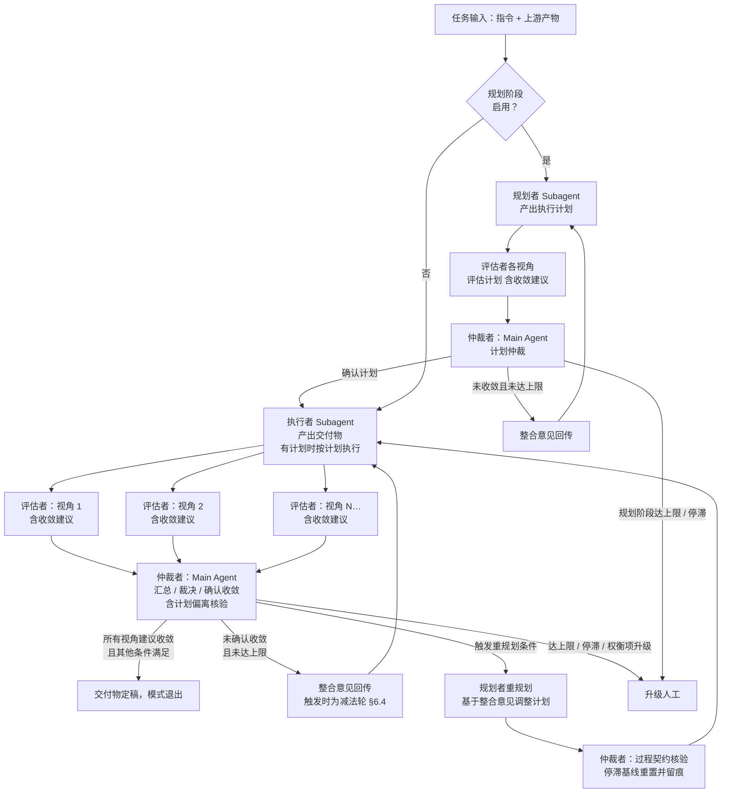

# 软件开发自动化工作流 —— 执行者-评估者-仲裁者工作模式

> 版本：v1.9
> 定位：**独立、自包含、可复用**的原子工作模式组件
> 关键约定：**仲裁者由 Main Agent 担任**；模式本身**不依赖任何外部文档**，所有外部参数在实例化时通过任务分发注入；未注入时使用 §10 内置默认规则独立运行；**仲裁者不得单方判定交付**，交付决定权归属评估者
>
> 版本演进留痕：本文版本演进注释已迁移至 skill 的版本迭代组件（references/version-evolution.md，含总账与 changelog 明细指针），头部仅保留当前版本与对齐基准

---

## 1. 模式定位

「执行—评估—仲裁」是一个与具体阶段、具体流水线无关的通用工作模式，用于完成任何「产出—审视—修正」型目标：

- **自包含**：模式本身不引用外部文档；所有外部约束通过实例化参数注入，未注入时使用 §10 内置默认规则；
- **可独立使用**：脱离任何流水线，单独用于任一需要质量逼近的任务；
- **可组合使用**：作为更大流程的子模式被多次实例化；
- **职责固定**：各角色的分工与可见信息范围是模式契约，不随实例改变；
- **能力增强**：各角色可利用运行时上下文中可得的 skill 与 tool（自行发现或经上下文包注入，见 §9.6）增强执行能力；能力利用属执行层增强，不改变角色契约、独立性原则与收敛机制；
- **模式定位**：本模式是**质量收敛模式（Quality Loop Pattern）**，属于**执行机制**而非方法论，不是完整的 Agent 工作流；目标形成、跨任务分发、工具选择属外层运行时职责（见 §8）。

---

## 2. 角色模型

模式由四个角色构成，其中 **Planner 仅在规划阶段启用时存在**（§9.2，默认启用）；禁用规划阶段时模式退化为三角色结构，行为与此前版本一致。

| 角色 | 承担者 | 职责 | 可见信息范围 |
| --- | --- | --- | --- |
| 规划者（Planner） | 独立 Subagent | 规划阶段：基于任务指令产出执行计划（目标拆解、步骤排序、依据说明，结构见 §10.8）；执行阶段：承接触发式重规划（§4.1） | 任务指令 + 上游产物摘要 + 计划模板 + 上一轮计划整合意见；（重规划时另含）定稿计划 + 当轮整合意见 + 偏离/假设核验结论 |
| 执行者（Executor） | 独立 Subagent | 按任务指令产出交付物（存在已确认执行计划时按计划执行） | 任务指令 + **已确认执行计划**（规划阶段启用时） + 上游产物摘要 + 交付物模板 + 上一轮整合意见 |
| 评估者（Evaluator） | 独立 Subagent，每视角一个 | 规划阶段评估执行计划、执行阶段评估交付物，输出评估报告，**给出收敛建议** | 评估标准 + 被评对象本身（计划或交付物；交付物含 §10.4 五段结构完整文件，含变更说明） + 输出格式要求 +（当上游摘要非空时）上游摘要；**不可见**执行过程与其他视角报告；执行阶段评估者**不可见执行计划**（§2.3） |
| 仲裁者（Arbiter） | **Main Agent** | 汇总各视角报告、裁决冲突（含计划偏离声明）、确认收敛、驱动循环 | 全部视角报告 + 问题台账 + 执行计划（规划阶段启用时） + 任务全局上下文 |

### 2.1 为什么仲裁者由 Main Agent 担任

| 理由 | 说明 |
| --- | --- |
| 全局视角 | 权衡需要需求目标、阶段定位、迭代历史等全局信息，Main Agent 天然持有 |
| 驱动权 | 裁决结果需要直接驱动下一步动作（回传重做、回退上游、升级人工），这是 Main Agent 的固有职责，无需再经一层转交 |
| 降低开销 | 省去一个 Subagent 的上下文传递与转述损耗，裁决与调度合一 |
| 责任一致 | 循环是否收敛、何时停止，最终责任本就在 Main Agent，仲裁权与责任对齐 |

### 2.2 Main Agent 担任仲裁者的约束

Main Agent 虽有全局视野，仲裁时仍受以下约束，防止绕过独立评估：

1. **以报告为准**：整合结论必须基于各视角评估报告得出，不得以自身判断替代评估结论；
2. **不越权评估**：Main Agent 若发现报告未提及的问题，不得直接计入结论，须纳入整合意见回传执行者修正，由评估者在下一轮评估中自行判定；**例外**：当 Main Agent 自行发现的问题达到阻断级时，有权暂停收敛并将问题回传修正，不受「不得直接计入结论」的限制——此为例外性阻断暂缓权，不改变交付决定权归属评估者的基本原则；
3. **裁决留痕**：每次仲裁产出仲裁记录（一致意见合并结果、冲突双方原始意见的文件引用、裁决依据、最终结论），落盘可追溯；
4. **规则外置**：优先级阶梯与权衡处置规则使用 §10 内置的默认规则，不随实例变更；
5. **不得单方判定交付**：Main Agent 不得以自身判断宣称交付物「已修复」「可交付」或终止评估；**交付决定权归属评估者**——只有当**所有视角的评估者均在报告中建议收敛**且满足其他收敛条件后，Main Agent 才可宣告交付并进入定稿流程。

### 2.3 计划审视机制（规划阶段）

引入 Planner 后，执行计划的产生与审视遵循以下规则：

| 设计点 | 规则 |
| --- | --- |
| 计划同样受独立评估 | 执行计划由评估者按视角评估、仲裁者裁决，复用 §4 循环与 §6 收敛规则（规划阶段迭代上限默认 3 轮），避免「拆解无人审查」 |
| 规划者掌战略、执行者掌战术 | 规划者拥有战略（目标拆解与步骤编排）；执行者拥有战术（步骤内的具体实现）：**可自行调整执行细节**（执行细节型偏离，事后登记，见 §5），但**不得改变目标与规划意图**；计划层面调整仅可通过三条路径：执行者声明计划偏离项由仲裁者裁决（§5）、**触发式重规划**（§4.1）、经人工裁决重启规划阶段（§6） |
| 目标偏离不在模式权限内 | 目标来自任务指令（§9.5）；执行证据表明目标本身有误（目标失效型偏离）时，模式无权修改，必须升级人工 |
| 执行阶段评估者不可见执行计划 | 避免评估基准继承计划遗漏；完整性判定仍以任务指令目标为准，计划遗漏由规划阶段评估拦截 |
| 仲裁者核验偏离声明 | 属过程契约核验而非质量评估，与 §2.2 约束 2 的边界一致 |

---

## 3. 独立性原则

- 执行者与评估者互不可见对方的推理过程，评估只看产物本身，避免「自我合理化」偏差；
- 各视角评估者之间上下文隔离、独立成文，避免先入为主的相互影响；
- **评估不受干预**：评估者产出报告前，Main Agent 不向其透露其他视角结论或自身倾向；自行发现的问题纳入整合意见在下一轮回传执行者修正；
- **按需引用边界**：各角色的按需引用仅限本人输入中已登记路径的全文展开；**不开放**其他视角报告、他角色执行过程、当轮非本人报告；评估者上下文包仅含评估标准 + 被评对象 +（当上游摘要非空时）上游摘要 + 输出格式要求，不含迭代历史与历轮报告（含自身历轮报告）；
- **规划阶段同此隔离**：计划评估复用上述隔离规则；执行阶段评估者**不可见执行计划**，避免评估基准继承计划遗漏，完整性判定仍以任务指令目标为准；
- 所有评估意见必须是**可执行的修改指引**（问题位置、期望标准、修改方向），而非仅给出分数。

---

## 4. 工作循环



动作序列：

**规划阶段**（启用时，规划阶段迭代上限默认 3 轮）：

1. Main Agent 装配规划者输入（含计划模板，默认见 §10.8），派发规划者产出执行计划；
2. Main Agent 并行派发各视角评估者评估计划，收集评估报告（评估标准按 §10.3 覆盖任务指令目标与约束）；
3. Main Agent 按 §6 规则仲裁计划：确认计划收敛 → 计划定稿，进入执行阶段；未收敛且未达上限 → 整合意见回传规划者进入下一轮；规划阶段达上限或停滞 → 升级人工。

**执行阶段单轮动作序列**：

1. Main Agent 装配执行者输入（含交付物模板；规划阶段启用时含已确认执行计划），派发执行者产出交付物；
2. Main Agent 并行派发各视角评估者，收集评估报告（含评分 + 收敛建议）；
3. Main Agent 仲裁：
   - 逐项核验各视角的收敛建议与评分；
   - 合并一致意见，裁决冲突（问题清单逐条标注根因标签，支撑 §6.3 同根因复发熔断）；
   - 核验计划偏离声明（如有，按三型分类处置见 §5：假设失效 → 触发重规划 §4.1，目标失效 → 升级人工）；
   - 判定整体收敛状态；
   - 减法轮触发判定（§6.4 四条件逐项检查，条件④优先于停滞检测升级人工路径）；
4. 满足 §6.1 收敛判定全部条件（含问题台账核验）→ 宣告交付，定稿退出；
5. **未确认收敛**且未达迭代上限 → 仲裁者判定是否触发重规划条件（§4.1）：触发 → 进入触发式重规划，以调整后计划开启新一轮；未触发 → 整合意见作为执行者输入进入下一轮。「未确认收敛」涵盖：存在未收敛视角、所有视角收敛但评分未达阈值（仅在自定义规则下条件分离时可能出现，默认规则下此情形不成立）、所有视角收敛但阻断级问题未清零（仅在自定义规则下可能出现）等任一条件未满足的情形；
6. 达到迭代上限、评分停滞或出现需升级的权衡项 → 升级人工裁决。

### 4.1 触发式重规划

重规划是**条件分支**而非每轮必经环节：多数轮次的问题属局部修正，整合意见直接回传执行者；仅当仲裁者判定整合结论触发以下条件时，派发规划者调整计划：

**触发条件**（由仲裁者判定，判定理由写入仲裁记录）：

1. 重复问题反思触发（§6），且修改方向调整涉及计划层面变化；
2. 整合意见涉及计划步骤的增删或顺序重构（超出局部条目修改）；
3. 执行者偏离声明被接受且属假设失效型（§5），需目标拆解重构；
4. 注入假设被交付物证据证伪，且执行计划基于该假设规划。

**重规划流程**：

1. Main Agent 装配规划者重规划输入：定稿计划 + 当轮整合意见 + 偏离/假设核验结论；
2. 规划者产出调整后计划（结构仍遵循 §10.8，变更说明聚焦调整点及其依据）；
3. 仲裁者按过程契约核验：目标映射是否完整、调整是否与触发条件对应、（并发减法轮时）减法轮约束是否承接；核验通过 → 计划生效，**不重新走规划阶段完整评估循环**；核验不合格 → 退回重出（按 §7 退回重出规则，连续 2 次不合格升级人工）；
4. 执行阶段按调整后计划开启新一轮；**停滞检测与重复问题计数以本轮为新基线**（见 §6 重规划基线重置；熔断计数不随之重置）；

**规划阶段禁用时的回退**：规划阶段禁用时无规划者承接重规划；触发条件命中时，方向性调整在整合意见中处置；涉及目标拆解重构的，直接升级人工。

---

## 5. 输入输出契约

| 角色 | 输入 | 输出 |
| --- | --- | --- |
| 规划者（规划阶段启用时） | 任务指令 + 上游产物摘要 + **计划模板（§10.8 默认）** +（第 2 轮起）上一轮计划整合意见 +（重规划时）定稿计划 + 当轮整合意见 + 偏离/假设核验结论 | 执行计划（含拆解依据） |
| 执行者 | 任务指令 + **已确认执行计划（规划阶段启用时）** + 上游产物摘要 + **交付物模板（或模板引用）** +（第 2 轮起）上一轮整合意见 | 交付物 + 交付物摘要 + **未落实项声明**（如有） + **计划偏离声明**（如有） |
| 评估者 | 评估标准 + 被评对象（规划阶段为执行计划、执行阶段为交付物） + 输出格式要求 +（当上游摘要非空时）上游摘要 | 视角评估报告（结论、评分、问题清单、**收敛建议**） |
| 仲裁者（Main Agent） | 各视角评估报告 + 仲裁规则 + 迭代历史 + 问题台账 + 执行计划（规划阶段启用时） | 仲裁记录 + 整合结论（确认收敛 / 整合意见 / 升级人工） |

关键输出要求：

- **问题清单逐条分级**：每条含**严重级别（阻断 / 重要 / 建议）**、问题位置、期望标准、修改方向；级别划分使用 §10 默认三级；
- **评估意见必须附证据**：证据最小要素为**位置 + 原文摘录**——引用交付物中的具体位置并摘录对应原文条目；无证据支撑的意见由 Main Agent 退回该视角补充依据，不计入整合结论；
- **收敛建议**：评估者在报告末尾基于自身评分与阻断级问题状态给出「建议收敛 / 不建议收敛」及依据（详见 §10.6 默认结构）；
- **未落实项声明**：执行者对无法落实的整合意见，须在交付物中以「未落实项 + 理由」显式声明，由仲裁者在下一轮仲裁中处置；未声明者视为已接受全部意见；
- **能力利用声明**：使用外部能力（skill / tool）的角色须在产出中声明当轮使用情况（名称、用途、产出概要）；未使用时不声明；声明内容不向其他角色暴露（§3 独立性原则）；见 §9.6 能力利用协议；
- **新增条款零增量检验**：第 2 轮起，执行者对整合意见要求之外自行新增的条款/章节/分支/判定规则，须在交付物变更说明中逐条附**零增量论证**——回答「删除该条款是否损失行为定义」；论证为「不损失」或无论证的新增条款，由仲裁者退回不纳入本轮交付物（评估者按 §10.3 简洁性审视义务复核论证成立性）；减法轮内本条收紧为禁止新增（见 §6.4 减法轮触发）；
- **计划偏离声明（三型分类）**：规划阶段启用时，偏离已确认执行计划按类型处置：
  - **执行细节型**：不改变步骤目标与完成判据，仅实现方式调整 → 执行者可自行调整，无需事先声明，但须在交付物变更说明（§10.4 第 3 段）中登记；仲裁者不将此类调整视为计划一致性违规；
  - **假设失效型**：计划步骤依赖的前提证据或假设被执行过程证伪 → 须以「偏离项 + 理由」显式声明，仲裁者核验成立 → 触发重规划（§4.1）；重规划后仍未解决 → 升级人工；
  - **目标失效型**：执行证据表明任务指令的目标、约束或验收标准本身有误 → 须显式声明，仲裁者核验成立 → 升级人工（目标属任务指令层面，模式无权修改，见 §9.5），不得改变目标继续执行；
  - 未声明的非执行细节型偏离由仲裁者按计划一致性核验发现，按过程契约违规退回重出；
- 任一角色的输出不符合上述格式，Main Agent 退回重出，不进入下一环节；
- 所有输入输出按任务分发时指定的归档位置落盘（默认按 §10.5 自包含规则，交付物每轮写入当轮 `round-N/` 目录，各轮保留完整副本，评估报告与仲裁记录同样按轮次追加）；
- 交付物结构遵循实例化时注入的模板；未注入时使用 §10.4 最小默认结构。

**关于「上游产物摘要」可为空**：当模式独立使用、无上游产物时，该字段可为空；执行者仅依据任务指令产出，评估时「与上游对齐」子项的处理见 §10.3。

### 5.1 术语界定

| 术语 | 含义 |
| --- | --- |
| 整合结论 | 仲裁产出的三态判定：确认收敛 / 整合意见 / 升级人工 |
| 整合意见 | 整合结论为「整合意见」态（即未确认收敛）时回传给执行者的修改指引集合 |
| 仲裁记录 | 每轮仲裁的落盘载体（详见 §10.7 默认结构） |
| 收敛建议 | 评估者在报告末尾给出的「建议收敛 / 不建议收敛」判断，是仲裁者确认收敛的必要条件 |
| 权衡项 | 仲裁者对同优先级、各有代价的冲突意见按仲裁规则标记的待决项；出口仅两个：规则内自动采纳并留痕、升级人工决策 |
| 执行计划 | 规划者在规划阶段产出的被评对象，执行者执行的依据（结构见 §10.8） |
| 计划偏离项 | 偏离已确认执行计划的声明；分为执行细节型 / 假设失效型 / 目标失效型三类（§5），按类型处置：事后登记 / 触发重规划 / 升级人工 |
| 规划阶段 | 可选阶段（默认启用）：规划者产出执行计划并经评估—仲裁收敛；禁用时模式仅含执行阶段 |
| 触发式重规划 | 整合结论为整合意见时，仲裁者判定触发重规划条件后派发规划者调整计划；属条件分支而非每轮必经环节（见 §4.1） |
| 问题台账 | 实例归档内的跨轮持久文件 `issue-log.md`，登记全部问题的 ID、级别、根因标签、发现轮次与闭合状态；收敛判定的核验对象（见 §6.2） |
| 根因标签 | 仲裁者对每条问题标注的根因分类；同标签问题**跨轮**第 2 次出现触发同根因复发熔断（仅计执行阶段台账条目；同一轮清单内多条同标签不触发，见 §6.3） |
| 零增量论证 | 对新增条款（§5）或删除/合并项（减法轮）的「删除后是否损失行为定义」论证；不损失行为的新增不得准入 |
| 减法轮 | 由 §6.4 触发条件强制安排的只删不增整改轮：修订仅限删除、合并、简化，不得新增任何条款；任务指令或整合意见要求的新增亦须以等价删除置换，无法置换的升级人工（见 §6.4 减法轮触发） |

---

## 6. 收敛与终止

| 条件 | 规则（默认值，可在实例化时覆盖） |
| --- | --- |
| 评分标度 | 各视角评分采用 1–10 分制，默认收敛阈值 8 分 |
| 收敛判定 | 所有视角评估者均建议收敛 + 各视角评分均 ≥ 阈值 + 阻断级问题清零 + 问题台账核验 + 阻断暂缓权检查；详见 §6.1 |
| 问题台账 | 跨轮持久文件 `issue-log.md`（§10.5），收敛证据链载体；登记字段含 ID/级别/根因标签/发现轮次/闭合状态；追加约束重启时转只读归档并新建台账；详见 §6.2 |
| 同根因复发熔断 | 同根因标签问题跨轮第 2 次出现时，整合意见禁止加补丁、须改为模型级修复方向；与重复问题反思边界明确；详见 §6.3 |
| 减法轮触发 | 满足四条件之一时宣布下一轮只删不增；条件④优先于停滞检测升级路径；禁止新增条款、须等价置换；详见 §6.4 |
| 收敛加速 | 当评估存在「重要」级问题时，整合意见仅回传「阻断」级与「重要」级问题，「建议」级问题暂不纳入回传（仍记录于仲裁记录），使执行者聚焦于影响收敛的关键问题；当不存在「重要」级问题时，整合意见仅回传「阻断」级问题；收敛条件满足时即确认收敛，不因「建议」级问题未解决而继续迭代——「重要」级问题通过拉低评分间接影响收敛条件（见 §10.1），不作为独立收敛前置条件 |
| 迭代上限 | 默认 10 轮（执行阶段） |
| 规划阶段收敛 | 规划阶段复用收敛判定、收敛加速与停滞检测规则（问题台账同样登记计划问题，发现轮次标注 `plan-r<轮次>` 前缀）；**同根因复发熔断、减法轮、零增量检验仅适用于执行阶段**；简洁性审视义务（§10.3）在规划阶段同样履行，但仅限清点计划的可删部分，不复核零增量论证；规划阶段迭代上限默认 3 轮（可注入）；计划确认收敛 → 计划定稿进入执行阶段；规划阶段达上限或停滞 → 升级人工 |
| 停滞检测 | 连续 2 轮**未建议收敛的视角**评分无提升（净变化 ≤ 0，即持平或下降）→ 触发停滞。**按视角独立计算**，任一未收敛视角满足即触发；已建议收敛的视角不纳入停滞检测。**收敛判定优先于停滞检测**：当收敛条件满足时，无论停滞检测是否触发，均按收敛路径退出。**减法轮拦截**：停滞触发时，若同时满足减法轮触发条件④（停滞 + 交付物持续增长），优先触发减法轮（§6.4），减法轮后评分仍无提升方升级人工；不满足条件④的停滞直接升级人工。规划阶段与执行阶段各自独立检测 |
| 重复问题反思 | 同一问题位置（或同构问题）连续 2 轮经整合意见回传后仍未解决 → 仲裁者必须在仲裁记录中写入**反思段**：判定既往修改指引是否仅治标未治本、问题根因是否在执行者可触及范围内，并据此**调整整合意见的修改方向**（涉及计划层面调整时触发重规划，见 §4.1）；方向调整后同一问题仍未解决 → 升级人工。反思判定依据须引用历轮评估报告与仲裁记录中的对应条目 |
| 重规划基线重置 | 触发式重规划（§4.1）发生后，执行阶段停滞检测与重复问题计数以重规划轮次为新基线（新计划构成新的评估基准，此前轮次评分不再可比）；**同根因复发熔断计数不随基线重置**（台账跨轮持久，熔断针对根因未根治而非计划失配）；重置理由记入仲裁记录 |
| 轮次计量 | 执行阶段迭代轮次以**仲裁完成**为准递增；退回重出发生在当轮之内，不另行计轮。规划阶段轮次独立计量（以计划仲裁完成为准） |
| 人工裁决 | 追加约束重启 / 接受当前产物 / 回退上游 / 裁决权衡项（详见下表） |

**人工裁决的后续动作**：

| 出口 | 后续动作 |
| --- | --- |
| 追加约束重启 | 迭代轮次**重置为 0**，上下文包按新约束重新装配，已落盘文件转为只读归档保留；重置后新轮次目录从当前最大轮次号 +1 继续（如已存在 round-1~3，重启后从 round-4 开始）；**停滞检测历史同步重置**（因新约束下评分基准变化，历史评分不再可比）；**规划阶段启用时，重启包含重新执行规划阶段**（规划阶段轮次同步重置）； |
| 接受当前产物 | 当前交付物定稿，按收敛路径退出；仲裁记录补注人工裁决议据；**此出口仅可在人工明确授权时使用，仲裁者不得自行触发**； |
| 回退上游 | 本实例**终止**，上游实例被重新激活并接收本实例的未落实项与仲裁记录作为新输入；**当模式独立使用、无上游实例时，此出口不可用**：人工回应输入格式中**必须**将该选项禁用，**同时**在升级材料包中注明当前实例无上游以供参考； |
| 裁决权衡项 | 权衡项按人工裁定处置，仲裁记录补注；如裁定后满足收敛判定则确认收敛，否则继续迭代（轮次不重置）。**若当前已达迭代上限，裁定后未满足收敛判定的不再继续迭代，直接再次升级人工。** |

阈值、标度与上限在实例化时由 Main Agent 写入实例级上下文。

**升级材料包规范**：当循环进入人工裁决时（包括达迭代上限、停滞、权衡项升级、退回重出超限等触发场景），Main Agent 必须向人工呈交以下结构化材料包：

1. **升级摘要**（结构化）：包含阻塞原因、当前迭代轮次与上限、各视角评分趋势（逐轮列表）、最近一轮的收敛建议汇总、待人工决策项；
2. **落盘材料清单**：最新一轮的交付物及其摘要、各视角评估报告、仲裁记录；可选附加最近 2 轮的评估报告与仲裁记录（供趋势参考）；
3. **人工回应输入格式**：结构化决策（从以下四选项中选择 + 附带文本），各选项对附带文本的要求如下：
   - 「追加约束重启」→ **必填**：新约束描述；
   - 「接受当前产物」→ **必填**：明确授权声明（如「确认接受当前产物」）；
   - 「回退上游」→ 选填：补充说明；
   - 「裁决权衡项」→ **必填**：各权衡项的裁定结论。

4. **回退影响面评估**（条件性：当「回退上游」为可用出口时必含）：受影响阶段列表、已定稿实例数量、在途（运行中/暂停）实例数量、已落盘代码变更概况（开发阶段回退时）；供人工评估回退成本与影响范围。

### 6.1 收敛判定

**所有视角评估者均建议收敛** + 各视角评分均 ≥ 阈值 + 阻断级问题清零；判定必须基于评估者最新一轮报告，仲裁者不得绕过评估直接判定。上述条件为**必要条件**；此外，§2.2 约束 2 的阻断暂缓权为附加检查——即使所有条件满足，Main Agent 仍可基于自行发现的阻断级问题暂停收敛；**问题台账核验为收敛判定的组成部分**：台账（见 §6.2）中阻断级问题均须处于「已闭合」状态（含闭合位置与证据引用）方可确认收敛；「重要」级问题逐条核验闭合状态并在仲裁记录留痕，其收敛影响仍按收敛加速与 §10.1 规则以评分承载，不作为独立收敛前置条件（台账的价值在于使每条问题的处置状态可追溯、可审计，而非增设准入门槛）。（注：在默认规则下「评分达阈值」与「阻断级清零」两条件已被「均建议收敛」的判定逻辑覆盖；此处显式列出，作为仲裁者的独立核验步骤，以兼容自定义规则下条件分离的场景。）

### 6.2 问题台账

实例归档位置内的跨轮持久文件 `issue-log.md`（§10.5），为收敛证据链载体：每条问题登记字段为 ID、级别、根因标签、发现轮次、闭合状态（闭合位置 + 证据引用 / 未闭合 / 留待后续轮次 / 评分承载 + 轮次引用（「重要」级））；仲裁者每轮将整合后问题清单（§10.7 第 7 段）登记入台账并逐条标注根因标签，整改轮核验闭合后更新状态（台账状态于每轮仲裁时依据最新评估报告先行更新，随后进行收敛判定核验）；「留待后续轮次」仅限建议级，阻断级与未以评分承载的「重要」级不得以此状态放行收敛。**根因标签口径**：优先复用台账既有标签，确无适配时方可新建；粒度判据为「可用同一类修复方向消除的一组问题」。「重要」级问题允许以「评分承载」状态收敛（评估者评分已反映该问题且维持收敛建议时，闭合状态记为「评分承载 + 轮次引用」），收敛确认时「重要」级条目可放行终态仅「已闭合」或「评分承载 + 轮次引用」；**追加约束重启时**台账随旧轮次转只读归档，重启后新建台账（命名 `issue-log-restart<N>.md`，N 为重启次数：N=0 即初始台账 `issue-log.md`，首次重启生成 `issue-log-restart1.md`），历史条目不参与重启后的熔断判定。

### 6.3 同根因复发熔断

同一根因标签的问题**跨轮**第 2 次出现（以台账发现轮次计，不要求同位置；同一轮清单内多条同标签不触发；计数仅统计执行阶段台账条目，`plan-r` 前缀条目不计入）时，整合意见**不得再包含「新增守卫/例外/兜底条款」类修改方向**，必须改为模型级修复方向——消维度、改派生、并机制、压缩语义等从源头消除该类问题的修法；熔断判定与修复方向选择写入仲裁记录（判定依据引用问题台账对应条目）。与重复问题反思的边界：后者针对同一位置连续未解决（治标/治本反思），本条针对同根因在新位置再现（禁止再加补丁）。

### 6.4 减法轮触发

满足以下任一条件时仲裁者宣布下一轮为**减法轮**（条件④优先于停滞检测升级人工路径）：① 连续 2 轮新增行为定义项（条款/章节/分支/判定规则）数 > 删除/合并的行为定义项数（以变更说明分区标注与项类标注为据，§10.4；简洁性审视义务产出的被动清理——删除冗余注记、重复措辞等非行为定义内容——不计入「删除/合并项」计数，区分「被动清理」与「结构性减法」）；② 同根因复发熔断被触发；③ 达迭代上限未收敛且人工裁决选用追加约束重启；④ 评分停滞且交付物持续增长：满足停滞检测前半条件（连续 2 轮未建议收敛视角评分无提升）且同期满足条件①（连续 2 轮新增行为定义项数 > 删除/合并项数）→ 优先触发减法轮。减法轮约束：修订仅限删除、合并、简化，**不得新增任何条款**（任务指令或整合意见要求的新增亦须以等价删除置换，等价性由仲裁者按 §10.2 优先级阶梯判定并写入仲裁记录，存在争议时按权衡项处置；无法置换的升级人工）；删除/合并项逐条附零增量论证（比照 §5 新增条款零增量检验）；**宣布必须写入下一轮整合意见首部**（条件③触发时写入追加约束重启指令），作为执行者输入的组成部分；减法轮计入迭代轮次，结束后未收敛的按常规规则继续迭代，至迭代上限或停滞检测仍未收敛的升级人工；**与触发式重规划并发时**（§4.1），减法轮宣布同步写入重规划输入，规划者将约束承接入调整后计划（仲裁者过程契约核验项增列「减法轮约束承接」），并发轮执行者输入除调整后计划外同时携带当轮整合意见（首部含减法轮宣布）。触发条件于达到迭代上限的同轮满足时，按升级人工路径处置，不再宣布减法轮。

---

## 7. 异常处理与恢复

| 场景 | 处理规则 |
| --- | --- |
| 退回重出仍不合格 | 同一角色输出连续 2 次退回重出仍不合格 → 升级人工 |
| Subagent 失败 / 超时 / 空输出 | 以相同输入重试 1 次；仍失败 → 升级人工，不静默跳过 |
| 循环中断恢复 | 按「轮次内补齐」原则：凭落盘文件核对当轮应到/已到报告，仅补派缺失视角；报告齐备后方可仲裁，不整轮重来 |
| 视角集合变更 | 视角集合在实例化时写入阶段上下文，循环中途**不得增删**；确需调整时重启本阶段循环并重新确认阈值 |
| 执行者声明未落实项 | 下一轮仲裁时由 Main Agent 处置：意见确不可行 → 撤销该意见并留痕；执行者理由不成立 → 维持意见并说明依据 |
| 执行中发现计划不可行 | 按计划偏离三型分类处置（见 §5）：执行细节型 → 执行者自行调整并事后登记；假设失效型 → 仲裁者核验成立后触发重规划（§4.1），重规划后仍未解决或核验不合格 → 升级人工；目标失效型 → 升级人工（模式无权修改目标） |

---

## 8. 适用边界

| 适用 | 不适用 |
| --- | --- |
| 产出质量需多轮逼近的任务（需求梳理、任务拆解、方案设计、编码、测试） | 一次性机械操作（文件移动、格式化转换） |
| 存在多维权衡的产物（产品价值 vs 技术成本） | 结果唯一确定的计算（直接执行即可） |
| 需要留痕审计的过程 | 无需过程记录的临时查询 |

**模式外职责声明**：跨任务的分发拆解、执行工具的选择与元数据管理、外层假设的产生均属外层任务分发或 Agent 运行时职责，不在本模式范围内（假设与证据要求可经任务指令注入，由规划阶段或执行者承接落实，见 §9.1）；模式内的任务拆解由可选规划阶段承接（§2.3），不外延。本模式以「单一交付目标的质量逼近」为固定粒度，引入上述模式外职责将破坏模式的原子性与自包含性。**能力利用**——各角色在执行过程中利用上下文中可得的 skill 与 tool 增强产出能力——属模式内执行层增强（见 §9.6），不与「工具选择」混淆（后者属模式外运行时职责）。

---

## 9. 实例化接口

模式本身是独立、自包含的，运行所需的外部约束统一通过**任务分发时的上下文包**注入。未注入时使用 §10 内置的默认值。

### 9.1 上下文包构成

上下文包由两部分组成，二者边界清晰：

| 部分 | 来源 | 内容 |
| --- | --- | --- |
| **任务指令**（任务级） | 由任务分发方提供，每次实例不同 | 任务目标、上游产物摘要（**可为空**，无上游时执行者仅依据任务指令产出）、验收标准等与本次任务相关的业务信息；结构须满足 §9.5 前置检查的最小要素要求 |
| **模式参数**（实例级） | 由任务分发方注入，可使用默认值 | §9.2 列出的八类参数（评估视角、阈值、上限等） |

任务指令**不是**模式参数的一部分：它承载业务上下文，模式参数承载模式运行所需的控制开关。任务指令须包含四个最小要素：**目标**（要达成的交付结果）、**约束**（不得违背的限制条件）、**验收标准**（可据以判定完成的依据）、**范围**（交付物边界）；缺失任一要素时按 §9.5 前置检查处置，不得带缺失进入循环。交付物模板作为模式参数之一，由 Main Agent 在装配执行者输入时自动注入。

**任务指令可选扩展字段**：① `hypotheses`（假设清单）与 `evidenceRequired`（证据要求）：注入后，规划阶段启用时规划者必须将其纳入执行计划并规划取证步骤；规划阶段禁用时由执行者自行规划取证；交付物必须**逐条回应**假设（证实 / 证伪 + 证据引用），各视角评估标准的正确性维度须覆盖假设回应的充分性（见 §10.3）；② 两字段均可选，未注入时不产生相关义务。

### 9.2 可注入模式参数

| 参数 | 说明 | 默认值 |
| --- | --- | --- |
| 评估视角集合 | 视角 ID 与评估标准 | 见 §10.3 默认通用视角 |
| 收敛阈值 | 各视角评分最低要求 | 8 / 10 |
| 迭代上限 | 单实例最大迭代轮次 | 10 轮 |
| 归档位置 | 落盘文件目录与命名模板 | `.autoflow/work-mode-artifacts/`（见 §10.5） |
| 交付物模板 | 执行者输出结构要求 | 见 §10.4 最小默认结构 |
| 规划阶段开关 | 是否启用规划阶段（Planner） | 启用 |
| 规划阶段迭代上限 | 计划收敛的最大轮次 | 3 轮 |
| 能力清单 | 角色可利用的外部 skill 与 tool 声明（名称、用途摘要） | 空（角色自行从运行时上下文发现，见 §9.6） |

### 9.3 注入时机

实例化时由任务分发方（通常是上层流水线或 Main Agent 自身）将任务指令与模式参数一并写入上下文包，本模式按契约读取，**不再引用任何外部文档**；如需引用外部规则，由任务分发方将相关内容以文本或路径摘要形式显式纳入上下文包。

### 9.4 角色能力要求与降级策略

模式对各角色的承担者有最低能力要求：

| 角色 | 能力要求 | 降级策略 |
| --- | --- | --- |
| 执行者 | 通用内容生产能力（文档撰写、代码编写等） | 当运行环境不提供具备该能力的独立 Subagent 时，可由 Main Agent 兼任执行者；此为独立性偏差，须在每轮仲裁记录中显式标注 |
| 规划者 | 任务拆解与规划能力（目标分解、步骤排序、依据说明） | 当运行环境不提供具备该能力的独立 Subagent 时，可由 Main Agent 兼任；此为独立性偏差，须在规划阶段各轮仲裁记录中显式标注 |
| 评估者 | 通用内容评估能力（文档理解、逻辑分析、多维度评判） | **不可降级**——评估者必须由独立 Subagent 担任，Main Agent 不得兼任 |

降级触发时，仲裁者须在升级材料包中注明当前实例使用了何种角色降级策略（执行者和/或规划者），供人工判断是否接受降级产出。

**实例化前置条件**：本模式要求运行环境至少提供 1 个独立 Subagent 用于评估者角色；若运行环境不提供独立 Subagent，模式不可实例化。

### 9.5 实例化前置检查（目标澄清）

实例化前，Main Agent 必须对任务指令完成以下三项检查，确保进入循环的目标是**可评估化**的：

| 检查项 | 判定标准 | 不满足时的处置 |
| --- | --- | --- |
| 目标清晰 | 目标表述为可判定完成的交付结果，而非模糊意向（如「优化一下」「改好」） | 向任务分发方或人工澄清补齐后重新检查 |
| 约束无冲突 | 任务指令内部各约束之间、约束与目标之间无相互矛盾 | 冲突项升级人工裁定，裁定结论并入任务指令 |
| 验收标准可评估 | 验收标准可被评估者据以给出「满足 / 不满足」判断，而非纯主观表述 | 补齐为可判定表述；无法补齐时按「目标不清晰」升级人工 |

三项检查任一未通过且无法补齐时，**不得实例化本模式**——带模糊目标进入循环只会产生无收敛方向的无效迭代。检查结论（通过 / 补齐内容 / 升级原因）记入实例级上下文。

---

### 9.6 能力利用协议

各角色在执行过程中可利用运行时上下文中可得的 skill 与 tool 增强产出能力。能力利用是**可选的执行层增强**，不改变角色契约（§2）、独立性原则（§3）与收敛机制（§6）。

**能力来源**：

| 来源 | 说明 |
| --- | --- |
| 上下文包注入 | 任务分发方经模式参数能力清单（§9.2）显式声明可用能力；角色按清单使用 |
| 运行时上下文发现 | 角色从自身运行环境中被动发现可用的 skill 与 tool（如系统提示中登记的 skill、MCP 服务工具等）；发现即可用 |

两种来源并存：注入清单提供确定可用的能力集，运行时发现补充清单未覆盖的能力。未注入清单时角色仅依赖运行时发现。

**利用规则**：

1. **角色自主**：各角色自主判断是否使用能力及使用何种能力；能力利用属执行手段，产出契约不变（交付物仍须满足 §10.4，评估报告仍须满足 §10.6）；
2. **独立性不受影响**：角色使用能力的过程不向其他角色暴露（§3）；评估者使用能力不得用于窥探其他视角报告或执行计划（§2.3）；
3. **可追溯**：使用能力的角色须在产出中声明使用情况（skill/tool 名称、用途、产出概要），见 §5 能力利用声明；
4. **产出责任不转移**：使用能力产出的内容仍由角色承担质量责任；能力产出有误时角色不得以「能力输出所致」免除修正义务——能力是工具而非角色；
5. **失败处置**：能力调用失败（服务不可用、超时、输出异常）时角色可退回无能力模式继续执行；持续失败影响产出质量时按 §7 Subagent 失败处置规则处置，不静默跳过；
6. **收敛判定不受影响**：能力利用不改变 §6 收敛判定条件。

---

## 10. 内置默认规则

未注入模式参数时，模式使用以下默认规则独立运行。注入参数覆盖默认值。

### 10.1 问题严重级别

| 级别 | 含义 | 对收敛的影响 |
| --- | --- | --- |
| 阻断 | 正确性、安全、基础一致性被破坏，交付物不可用 | 必须清零才可收敛 |
| 重要 | 影响交付质量但不阻断基本可用 | **通过拉低评分间接阻止收敛**（无独立计数阈值）。参考锚点：每 2–3 个「重要」问题约拉低 1 分 |
| 建议 | 优化项、非关键体验问题 | 不阻止收敛 |

### 10.2 优先级阶梯（冲突裁决）

| 优先级 | 类别 | 裁决规则 |
| --- | --- | --- |
| ① | 正确性与安全 | 一票优先，不权衡，必须满足 |
| ② | 需求与验收合规 | 以需求规格为准；若不可行，产出澄清项升级人工 |
| ③ | 技术可行性与质量 | 满足①②前提下，采纳成本更低、风险更小的方案 |
| ④ | 体验与优化项 | 记录为建议项，不阻断收敛 |

同优先级、各有代价的冲突 → 标记为权衡项，按以下规则处置：

- **可自动采纳**（留痕不升级）：仅涉及单视角内部实现细节、不影响其他视角评估结论、且变更范围仅涉及交付物中的局部条目（≤ 2 处独立段落/模块/文件）、且不改变交付物对外暴露的结构或约定（如目录大纲、接口签名、关键术语定义等）；
- **升级人工**：不满足自动采纳条件的权衡项，当轮仲裁中即升级人工裁决。

### 10.3 默认评估视角

未注入视角集合时，默认启用单视角**「通用质量评估」**，按以下三个维度对交付物进行审视：

| 维度 | 关注要点 |
| --- | --- |
| 正确性 | 交付物是否满足任务指令中明确的目标与约束；逻辑、数据、引用是否正确 |
| 完整性 | 任务指令要求的部分是否齐全；遗漏的边界条件、异常场景、必要说明是否已补全 |
| 一致性 | **内部自洽**：交付物内部术语、结构、风格是否自洽，无自相矛盾；**与上游对齐**：与上游摘要是否一致（无上游时本子项标记为「不适用」） |

评分分解（默认）：正确性 5 分 + 完整性 3 分 + 一致性 2 分（内部自洽 1 分 + 与上游对齐 1 分）= 10 分总分。无上游时「与上游对齐」子项标记为「不适用」并自动获得 1 分，「内部自洽」子项始终评估；总分仍为 10 分制。

**简洁性审视义务（各视角通用）**：无论注入的评估标准为何，每个视角的评估者均须承担简洁性审视——清点交付物中**可删除而行为定义无损**的条款/段落/分支，逐条列为「重要」级问题（含位置与可删论证）；同时复核执行者零增量论证（§5）的成立性。发现项按普通「重要」级问题参与计分与收敛判定（默认视角下归入完整性维度），不另设独立计分路径。按简洁性意见或减法轮要求删除的内容，不因此单独计入完整性维度的「要求部分」，删除后不对完整性评分产生负向影响；但删除损失任务指令要求的行为或行为定义的，仍按正常评估提出问题并计分。本义务制衡「评估只奖励完备性、加条款永远得分」的收敛偏差，义务本身独立于注入的维度集合存在。

**评估标准的任务覆盖要求**：评估标准应覆盖任务指令中的核心目标与约束；若实例化时未单独注入评估标准，默认将任务指令中的目标与约束视为评估标准的正确性维度内容（评估者可据此判断交付物是否满足任务要求）。任务指令注入 `hypotheses` / `evidenceRequired` 时，正确性维度还须覆盖**假设回应的充分性**：是否逐条回应、证据是否支撑结论；规划阶段则核验执行计划是否承接假设并规划取证步骤。

**任务类型视角画像参考**（供任务分发方注入视角集合时参考；模式自身不动态选择视角，未注入时仍使用下述默认单视角）：

| 任务类型 | 建议视角集合 |
| --- | --- |
| 软件代码变更 | 正确性、安全性、可维护性、可测试性 |
| 架构与方案设计 | 可扩展性、耦合度、成本、风险 |
| 需求类文档 | 完整性、无歧义性、可验证性 |
| 其他 | 默认「通用质量评估」单视角 |

### 10.4 最小默认交付物结构

未注入交付物模板时，执行者输出必须包含以下五段（顺序固定）：

1. **标题**：一句话概括本次产出的目标；
2. **正文**：交付物主体，结构由任务指令或执行者自行组织；
3. **变更说明**：本轮相对上一轮的主要修改点（首轮为相对任务指令的新增内容）；**新增项与删除/合并项须分区显式标注；删除/合并项逐条附删除动机标注（按简洁性意见 / 减法轮要求 / 自主删减）与项类标注（行为定义项 / 非行为定义项）——行为定义项指条款、章节、分支、判定规则等定义行为的结构元素，非行为定义项指注记、措辞、指针等；项类标注支撑 §6 减法轮触发条件①的计数口径**（同时支撑 §5 零增量检验与 §6 减法轮触发的判定证据）；当轮使用外部能力（skill / tool）时须附能力利用声明（见 §5、§9.6）；
4. **摘要**：一段话概括交付物的核心内容、关键决策与主要变更（同时作为独立文件 `executor-summary.md` 输出，供下游实例或评估者引用）；
5. **未落实项声明**（可选）：对无法落实的整合意见以「未落实项 + 理由」显式声明；未声明者视为已接受全部意见。

### 10.5 默认归档位置

归档位置优先由外部注入；未注入时，模式默认在 skill 根目录下创建 `.autoflow/work-mode-artifacts/` 归档结构：

```
.autoflow/work-mode-artifacts/
├── planning/                      （规划阶段归档，仅规划阶段启用时生成）
│   ├── plan-r1.md                 （执行计划，各轮保留完整副本）
│   ├── eval-<视角ID>-plan-r1.md
│   └── arbitration-plan-r1.md
├── round-1/
│   ├── executor-deliverable.md    （交付物本体，含 §10.4 五段结构）
│   ├── executor-summary.md        （交付物摘要独立文件，供下游引用）
│   ├── eval-<视角ID>-r1.md
│   └── arbitration-r1.md
├── round-2/
├── ...
└── issue-log.md                  （问题台账，跨轮持久，见 §6.2 问题台账）
```

文件命名规则（按文件类型）：

- 执行计划：`plan-r<轮次>.md`（位于 `planning/` 目录）
- 规划阶段评估报告：`eval-<视角ID>-plan-r<轮次>.md`
- 规划阶段仲裁记录：`arbitration-plan-r<轮次>.md`
- 重规划计划：`plan-replan-r<触发时执行阶段轮次>.md`（位于 `planning/` 目录，变更说明聚焦调整点及依据）
- 执行者交付物：`executor-deliverable.md`
- 执行者摘要：`executor-summary.md`
- 评估者报告：`eval-<视角ID>-r<轮次>.md`
- 仲裁记录：`arbitration-r<轮次>.md`
- 问题台账：`issue-log.md`（实例归档根目录，跨轮持久追加更新，不按轮次分文件）；追加约束重启后新建 `issue-log-restart<N>.md`（N 为重启次数，首次重启生成 `issue-log-restart1.md`，见 §6.2 问题台账）

执行者文件不含轮次后缀（轮次由所在 `round-N/` 目录隐含）；评估者报告与仲裁记录含 `-r<轮次>` 后缀，便于跨轮检索。交付物本体与摘要每轮写入当轮 `round-N/` 目录（各轮保留完整副本，便于逐轮审计追溯），评估报告与仲裁记录同样按轮次追加，不覆盖历史。`executor-summary.md` 必须由执行者每轮同步生成，以便组合使用场景下下游实例的评估者引用。

### 10.6 默认评估者报告结构

未注入报告模板时，评估者报告必须包含以下段落（顺序固定）：

1. **视角 ID 与轮次**：标识本次评估的视角与迭代轮次；
2. **总评分（X/10）及维度分解**：按 §10.3 维度（或注入的评估标准）逐项评分；
3. **收敛建议**：「建议收敛」或「不建议收敛」+ 依据摘要。**默认判定规则**：当且仅当本视角评分 ≥ 收敛阈值 **且** 阻断级问题为 0 时给出「建议收敛」；否则给出「不建议收敛」并列明未满足的条件（评分未达阈值 / 存在阻断级问题）。
4. **问题清单**：逐条列出，每条含：严重级别、问题位置（章节号或行）、证据引用（交付物中的具体位置 + 对应原文摘录，见 §5 证据最小要素）、期望标准、修改方向；
5. **无问题维度确认**：已检查但未发现问题的维度显式标注「通过」。

### 10.7 默认仲裁记录结构

未注入记录模板时，仲裁记录必须包含以下段落（顺序固定）：

1. **轮次与时间戳**：标识本次仲裁的迭代轮次；
2. **各视角评分汇总与收敛条件核验**：列出各视角评分、收敛建议、阻断级问题计数、阈值核验结果、停滞检测结果（各视角评分趋势 + 是否触发）、重复问题检测结果（触发时附 §6 要求的反思段：治标/治本判定、根因判定、修改方向调整结论，判定依据引用历轮报告与仲裁记录对应条目）、**同根因复发熔断判定**（触发时附台账条目引用与修复方向选择）、**问题台账核验结果**（阻断/重要级闭合状态逐条核验，含状态迁移记录，「评分承载」判定附轮次与评分引用，见 §6.2）、减法轮触发判定（四条件逐项检查，见 §6.4；含连续加法轮次计数：当前 N/2，以变更说明项类标注为据）；
3. **一致意见合并**：各视角一致通过或一致指出的问题，直接合并为整合意见（逐条标注根因标签，支撑 §6.3 同根因复发熔断）；
4. **冲突裁决**：逐条列出，每条含：冲突双方意见的文件引用、裁决依据、采纳结论（采纳项逐条标注根因标签，与第 3 段对齐，支撑 §6.3 同根因复发熔断）；**含计划偏离声明裁决**（如有）：偏离项、偏离类型（执行细节 / 假设失效 / 目标失效）、执行者理由、处置结论（登记 / 纳入整合意见 / 触发重规划 / 升级人工）；**含重规划触发判定**（如有）：触发条件、判定理由、基线重置标注；
5. **权衡项处置**：标记为「自动采纳（留痕）」或「升级人工」，并说明依据；
6. **整合结论**：三态之一：确认收敛 / 整合意见（未确认收敛时回传）/ 升级人工；
7. **整合后问题清单**：逐条格式（每条含：问题位置 + 严重级别 + 来源条目引用），覆盖第 3 段合并问题、第 4 段采纳方指出的问题、第 5 段自动采纳权衡项所产生的问题（如有）、§2.2 约束 2 阻断暂缓权产出的问题（如有，来源标注为「Main Agent 阻断暂缓」）及 §6 收敛加速下暂不纳入回传的「建议」级问题（如有，来源标注为对应视角评估报告条目）。

### 10.8 默认执行计划结构

未注入计划模板时，规划者输出必须包含以下五段（顺序固定）：

1. **目标映射**：任务指令四要素（目标、约束、验收标准、范围）如何被计划承接，逐项对应；
2. **步骤清单**：每步含目标、预期产出、完成判据；步骤间依赖与顺序显式标注；
3. **拆解依据**：为什么这样拆、是否评估过替代拆法及其取舍理由（回应「拆解无人审查」的关键段落）；
4. **假设与证据要求**（如任务指令注入 `hypotheses` / `evidenceRequired`）：逐条承接并规划取证步骤；未注入时本段标注「不适用」；
5. **风险与偏离预案**：可预见的偏离场景及届时的处置预案（供执行者偏离声明与仲裁者裁决参考）。
